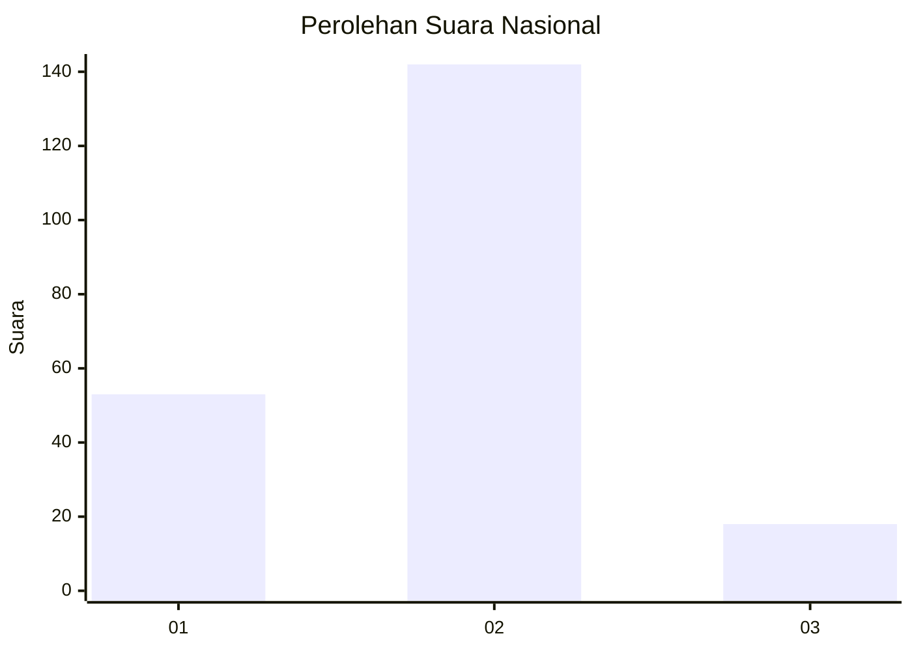
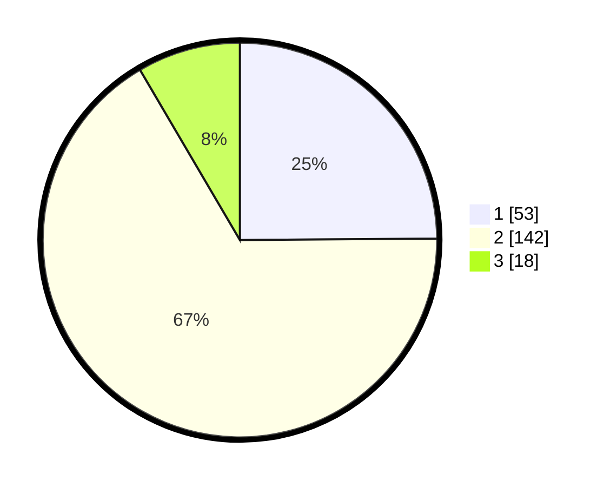

# Hasil

## Grafik

## Tabel

| No. | Nama Paslon    | Suara | Suara (raw) | Persentase |
|:--- |:-------------- | -----:| -----------:| ----------:|
| 1   | ANIES MUHAIMIN | 53    | [53][p-1]   | 24,88      |
| 2   | PRABOWO GIBRAN | 142   | [142][p-2]  | 66,67      |
| 3   | GANJAR MAHFUD  | 18    | [18][p-3]   | 8,45       |

[p-1]: https://github.com/gigit-pemilu/pemilu-2024/blob/main/pilpres/hitung-suara/sub/16-sumatera-selatan/sub/11-empat-lawang/sub/10-pendopo-barat/sub/2001-muaralintang-lama/sub/002-tps/sub/paslon-1.txt
[p-2]: https://github.com/gigit-pemilu/pemilu-2024/blob/main/pilpres/hitung-suara/sub/16-sumatera-selatan/sub/11-empat-lawang/sub/10-pendopo-barat/sub/2001-muaralintang-lama/sub/002-tps/sub/paslon-2.txt
[p-3]: https://github.com/gigit-pemilu/pemilu-2024/blob/main/pilpres/hitung-suara/sub/16-sumatera-selatan/sub/11-empat-lawang/sub/10-pendopo-barat/sub/2001-muaralintang-lama/sub/002-tps/sub/paslon-3.txt

## Foto C Plano

https://sirekap-obj-formc.kpu.go.id/7312/pemilu/ppwp/16/11/10/20/01/1611102001002-20240214-230444--faf0d1d8-13c5-4529-a500-019678649b8e.jpg

https://sirekap-obj-formc.kpu.go.id/7312/pemilu/ppwp/16/11/10/20/01/1611102001002-20240215-040941--4b4d5bc2-29dc-47f3-b827-adfd16d6fcae.jpg

https://sirekap-obj-formc.kpu.go.id/7312/pemilu/ppwp/16/11/10/20/01/1611102001002-20240214-193034--edf53312-7e30-430f-a3c6-cc1dbcd9d76b.jpg

## Metadata

| Key        | Value               |
| ---------- | ------------------- |
| Time Stamp | 2024-02-25 21:00:00 |

