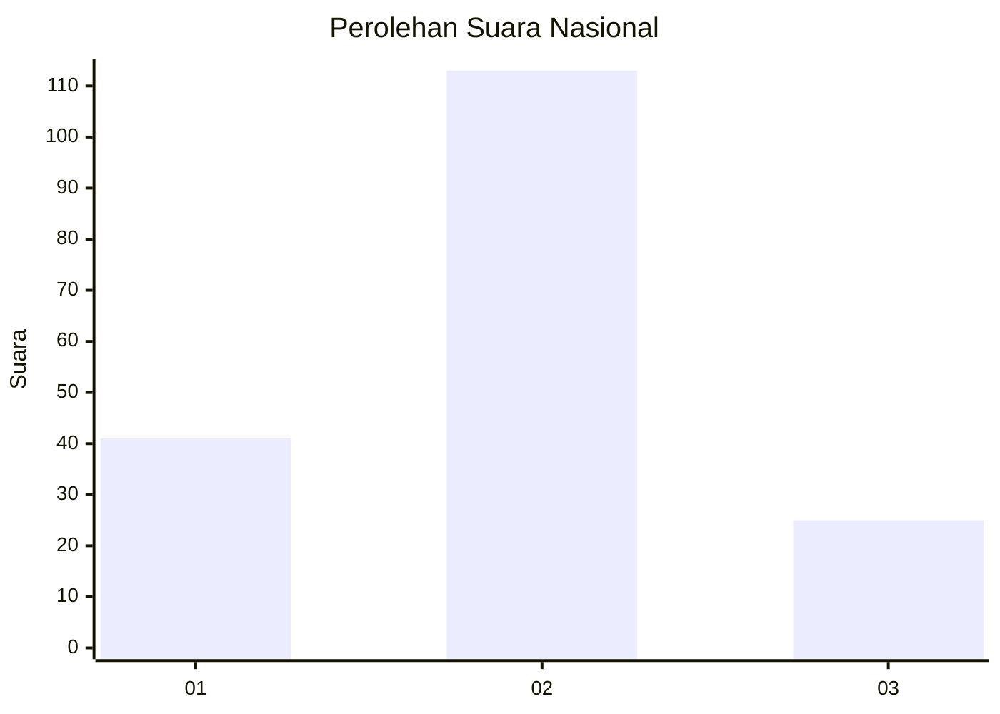
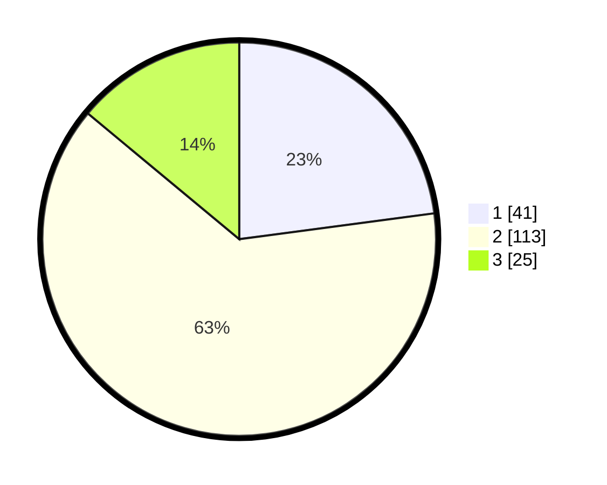

# Hasil

## Grafik

## Tabel

| No. | Nama Paslon    | Suara | Suara (raw) | Persentase |
|:--- |:-------------- | -----:| -----------:| ----------:|
| 1   | ANIES MUHAIMIN | 41    | [41][p-1]   | 22,91      |
| 2   | PRABOWO GIBRAN | 113   | [113][p-2]  | 63,13      |
| 3   | GANJAR MAHFUD  | 25    | [25][p-3]   | 13,97      |

[p-1]: https://github.com/gigit-pemilu/pemilu-2024/blob/main/pilpres/hitung-suara/sub/16-sumatera-selatan/sub/11-empat-lawang/sub/10-pendopo-barat/sub/2001-muaralintang-lama/sub/006-tps/sub/paslon-1.txt
[p-2]: https://github.com/gigit-pemilu/pemilu-2024/blob/main/pilpres/hitung-suara/sub/16-sumatera-selatan/sub/11-empat-lawang/sub/10-pendopo-barat/sub/2001-muaralintang-lama/sub/006-tps/sub/paslon-2.txt
[p-3]: https://github.com/gigit-pemilu/pemilu-2024/blob/main/pilpres/hitung-suara/sub/16-sumatera-selatan/sub/11-empat-lawang/sub/10-pendopo-barat/sub/2001-muaralintang-lama/sub/006-tps/sub/paslon-3.txt

## Foto C Plano

https://sirekap-obj-formc.kpu.go.id/e703/pemilu/ppwp/16/11/10/20/01/1611102001006-20240214-235826--698b387b-0f9e-412a-a8a2-a0e277266d36.jpg

https://sirekap-obj-formc.kpu.go.id/e703/pemilu/ppwp/16/11/10/20/01/1611102001006-20240215-000020--5d779aa9-9eb8-4b23-b85d-75502f79741a.jpg

https://sirekap-obj-formc.kpu.go.id/e703/pemilu/ppwp/16/11/10/20/01/1611102001006-20240215-000204--3ee764fc-afe1-4666-a901-23b422fd51b6.jpg

## Metadata

| Key        | Value               |
| ---------- | ------------------- |
| Time Stamp | 2024-02-16 21:01:00 |

