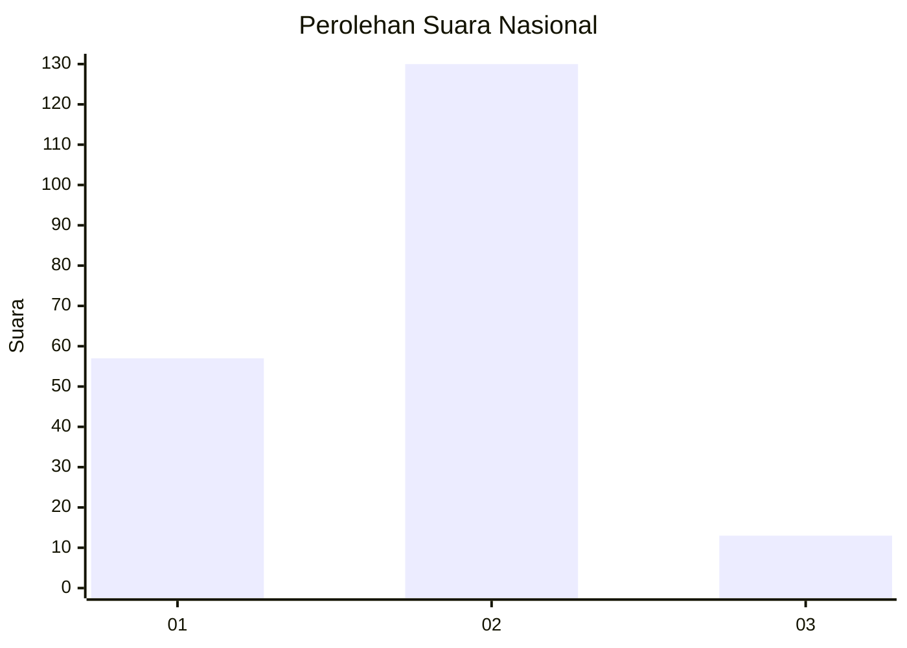
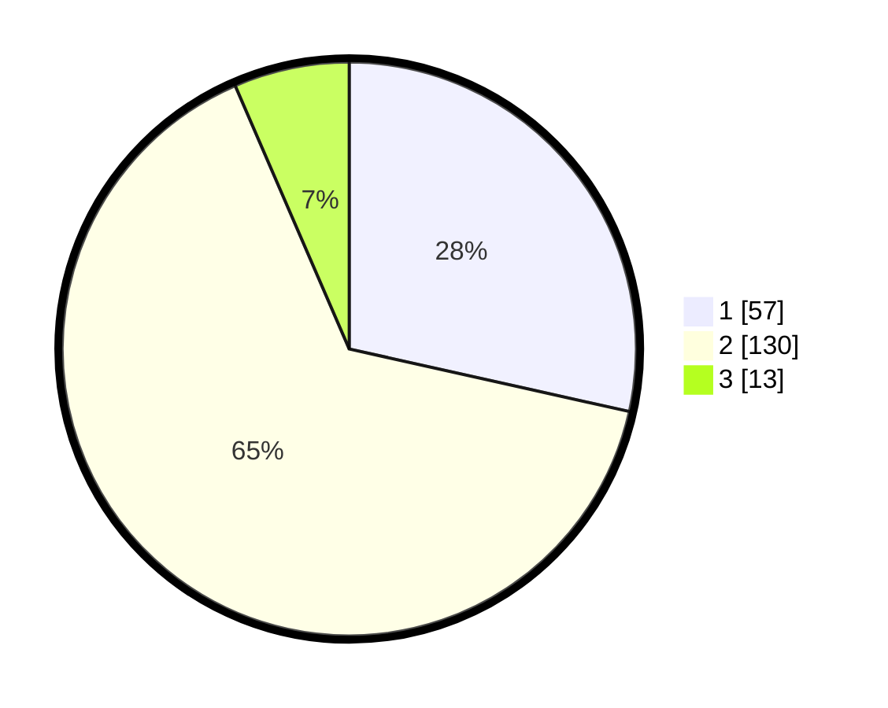

# Hasil

## Grafik

## Tabel

| No. | Nama Paslon    | Suara | Suara (raw) | Persentase |
|:--- |:-------------- | -----:| -----------:| ----------:|
| 1   | ANIES MUHAIMIN | 57    | [57][p-1]   | 28,50      |
| 2   | PRABOWO GIBRAN | 130   | [130][p-2]  | 65,00      |
| 3   | GANJAR MAHFUD  | 13    | [13][p-3]   | 6,50       |

[p-1]: https://github.com/gigit-pemilu/pemilu-2024/blob/main/pilpres/hitung-suara/sub/16-sumatera-selatan/sub/11-empat-lawang/sub/10-pendopo-barat/sub/2001-muaralintang-lama/sub/007-tps/sub/paslon-1.txt
[p-2]: https://github.com/gigit-pemilu/pemilu-2024/blob/main/pilpres/hitung-suara/sub/16-sumatera-selatan/sub/11-empat-lawang/sub/10-pendopo-barat/sub/2001-muaralintang-lama/sub/007-tps/sub/paslon-2.txt
[p-3]: https://github.com/gigit-pemilu/pemilu-2024/blob/main/pilpres/hitung-suara/sub/16-sumatera-selatan/sub/11-empat-lawang/sub/10-pendopo-barat/sub/2001-muaralintang-lama/sub/007-tps/sub/paslon-3.txt

## Foto C Plano

https://sirekap-obj-formc.kpu.go.id/aa79/pemilu/ppwp/16/11/10/20/01/1611102001007-20240215-031839--f06ba76b-dfc7-429e-8275-3b6c044b651b.jpg

https://sirekap-obj-formc.kpu.go.id/aa79/pemilu/ppwp/16/11/10/20/01/1611102001007-20240215-031852--bff901ad-5e2d-47de-8d11-d9111c8cc9d5.jpg

https://sirekap-obj-formc.kpu.go.id/aa79/pemilu/ppwp/16/11/10/20/01/1611102001007-20240215-031900--334565d3-a643-4061-b837-8e41e9bd1cb2.jpg

## Metadata

| Key        | Value               |
| ---------- | ------------------- |
| Time Stamp | 2024-02-15 15:00:29 |

