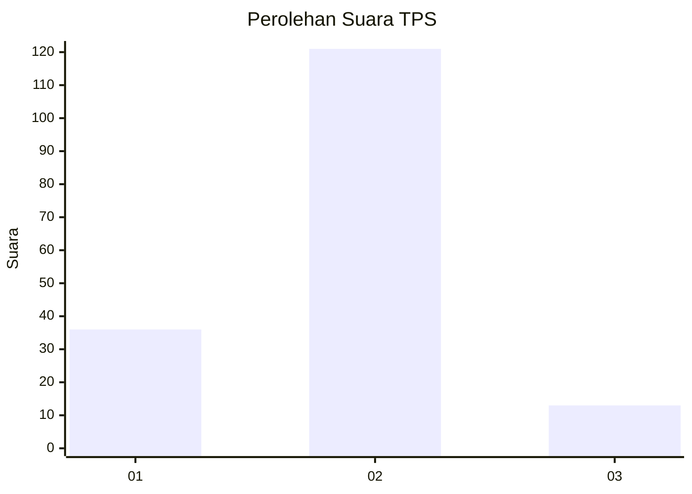
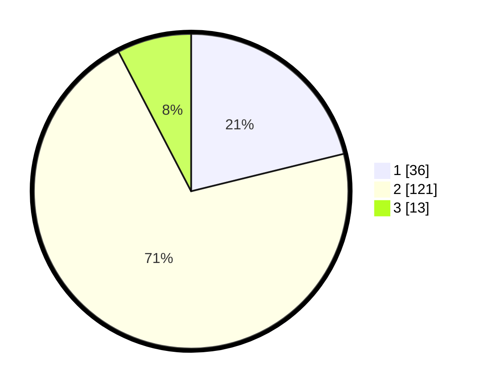

# Hasil

## Grafik

## Tabel

| No. | Nama Paslon    | Suara | Suara (raw) | Persentase |
|:--- |:-------------- | -----:| -----------:| ----------:|
| 1   | ANIES MUHAIMIN | 36    | [36][p-1]   | 21,18      |
| 2   | PRABOWO GIBRAN | 121   | [121][p-2]  | 71,18      |
| 3   | GANJAR MAHFUD  | 13    | [13][p-3]   | 7,65       |

[p-1]: https://github.com/gigit-pemilu/pemilu-2024-16-sumatera-selatan/blob/main/pilpres/hitung-suara/sub/16-sumatera-selatan/sub/11-empat-lawang/sub/10-pendopo-barat/sub/2003-tebat-payang/sub/001-tps/sub/paslon-1.txt
[p-2]: https://github.com/gigit-pemilu/pemilu-2024-16-sumatera-selatan/blob/main/pilpres/hitung-suara/sub/16-sumatera-selatan/sub/11-empat-lawang/sub/10-pendopo-barat/sub/2003-tebat-payang/sub/001-tps/sub/paslon-2.txt
[p-3]: https://github.com/gigit-pemilu/pemilu-2024-16-sumatera-selatan/blob/main/pilpres/hitung-suara/sub/16-sumatera-selatan/sub/11-empat-lawang/sub/10-pendopo-barat/sub/2003-tebat-payang/sub/001-tps/sub/paslon-3.txt

## Foto C Plano

https://sirekap-obj-formc.kpu.go.id/6141/pemilu/ppwp/16/11/10/20/03/1611102003001-20240215-045115--ee1ca526-7b35-46dd-9a9f-d2b48e6a05c2.jpg

https://sirekap-obj-formc.kpu.go.id/6141/pemilu/ppwp/16/11/10/20/03/1611102003001-20240215-013652--25b285f0-d4d5-41ff-97d1-3c9958f04294.jpg

https://sirekap-obj-formc.kpu.go.id/6141/pemilu/ppwp/16/11/10/20/03/1611102003001-20240215-045604--2c745562-1c1d-4839-b5c1-d788137f2dfe.jpg

## Metadata

| Key        | Value               |
| ---------- | ------------------- |
| Time Stamp | 2024-02-16 21:01:00 |

