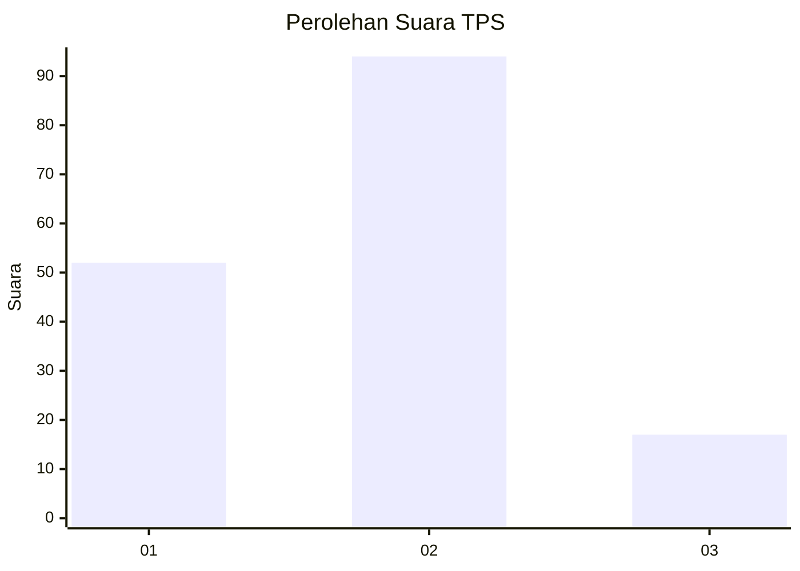
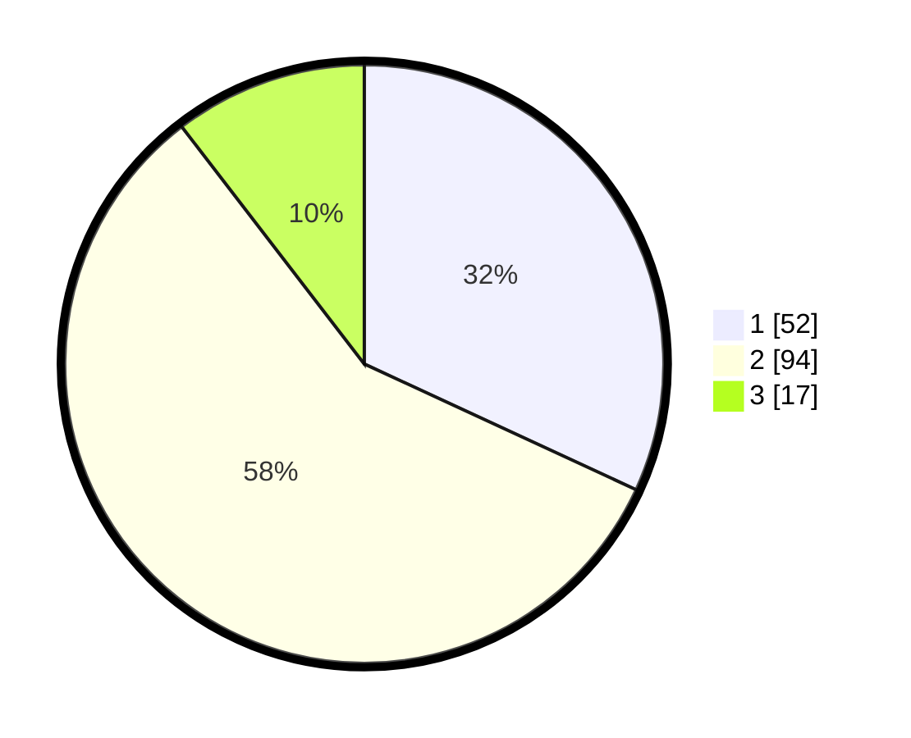

# Hasil

## Grafik

## Tabel

| No. | Nama Paslon    | Suara | Suara (raw) | Persentase |
|:--- |:-------------- | -----:| -----------:| ----------:|
| 1   | ANIES MUHAIMIN | 52    | [52][p-1]   | 31,90      |
| 2   | PRABOWO GIBRAN | 94    | [94][p-2]   | 57,67      |
| 3   | GANJAR MAHFUD  | 17    | [17][p-3]   | 10,43      |

[p-1]: https://github.com/gigit-pemilu/pemilu-2024-16-sumatera-selatan/blob/main/pilpres/hitung-suara/sub/16-sumatera-selatan/sub/11-empat-lawang/sub/10-pendopo-barat/sub/2003-tebat-payang/sub/002-tps/sub/paslon-1.txt
[p-2]: https://github.com/gigit-pemilu/pemilu-2024-16-sumatera-selatan/blob/main/pilpres/hitung-suara/sub/16-sumatera-selatan/sub/11-empat-lawang/sub/10-pendopo-barat/sub/2003-tebat-payang/sub/002-tps/sub/paslon-2.txt
[p-3]: https://github.com/gigit-pemilu/pemilu-2024-16-sumatera-selatan/blob/main/pilpres/hitung-suara/sub/16-sumatera-selatan/sub/11-empat-lawang/sub/10-pendopo-barat/sub/2003-tebat-payang/sub/002-tps/sub/paslon-3.txt

## Foto C Plano

https://sirekap-obj-formc.kpu.go.id/740e/pemilu/ppwp/16/11/10/20/03/1611102003002-20240215-043836--53e7791e-267f-448d-87e9-66d2c8070cb6.jpg

https://sirekap-obj-formc.kpu.go.id/740e/pemilu/ppwp/16/11/10/20/03/1611102003002-20240215-044016--5400aa6c-9664-4896-9434-867e67ffeb2a.jpg

https://sirekap-obj-formc.kpu.go.id/740e/pemilu/ppwp/16/11/10/20/03/1611102003002-20240215-044148--b6f39c21-adb1-4a1b-bd0c-db4092831f2d.jpg

## Metadata

| Key        | Value               |
| ---------- | ------------------- |
| Time Stamp | 2024-02-16 21:01:00 |

