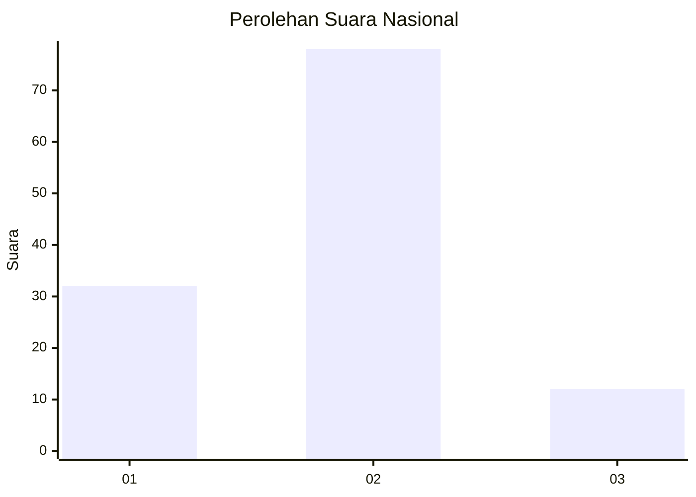
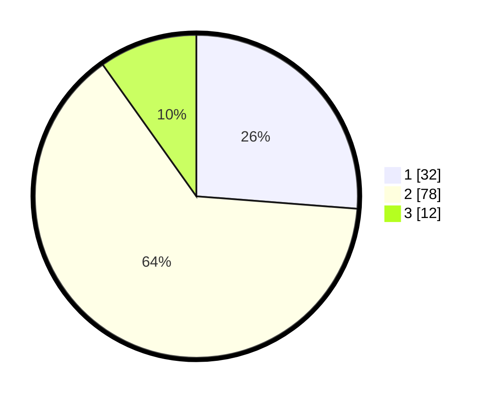

# Hasil

## Grafik

## Tabel

| No. | Nama Paslon    | Suara | Suara (raw) | Persentase |
|:--- |:-------------- | -----:| -----------:| ----------:|
| 1   | ANIES MUHAIMIN | 32    | [32][p-1]   | 26,23      |
| 2   | PRABOWO GIBRAN | 78    | [78][p-2]   | 63,93      |
| 3   | GANJAR MAHFUD  | 12    | [12][p-3]   | 9,84       |

[p-1]: https://github.com/gigit-pemilu/pemilu-2024/blob/main/pilpres/hitung-suara/sub/16-sumatera-selatan/sub/11-empat-lawang/sub/10-pendopo-barat/sub/2003-tebat-payang/sub/003-tps/sub/paslon-1.txt
[p-2]: https://github.com/gigit-pemilu/pemilu-2024/blob/main/pilpres/hitung-suara/sub/16-sumatera-selatan/sub/11-empat-lawang/sub/10-pendopo-barat/sub/2003-tebat-payang/sub/003-tps/sub/paslon-2.txt
[p-3]: https://github.com/gigit-pemilu/pemilu-2024/blob/main/pilpres/hitung-suara/sub/16-sumatera-selatan/sub/11-empat-lawang/sub/10-pendopo-barat/sub/2003-tebat-payang/sub/003-tps/sub/paslon-3.txt

## Foto C Plano

https://sirekap-obj-formc.kpu.go.id/150b/pemilu/ppwp/16/11/10/20/03/1611102003003-20240215-031232--f8037a14-0095-4596-aaa8-4c15fe4f1351.jpg

https://sirekap-obj-formc.kpu.go.id/150b/pemilu/ppwp/16/11/10/20/03/1611102003003-20240215-031624--425d6f25-1dd5-4279-bb5c-9c71fe666691.jpg

https://sirekap-obj-formc.kpu.go.id/150b/pemilu/ppwp/16/11/10/20/03/1611102003003-20240215-031832--1bc99d1f-130b-44e6-a2ed-4d22e6d8cb49.jpg

## Metadata

| Key        | Value               |
| ---------- | ------------------- |
| Time Stamp | 2024-02-16 21:01:00 |

