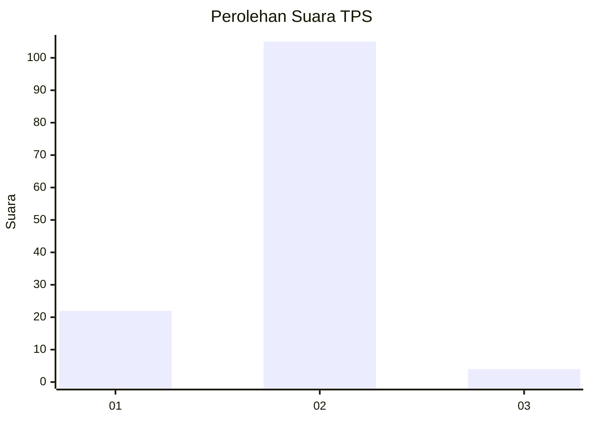
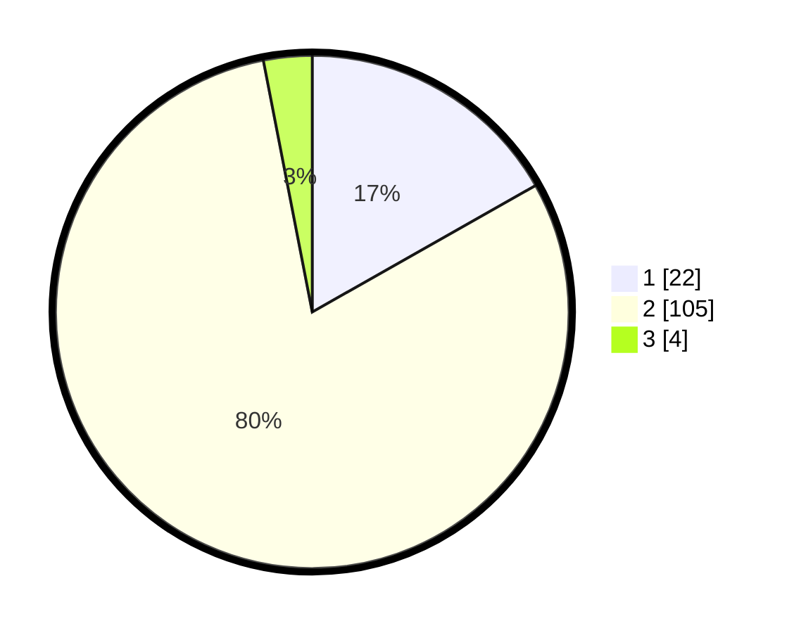

# Hasil

## Grafik

## Tabel

| No. | Nama Paslon    | Suara | Suara (raw) | Persentase |
|:--- |:-------------- | -----:| -----------:| ----------:|
| 1   | ANIES MUHAIMIN | 22    | [22][p-1]   | 16,79      |
| 2   | PRABOWO GIBRAN | 105   | [105][p-2]  | 80,15      |
| 3   | GANJAR MAHFUD  | 4     | [4][p-3]    | 3,05       |

[p-1]: https://github.com/gigit-pemilu/pemilu-2024-16-sumatera-selatan/blob/main/pilpres/hitung-suara/sub/16-sumatera-selatan/sub/11-empat-lawang/sub/10-pendopo-barat/sub/2007-air-kandis/sub/003-tps/sub/paslon-1.txt
[p-2]: https://github.com/gigit-pemilu/pemilu-2024-16-sumatera-selatan/blob/main/pilpres/hitung-suara/sub/16-sumatera-selatan/sub/11-empat-lawang/sub/10-pendopo-barat/sub/2007-air-kandis/sub/003-tps/sub/paslon-2.txt
[p-3]: https://github.com/gigit-pemilu/pemilu-2024-16-sumatera-selatan/blob/main/pilpres/hitung-suara/sub/16-sumatera-selatan/sub/11-empat-lawang/sub/10-pendopo-barat/sub/2007-air-kandis/sub/003-tps/sub/paslon-3.txt

## Foto C Plano

https://sirekap-obj-formc.kpu.go.id/14f2/pemilu/ppwp/16/11/10/20/07/1611102007003-20240215-015952--5042475e-5e36-4ac7-9f88-e2a43bb62eee.jpg

https://sirekap-obj-formc.kpu.go.id/14f2/pemilu/ppwp/16/11/10/20/07/1611102007003-20240215-020233--2e735839-6329-4086-9617-669579f0d80f.jpg

https://sirekap-obj-formc.kpu.go.id/14f2/pemilu/ppwp/16/11/10/20/07/1611102007003-20240215-020425--aaf5ad22-80fe-420b-a8d3-892b708849e8.jpg

## Metadata

| Key        | Value               |
| ---------- | ------------------- |
| Time Stamp | 2024-02-16 21:01:00 |

