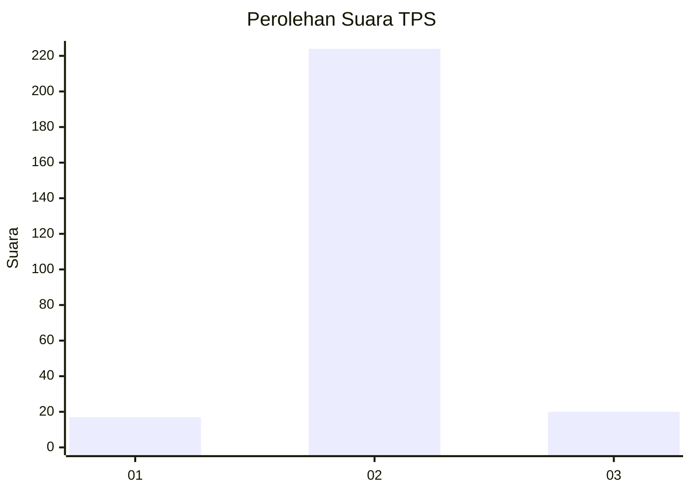
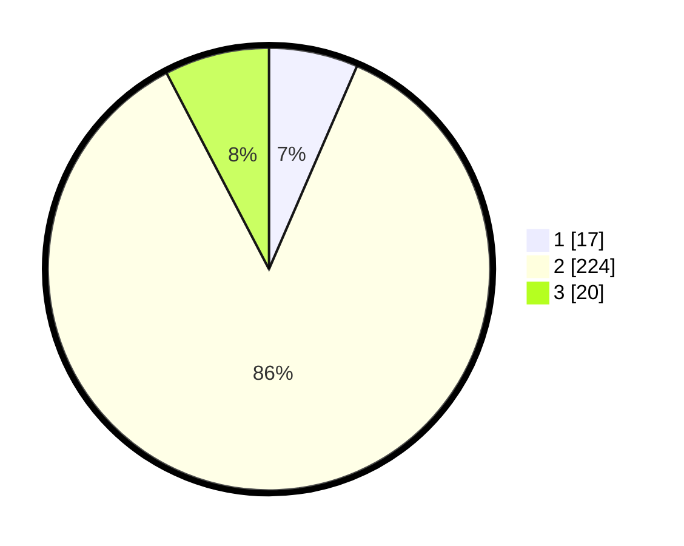

# Hasil

## Grafik

## Tabel

| No. | Nama Paslon    | Suara | Suara (raw) | Persentase |
|:--- |:-------------- | -----:| -----------:| ----------:|
| 1   | ANIES MUHAIMIN | 17    | [17][p-1]   | 6,51       |
| 2   | PRABOWO GIBRAN | 224   | [224][p-2]  | 85,82      |
| 3   | GANJAR MAHFUD  | 20    | [20][p-3]   | 7,66       |

[p-1]: https://github.com/gigit-pemilu/pemilu-2024-16-sumatera-selatan/blob/main/pilpres/hitung-suara/sub/16-sumatera-selatan/sub/12-penukal-abab-lematang-ilir/sub/01-talang-ubi/sub/2005-sungai-ibul/sub/005-tps/sub/paslon-1.txt
[p-2]: https://github.com/gigit-pemilu/pemilu-2024-16-sumatera-selatan/blob/main/pilpres/hitung-suara/sub/16-sumatera-selatan/sub/12-penukal-abab-lematang-ilir/sub/01-talang-ubi/sub/2005-sungai-ibul/sub/005-tps/sub/paslon-2.txt
[p-3]: https://github.com/gigit-pemilu/pemilu-2024-16-sumatera-selatan/blob/main/pilpres/hitung-suara/sub/16-sumatera-selatan/sub/12-penukal-abab-lematang-ilir/sub/01-talang-ubi/sub/2005-sungai-ibul/sub/005-tps/sub/paslon-3.txt

## Foto C Plano

https://sirekap-obj-formc.kpu.go.id/92e4/pemilu/ppwp/16/12/01/20/05/1612012005005-20240216-121603--40479fd1-972f-4de1-8e6b-0cf6bea1644a.jpg

https://sirekap-obj-formc.kpu.go.id/92e4/pemilu/ppwp/16/12/01/20/05/1612012005005-20240216-120916--0ee997b7-b7a2-4048-bd44-9b0173236a01.jpg

https://sirekap-obj-formc.kpu.go.id/92e4/pemilu/ppwp/16/12/01/20/05/1612012005005-20240216-122239--0a256816-e287-492b-9575-c776d50c6b65.jpg

## Metadata

| Key        | Value               |
| ---------- | ------------------- |
| Time Stamp | 2024-02-19 06:16:00 |

