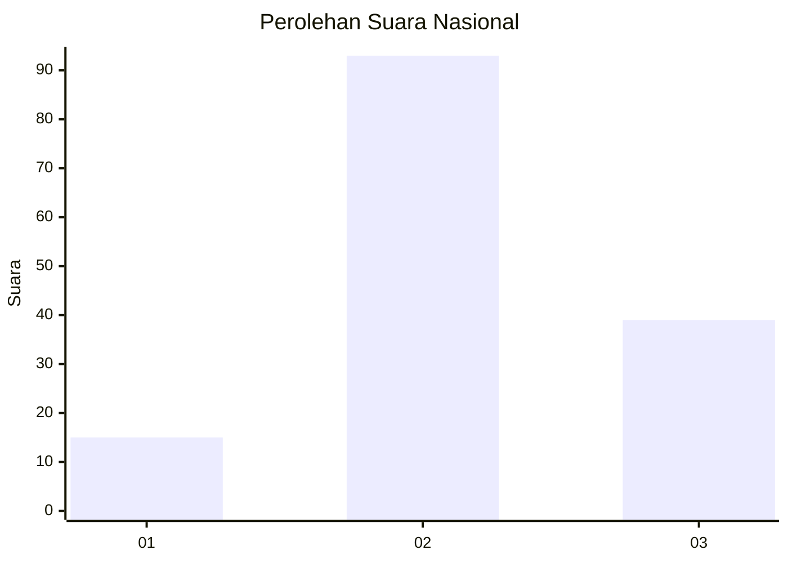
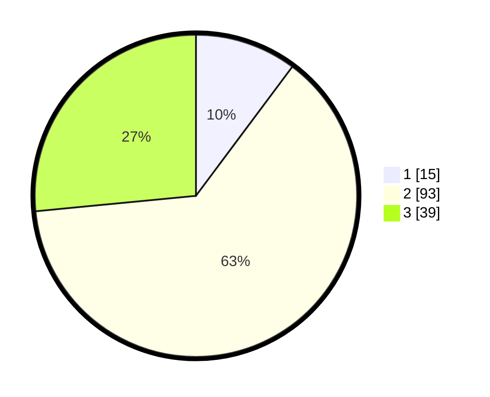

# Hasil

## Grafik

## Tabel

| No. | Nama Paslon    | Suara | Suara (raw) | Persentase |
|:--- |:-------------- | -----:| -----------:| ----------:|
| 1   | ANIES MUHAIMIN | 15    | [15][p-1]   | 10,20      |
| 2   | PRABOWO GIBRAN | 93    | [93][p-2]   | 63,27      |
| 3   | GANJAR MAHFUD  | 39    | [39][p-3]   | 26,53      |

[p-1]: https://github.com/gigit-pemilu/pemilu-2024/blob/main/pilpres/hitung-suara/sub/16-sumatera-selatan/sub/12-penukal-abab-lematang-ilir/sub/02-penukal-utara/sub/2008-tempirai-selatan/sub/004-tps/sub/paslon-1.txt
[p-2]: https://github.com/gigit-pemilu/pemilu-2024/blob/main/pilpres/hitung-suara/sub/16-sumatera-selatan/sub/12-penukal-abab-lematang-ilir/sub/02-penukal-utara/sub/2008-tempirai-selatan/sub/004-tps/sub/paslon-2.txt
[p-3]: https://github.com/gigit-pemilu/pemilu-2024/blob/main/pilpres/hitung-suara/sub/16-sumatera-selatan/sub/12-penukal-abab-lematang-ilir/sub/02-penukal-utara/sub/2008-tempirai-selatan/sub/004-tps/sub/paslon-3.txt

## Foto C Plano

https://sirekap-obj-formc.kpu.go.id/aa43/pemilu/ppwp/16/12/02/20/08/1612022008004-20240216-095348--320a59aa-4334-436b-8e76-4853cf438fa4.jpg

https://sirekap-obj-formc.kpu.go.id/aa43/pemilu/ppwp/16/12/02/20/08/1612022008004-20240220-164927--59160e73-a68d-41fd-b410-94f3b2adb0b3.jpg

https://sirekap-obj-formc.kpu.go.id/aa43/pemilu/ppwp/16/12/02/20/08/1612022008004-20240220-165110--301a583e-02e0-4c7c-a63b-3b04cb8010b9.jpg

## Metadata

| Key        | Value               |
| ---------- | ------------------- |
| Time Stamp | 2024-02-21 09:00:00 |

