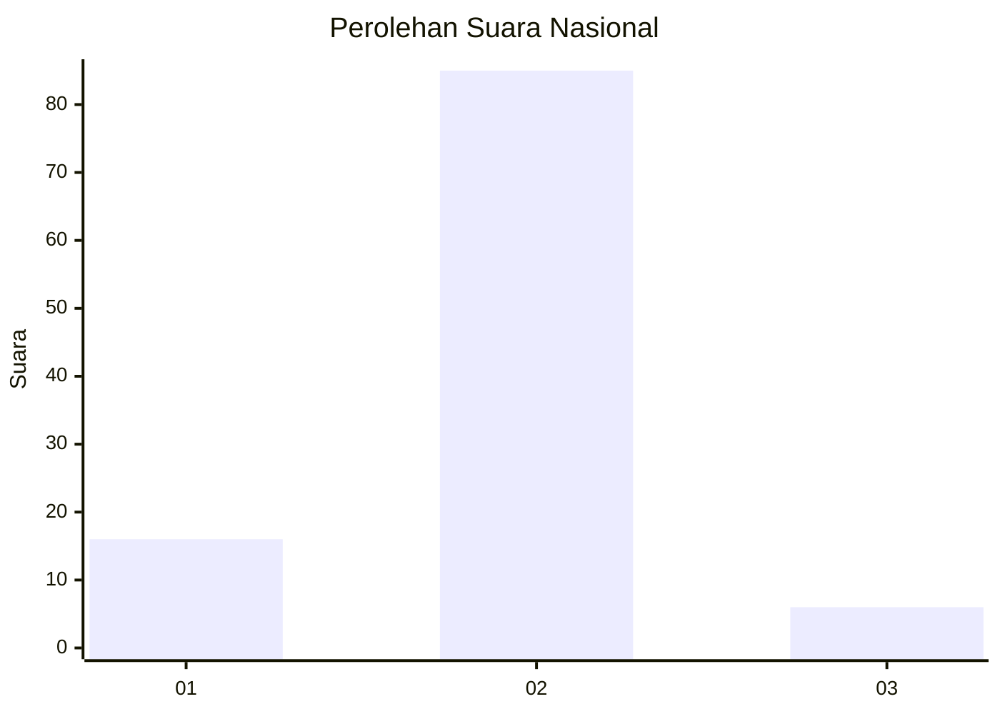
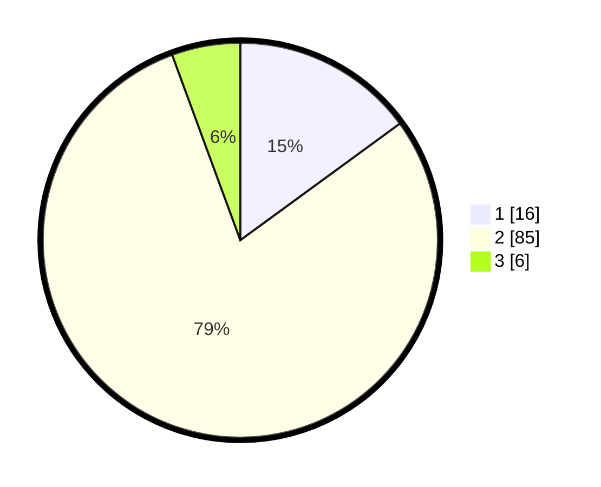

# Hasil

## Grafik

## Tabel

| No. | Nama Paslon    | Suara | Suara (raw) | Persentase |
|:--- |:-------------- | -----:| -----------:| ----------:|
| 1   | ANIES MUHAIMIN | 16    | [16][p-1]   | 14,95      |
| 2   | PRABOWO GIBRAN | 85    | [85][p-2]   | 79,44      |
| 3   | GANJAR MAHFUD  | 6     | [6][p-3]    | 5,61       |

[p-1]: https://github.com/gigit-pemilu/pemilu-2024/blob/main/pilpres/hitung-suara/sub/16-sumatera-selatan/sub/12-penukal-abab-lematang-ilir/sub/04-abab/sub/2006-prambatan/sub/901-tps/sub/paslon-1.txt
[p-2]: https://github.com/gigit-pemilu/pemilu-2024/blob/main/pilpres/hitung-suara/sub/16-sumatera-selatan/sub/12-penukal-abab-lematang-ilir/sub/04-abab/sub/2006-prambatan/sub/901-tps/sub/paslon-2.txt
[p-3]: https://github.com/gigit-pemilu/pemilu-2024/blob/main/pilpres/hitung-suara/sub/16-sumatera-selatan/sub/12-penukal-abab-lematang-ilir/sub/04-abab/sub/2006-prambatan/sub/901-tps/sub/paslon-3.txt

## Foto C Plano

https://sirekap-obj-formc.kpu.go.id/da59/pemilu/ppwp/16/12/04/20/06/1612042006901-20240214-184455--3fbaf094-2019-47a6-972c-b829b0f8b6e5.jpg

https://sirekap-obj-formc.kpu.go.id/da59/pemilu/ppwp/16/12/04/20/06/1612042006901-20240214-184752--f9e3e7c9-1bdb-406d-a23f-a4a3eefc4ecf.jpg

https://sirekap-obj-formc.kpu.go.id/da59/pemilu/ppwp/16/12/04/20/06/1612042006901-20240214-190055--cfa5922d-5a7d-4b79-9f36-2afe823b1289.jpg

## Metadata

| Key        | Value               |
| ---------- | ------------------- |
| Time Stamp | 2024-02-14 21:46:01 |

## DATA PEMILIH TETAP

Jumlah pemilih dalam DPT: **262**.
 * L: **223**.
 * P: **239**.

## DATA PENGGUNA HAK PILIH

Jumlah pengguna hak pilih dalam DPT: **867**.
 * L: **248**.
 * P: **819**.

Jumlah pengguna hak pilih dalam DPTb: **41**.
 * L: **226**.
 * P: **815**.

Jumlah pengguna hak pilih dalam DPK: **9**.
 * L: **0**.
 * P: **200**.

Jumlah pengguna hak pilih: **108**.
 * L: **874**.
 * P: **34**.

## JUMLAH SUARA SAH DAN TIDAK SAH

JUMLAH SELURUH SUARA SAH: **107**.

JUMLAH SUARA TIDAK SAH: **1**.

JUMLAH SELURUH SUARA SAH DAN SUARA TIDAK SAH: **108**.

