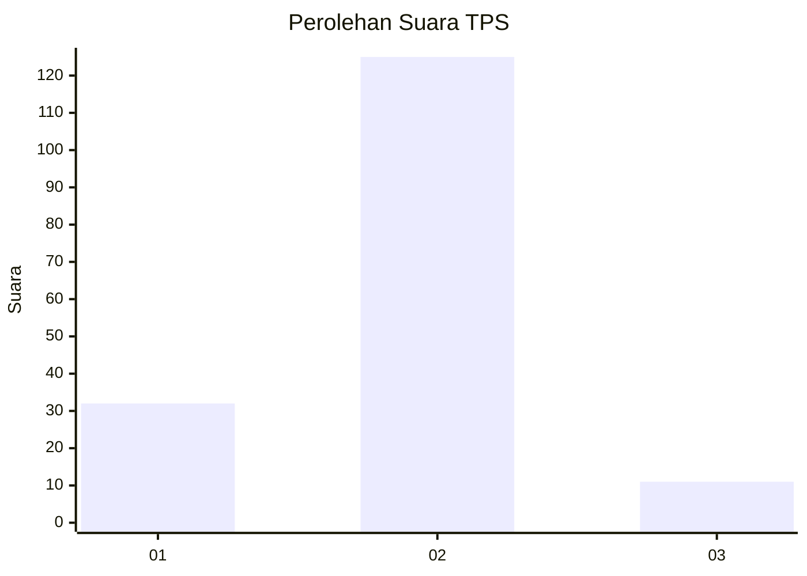
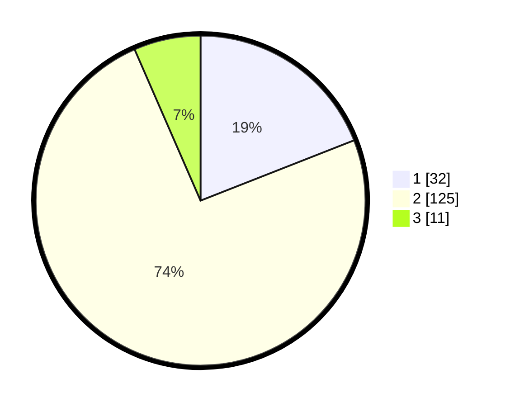

# Hasil

## Grafik

## Tabel

| No. | Nama Paslon    | Suara | Suara (raw) | Persentase |
|:--- |:-------------- | -----:| -----------:| ----------:|
| 1   | ANIES MUHAIMIN | 32    | [32][p-1]   | 19,05      |
| 2   | PRABOWO GIBRAN | 125   | [125][p-2]  | 74,40      |
| 3   | GANJAR MAHFUD  | 11    | [11][p-3]   | 6,55       |

[p-1]: https://github.com/gigit-pemilu/pemilu-2024-16-sumatera-selatan/blob/main/pilpres/hitung-suara/sub/16-sumatera-selatan/sub/12-penukal-abab-lematang-ilir/sub/05-tanah-abang/sub/2002-muara-sungai/sub/001-tps/sub/paslon-1.txt
[p-2]: https://github.com/gigit-pemilu/pemilu-2024-16-sumatera-selatan/blob/main/pilpres/hitung-suara/sub/16-sumatera-selatan/sub/12-penukal-abab-lematang-ilir/sub/05-tanah-abang/sub/2002-muara-sungai/sub/001-tps/sub/paslon-2.txt
[p-3]: https://github.com/gigit-pemilu/pemilu-2024-16-sumatera-selatan/blob/main/pilpres/hitung-suara/sub/16-sumatera-selatan/sub/12-penukal-abab-lematang-ilir/sub/05-tanah-abang/sub/2002-muara-sungai/sub/001-tps/sub/paslon-3.txt

## Foto C Plano

https://sirekap-obj-formc.kpu.go.id/35a3/pemilu/ppwp/16/12/05/20/02/1612052002001-20240218-134234--ae90ffcd-0b30-4c2c-baec-acbb10ea953c.jpg

https://sirekap-obj-formc.kpu.go.id/35a3/pemilu/ppwp/16/12/05/20/02/1612052002001-20240218-134343--127d4ced-a6f9-4e2a-ae79-a7835de864f1.jpg

https://sirekap-obj-formc.kpu.go.id/35a3/pemilu/ppwp/16/12/05/20/02/1612052002001-20240218-134450--90983924-60b2-4303-82c3-3dcee5ebfe5d.jpg

## Metadata

| Key        | Value               |
| ---------- | ------------------- |
| Time Stamp | 2024-02-19 06:16:00 |

## DATA PEMILIH TETAP

Jumlah pemilih dalam DPT: **0**.
 * L: **0**.
 * P: **0**.

## DATA PENGGUNA HAK PILIH

Jumlah pengguna hak pilih dalam DPT: **0**.
 * L: **500**.
 * P: **0**.

Jumlah pengguna hak pilih dalam DPTb: **660**.
 * L: **895**.
 * P: **51**.

Jumlah pengguna hak pilih dalam DPK: **502**.
 * L: **0**.
 * P: **0**.

Jumlah pengguna hak pilih: **900**.
 * L: **0**.
 * P: **7**.

## JUMLAH SUARA SAH DAN TIDAK SAH

JUMLAH SELURUH SUARA SAH: **168**.

JUMLAH SUARA TIDAK SAH: **0**.

JUMLAH SELURUH SUARA SAH DAN SUARA TIDAK SAH: **168**.

