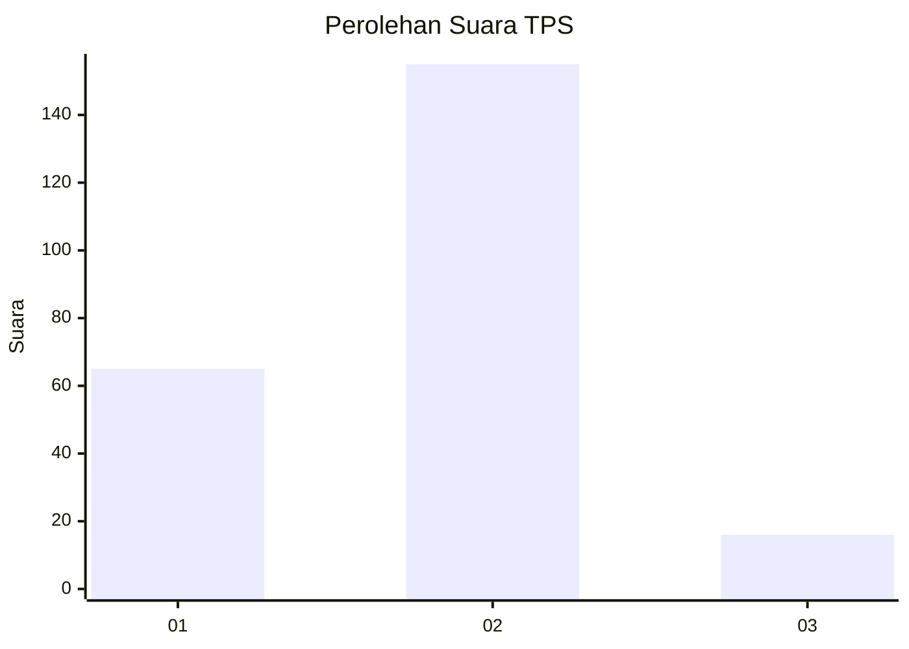
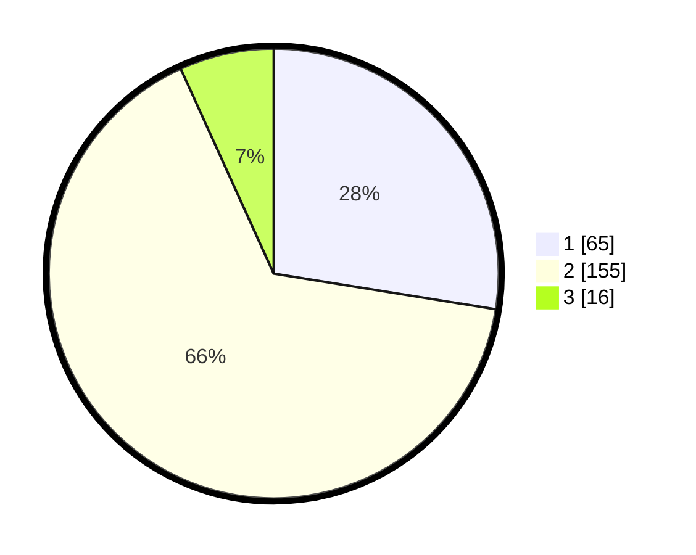

# Hasil

## Grafik

## Tabel

| No. | Nama Paslon    | Suara | Suara (raw) | Persentase |
|:--- |:-------------- | -----:| -----------:| ----------:|
| 1   | ANIES MUHAIMIN | 65    | [65][p-1]   | 27,54      |
| 2   | PRABOWO GIBRAN | 155   | [155][p-2]  | 65,68      |
| 3   | GANJAR MAHFUD  | 16    | [16][p-3]   | 6,78       |

[p-1]: https://github.com/gigit-pemilu/pemilu-2024-16-sumatera-selatan/blob/main/pilpres/hitung-suara/sub/16-sumatera-selatan/sub/13-musi-rawas-utara/sub/01-rupit/sub/1007-muara-rupit/sub/002-tps/sub/paslon-1.txt
[p-2]: https://github.com/gigit-pemilu/pemilu-2024-16-sumatera-selatan/blob/main/pilpres/hitung-suara/sub/16-sumatera-selatan/sub/13-musi-rawas-utara/sub/01-rupit/sub/1007-muara-rupit/sub/002-tps/sub/paslon-2.txt
[p-3]: https://github.com/gigit-pemilu/pemilu-2024-16-sumatera-selatan/blob/main/pilpres/hitung-suara/sub/16-sumatera-selatan/sub/13-musi-rawas-utara/sub/01-rupit/sub/1007-muara-rupit/sub/002-tps/sub/paslon-3.txt

## Foto C Plano

https://sirekap-obj-formc.kpu.go.id/38b3/pemilu/ppwp/16/13/01/10/07/1613011007002-20240215-004648--ed91db42-509b-46c2-954a-995987b6b469.jpg

https://sirekap-obj-formc.kpu.go.id/38b3/pemilu/ppwp/16/13/01/10/07/1613011007002-20240215-004833--5b751a70-ff7e-4825-85f3-a176ea501878.jpg

https://sirekap-obj-formc.kpu.go.id/38b3/pemilu/ppwp/16/13/01/10/07/1613011007002-20240215-005113--053f66ab-3ed4-41b4-931c-87c0ff4cae76.jpg

## Metadata

| Key        | Value               |
| ---------- | ------------------- |
| Time Stamp | 2024-02-15 15:00:29 |

