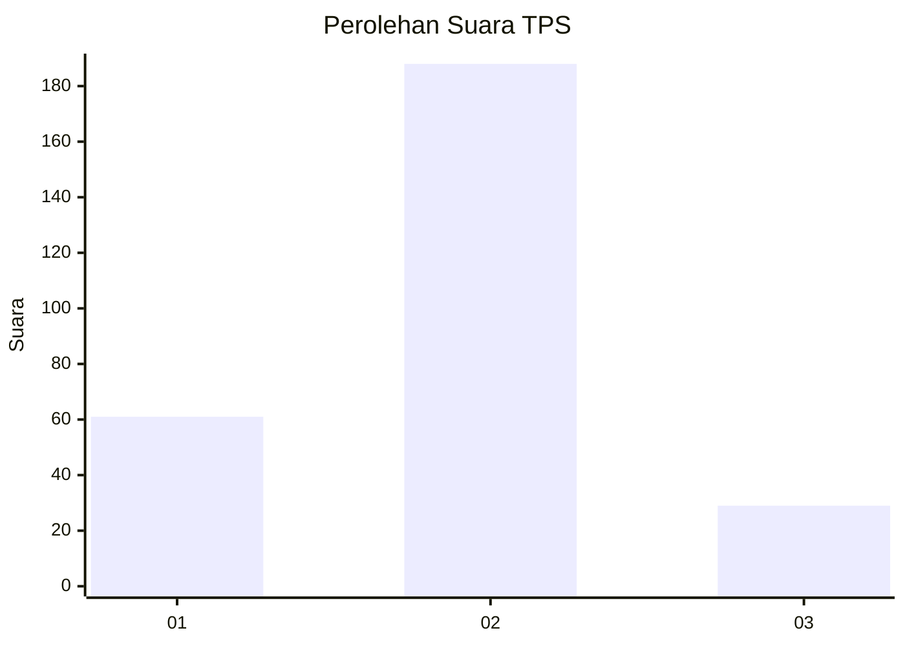

# Hasil

## Grafik

## Tabel

| No. | Nama Paslon    | Suara | Suara (raw) | Persentase |
|:--- |:-------------- | -----:| -----------:| ----------:|
| 1   | ANIES MUHAIMIN | 61    | [61][p-1]   | 21,94      |
| 2   | PRABOWO GIBRAN | 188   | [188][p-2]  | 67,63      |
| 3   | GANJAR MAHFUD  | 29    | [29][p-3]   | 10,43      |

[p-1]: https://github.com/gigit-pemilu/pemilu-2024-16-sumatera-selatan/blob/main/pilpres/hitung-suara/sub/16-sumatera-selatan/sub/13-musi-rawas-utara/sub/01-rupit/sub/1007-muara-rupit/sub/005-tps/sub/paslon-1.txt
[p-2]: https://github.com/gigit-pemilu/pemilu-2024-16-sumatera-selatan/blob/main/pilpres/hitung-suara/sub/16-sumatera-selatan/sub/13-musi-rawas-utara/sub/01-rupit/sub/1007-muara-rupit/sub/005-tps/sub/paslon-2.txt
[p-3]: https://github.com/gigit-pemilu/pemilu-2024-16-sumatera-selatan/blob/main/pilpres/hitung-suara/sub/16-sumatera-selatan/sub/13-musi-rawas-utara/sub/01-rupit/sub/1007-muara-rupit/sub/005-tps/sub/paslon-3.txt

## Foto C Plano

https://sirekap-obj-formc.kpu.go.id/4344/pemilu/ppwp/16/13/01/10/07/1613011007005-20240214-230024--1b9b08d9-c9a2-496f-aa24-7d798990af08.jpg

https://sirekap-obj-formc.kpu.go.id/4344/pemilu/ppwp/16/13/01/10/07/1613011007005-20240214-155514--2bc74b4d-3d45-48a0-bbb7-600758383f1c.jpg

https://sirekap-obj-formc.kpu.go.id/4344/pemilu/ppwp/16/13/01/10/07/1613011007005-20240214-155740--9a55b6c2-49f1-4436-a120-82326b608109.jpg

## Metadata

| Key        | Value               |
| ---------- | ------------------- |
| Time Stamp | 2024-02-15 09:00:24 |

