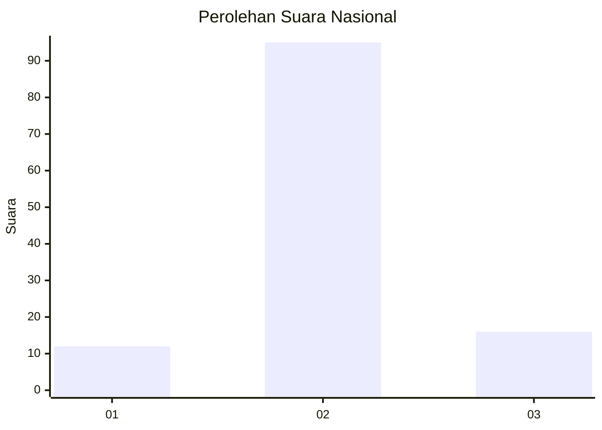
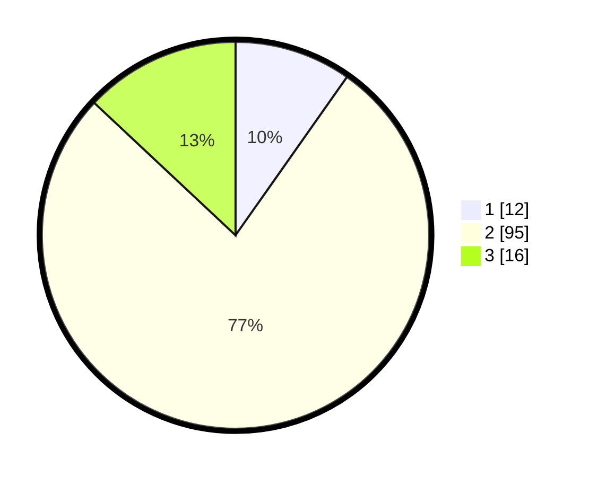

# Hasil

## Grafik

## Tabel

| No. | Nama Paslon    | Suara | Suara (raw) | Persentase |
|:--- |:-------------- | -----:| -----------:| ----------:|
| 1   | ANIES MUHAIMIN | 12    | [12][p-1]   | 9,76       |
| 2   | PRABOWO GIBRAN | 95    | [95][p-2]   | 77,24      |
| 3   | GANJAR MAHFUD  | 16    | [16][p-3]   | 13,01      |

[p-1]: https://github.com/gigit-pemilu/pemilu-2024/blob/main/pilpres/hitung-suara/sub/16-sumatera-selatan/sub/13-musi-rawas-utara/sub/01-rupit/sub/1007-muara-rupit/sub/018-tps/sub/paslon-1.txt
[p-2]: https://github.com/gigit-pemilu/pemilu-2024/blob/main/pilpres/hitung-suara/sub/16-sumatera-selatan/sub/13-musi-rawas-utara/sub/01-rupit/sub/1007-muara-rupit/sub/018-tps/sub/paslon-2.txt
[p-3]: https://github.com/gigit-pemilu/pemilu-2024/blob/main/pilpres/hitung-suara/sub/16-sumatera-selatan/sub/13-musi-rawas-utara/sub/01-rupit/sub/1007-muara-rupit/sub/018-tps/sub/paslon-3.txt

## Foto C Plano

https://sirekap-obj-formc.kpu.go.id/0f8a/pemilu/ppwp/16/13/01/10/07/1613011007018-20240214-224636--46d7f761-c45a-4bd2-b328-f595cc790693.jpg

https://sirekap-obj-formc.kpu.go.id/0f8a/pemilu/ppwp/16/13/01/10/07/1613011007018-20240214-225157--7798c9f5-1a27-4434-a875-3ebdae691003.jpg

https://sirekap-obj-formc.kpu.go.id/0f8a/pemilu/ppwp/16/13/01/10/07/1613011007018-20240214-225403--fa02a98d-80e1-427c-aa73-e03775c585ba.jpg

## Metadata

| Key        | Value               |
| ---------- | ------------------- |
| Time Stamp | 2024-02-15 15:30:25 |

