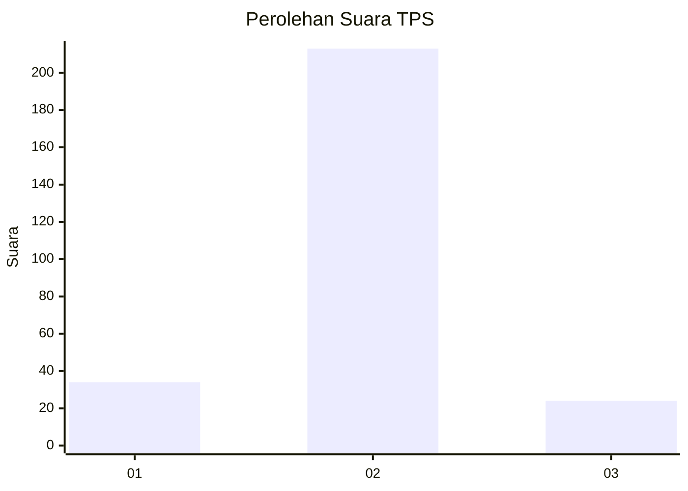
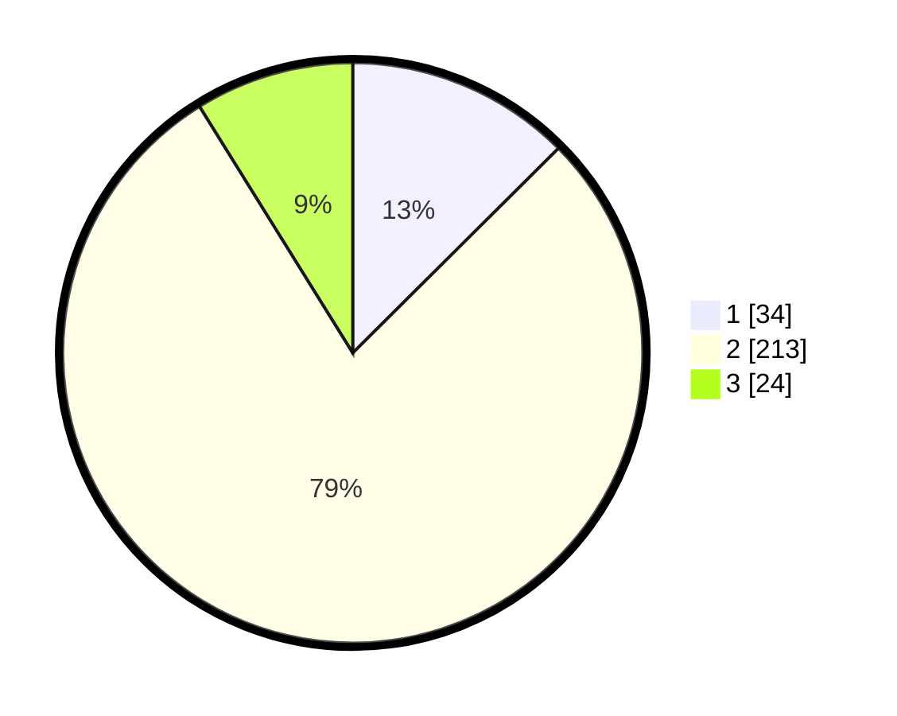

# Hasil

## Grafik

## Tabel

| No. | Nama Paslon    | Suara | Suara (raw) | Persentase |
|:--- |:-------------- | -----:| -----------:| ----------:|
| 1   | ANIES MUHAIMIN | 34    | [34][p-1]   | 12,55      |
| 2   | PRABOWO GIBRAN | 213   | [213][p-2]  | 78,60      |
| 3   | GANJAR MAHFUD  | 24    | [24][p-3]   | 8,86       |

[p-1]: https://github.com/gigit-pemilu/pemilu-2024-16-sumatera-selatan/blob/main/pilpres/hitung-suara/sub/16-sumatera-selatan/sub/13-musi-rawas-utara/sub/01-rupit/sub/2006-bingin-rupit/sub/002-tps/sub/paslon-1.txt
[p-2]: https://github.com/gigit-pemilu/pemilu-2024-16-sumatera-selatan/blob/main/pilpres/hitung-suara/sub/16-sumatera-selatan/sub/13-musi-rawas-utara/sub/01-rupit/sub/2006-bingin-rupit/sub/002-tps/sub/paslon-2.txt
[p-3]: https://github.com/gigit-pemilu/pemilu-2024-16-sumatera-selatan/blob/main/pilpres/hitung-suara/sub/16-sumatera-selatan/sub/13-musi-rawas-utara/sub/01-rupit/sub/2006-bingin-rupit/sub/002-tps/sub/paslon-3.txt

## Foto C Plano

https://sirekap-obj-formc.kpu.go.id/a352/pemilu/ppwp/16/13/01/20/06/1613012006002-20240215-121103--1213b087-5eac-46a3-9dff-7a7641cca888.jpg

https://sirekap-obj-formc.kpu.go.id/a352/pemilu/ppwp/16/13/01/20/06/1613012006002-20240214-214304--bd5c84c0-8f29-4f2d-9841-a35e4f38ba0b.jpg

https://sirekap-obj-formc.kpu.go.id/a352/pemilu/ppwp/16/13/01/20/06/1613012006002-20240215-122054--530a4ff8-73f5-4704-805b-425cf7aa2e6a.jpg

## Metadata

| Key        | Value               |
| ---------- | ------------------- |
| Time Stamp | 2024-02-15 23:29:50 |

