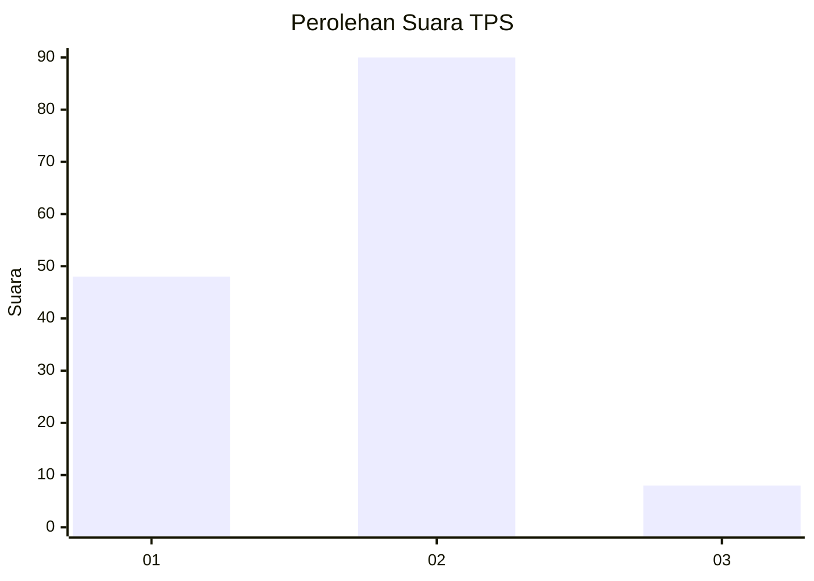
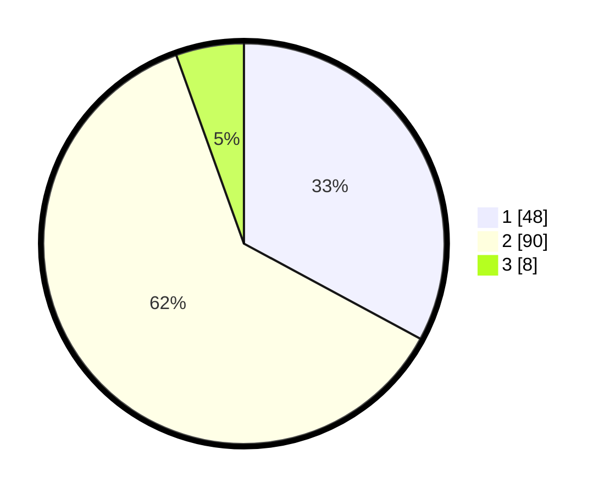

# Hasil

## Grafik

## Tabel

| No. | Nama Paslon    | Suara | Suara (raw) | Persentase |
|:--- |:-------------- | -----:| -----------:| ----------:|
| 1   | ANIES MUHAIMIN | 48    | [48][p-1]   | 32,88      |
| 2   | PRABOWO GIBRAN | 90    | [90][p-2]   | 61,64      |
| 3   | GANJAR MAHFUD  | 8     | [8][p-3]    | 5,48       |

[p-1]: https://github.com/gigit-pemilu/pemilu-2024-16-sumatera-selatan/blob/main/pilpres/hitung-suara/sub/16-sumatera-selatan/sub/13-musi-rawas-utara/sub/02-rawas-ulu/sub/1005-pasar-surulangun/sub/007-tps/sub/paslon-1.txt
[p-2]: https://github.com/gigit-pemilu/pemilu-2024-16-sumatera-selatan/blob/main/pilpres/hitung-suara/sub/16-sumatera-selatan/sub/13-musi-rawas-utara/sub/02-rawas-ulu/sub/1005-pasar-surulangun/sub/007-tps/sub/paslon-2.txt
[p-3]: https://github.com/gigit-pemilu/pemilu-2024-16-sumatera-selatan/blob/main/pilpres/hitung-suara/sub/16-sumatera-selatan/sub/13-musi-rawas-utara/sub/02-rawas-ulu/sub/1005-pasar-surulangun/sub/007-tps/sub/paslon-3.txt

## Foto C Plano

https://sirekap-obj-formc.kpu.go.id/d3c6/pemilu/ppwp/16/13/02/10/05/1613021005007-20240214-205630--6816a631-288c-4cd1-a814-abd79b4c3c29.jpg

https://sirekap-obj-formc.kpu.go.id/d3c6/pemilu/ppwp/16/13/02/10/05/1613021005007-20240215-025912--3c85c62e-093f-4203-86a2-0790461eeb7f.jpg

https://sirekap-obj-formc.kpu.go.id/d3c6/pemilu/ppwp/16/13/02/10/05/1613021005007-20240214-211754--9bdacedf-34ba-4e39-b0de-2af61c7811d9.jpg

## Metadata

| Key        | Value               |
| ---------- | ------------------- |
| Time Stamp | 2024-02-17 16:00:02 |

