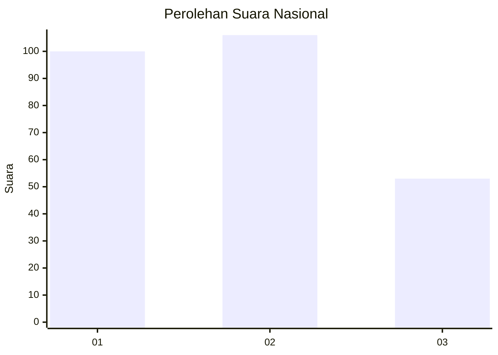
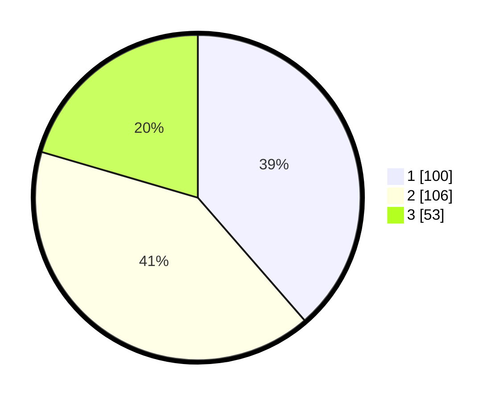

# Hasil

## Grafik

## Tabel

| No. | Nama Paslon    | Suara | Suara (raw) | Persentase |
|:--- |:-------------- | -----:| -----------:| ----------:|
| 1   | ANIES MUHAIMIN | 100   | [100][p-1]  | 38,61      |
| 2   | PRABOWO GIBRAN | 106   | [106][p-2]  | 40,93      |
| 3   | GANJAR MAHFUD  | 53    | [53][p-3]   | 20,46      |

[p-1]: https://github.com/gigit-pemilu/pemilu-2024/blob/main/pilpres/hitung-suara/sub/16-sumatera-selatan/sub/13-musi-rawas-utara/sub/02-rawas-ulu/sub/2001-pangkalan/sub/002-tps/sub/paslon-1.txt
[p-2]: https://github.com/gigit-pemilu/pemilu-2024/blob/main/pilpres/hitung-suara/sub/16-sumatera-selatan/sub/13-musi-rawas-utara/sub/02-rawas-ulu/sub/2001-pangkalan/sub/002-tps/sub/paslon-2.txt
[p-3]: https://github.com/gigit-pemilu/pemilu-2024/blob/main/pilpres/hitung-suara/sub/16-sumatera-selatan/sub/13-musi-rawas-utara/sub/02-rawas-ulu/sub/2001-pangkalan/sub/002-tps/sub/paslon-3.txt

## Foto C Plano

https://sirekap-obj-formc.kpu.go.id/b4b9/pemilu/ppwp/16/13/02/20/01/1613022001002-20240215-001722--9472282e-be29-4b60-a9a8-bfa11081809c.jpg

https://sirekap-obj-formc.kpu.go.id/b4b9/pemilu/ppwp/16/13/02/20/01/1613022001002-20240214-231544--33d0a05a-87f0-45e3-8d9d-28f631c27b52.jpg

https://sirekap-obj-formc.kpu.go.id/b4b9/pemilu/ppwp/16/13/02/20/01/1613022001002-20240215-023208--14238802-861b-44d1-a092-28e27d6ac783.jpg

## Metadata

| Key        | Value               |
| ---------- | ------------------- |
| Time Stamp | 2024-02-15 23:29:50 |

