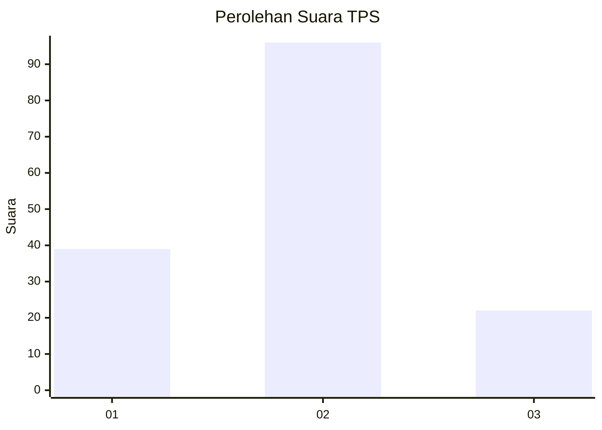
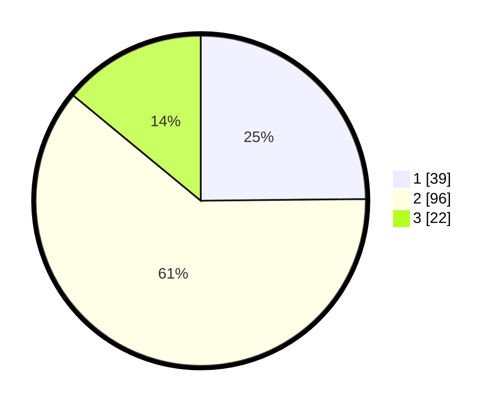

# Hasil

## Grafik

## Tabel

| No. | Nama Paslon    | Suara | Suara (raw) | Persentase |
|:--- |:-------------- | -----:| -----------:| ----------:|
| 1   | ANIES MUHAIMIN | 39    | [39][p-1]   | 24,84      |
| 2   | PRABOWO GIBRAN | 96    | [96][p-2]   | 61,15      |
| 3   | GANJAR MAHFUD  | 22    | [22][p-3]   | 14,01      |

[p-1]: https://github.com/gigit-pemilu/pemilu-2024-16-sumatera-selatan/blob/main/pilpres/hitung-suara/sub/16-sumatera-selatan/sub/13-musi-rawas-utara/sub/02-rawas-ulu/sub/2010-lesung-batu/sub/002-tps/sub/paslon-1.txt
[p-2]: https://github.com/gigit-pemilu/pemilu-2024-16-sumatera-selatan/blob/main/pilpres/hitung-suara/sub/16-sumatera-selatan/sub/13-musi-rawas-utara/sub/02-rawas-ulu/sub/2010-lesung-batu/sub/002-tps/sub/paslon-2.txt
[p-3]: https://github.com/gigit-pemilu/pemilu-2024-16-sumatera-selatan/blob/main/pilpres/hitung-suara/sub/16-sumatera-selatan/sub/13-musi-rawas-utara/sub/02-rawas-ulu/sub/2010-lesung-batu/sub/002-tps/sub/paslon-3.txt

## Foto C Plano

https://sirekap-obj-formc.kpu.go.id/1d0f/pemilu/ppwp/16/13/02/20/10/1613022010002-20240214-235002--b97805ee-891b-46fc-8789-a114757b49ff.jpg

https://sirekap-obj-formc.kpu.go.id/1d0f/pemilu/ppwp/16/13/02/20/10/1613022010002-20240214-235448--92ecd981-025a-41c0-b57d-6fa35c48445d.jpg

https://sirekap-obj-formc.kpu.go.id/1d0f/pemilu/ppwp/16/13/02/20/10/1613022010002-20240215-003225--379c1861-88f0-4be3-9117-0bac1d2a3e89.jpg

## Metadata

| Key        | Value               |
| ---------- | ------------------- |
| Time Stamp | 2024-02-16 16:25:10 |

