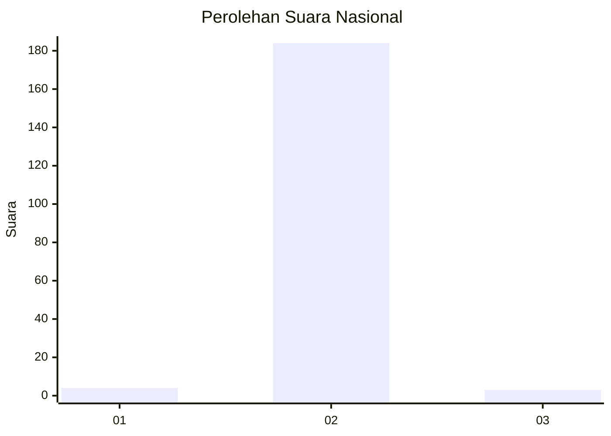
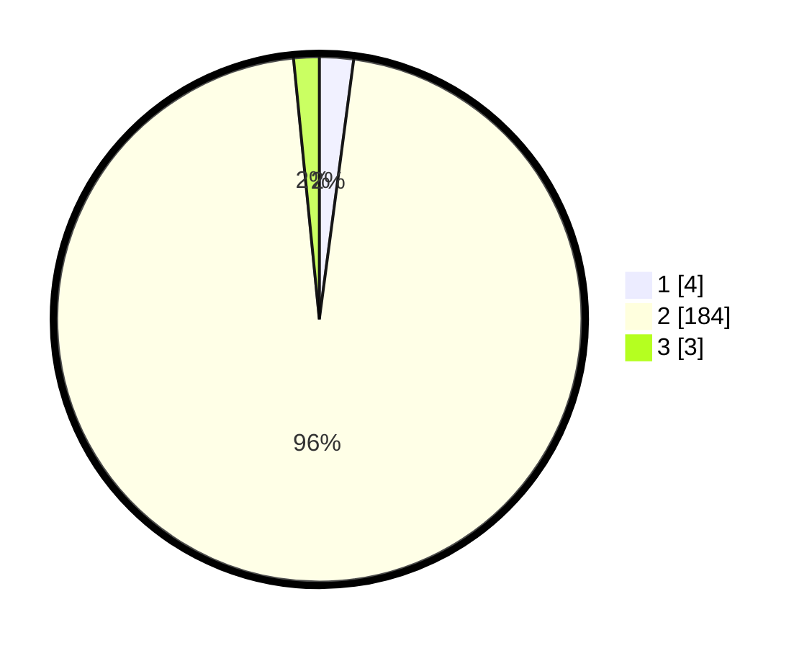

# Hasil

## Grafik

## Tabel

| No. | Nama Paslon    | Suara | Suara (raw) | Persentase |
|:--- |:-------------- | -----:| -----------:| ----------:|
| 1   | ANIES MUHAIMIN | 4     | [4][p-1]    | 2,09       |
| 2   | PRABOWO GIBRAN | 184   | [184][p-2]  | 96,34      |
| 3   | GANJAR MAHFUD  | 3     | [3][p-3]    | 1,57       |

[p-1]: https://github.com/gigit-pemilu/pemilu-2024/blob/main/pilpres/hitung-suara/sub/16-sumatera-selatan/sub/13-musi-rawas-utara/sub/02-rawas-ulu/sub/2015-lubuk-mas/sub/001-tps/sub/paslon-1.txt
[p-2]: https://github.com/gigit-pemilu/pemilu-2024/blob/main/pilpres/hitung-suara/sub/16-sumatera-selatan/sub/13-musi-rawas-utara/sub/02-rawas-ulu/sub/2015-lubuk-mas/sub/001-tps/sub/paslon-2.txt
[p-3]: https://github.com/gigit-pemilu/pemilu-2024/blob/main/pilpres/hitung-suara/sub/16-sumatera-selatan/sub/13-musi-rawas-utara/sub/02-rawas-ulu/sub/2015-lubuk-mas/sub/001-tps/sub/paslon-3.txt

## Foto C Plano

https://sirekap-obj-formc.kpu.go.id/0226/pemilu/ppwp/16/13/02/20/15/1613022015001-20240215-204124--6f52b5c9-4471-4042-ace5-c468e55b3029.jpg

https://sirekap-obj-formc.kpu.go.id/0226/pemilu/ppwp/16/13/02/20/15/1613022015001-20240215-070935--de9e8e0d-a246-4806-9929-8753d7e546e0.jpg

https://sirekap-obj-formc.kpu.go.id/0226/pemilu/ppwp/16/13/02/20/15/1613022015001-20240215-070955--2f5e2d17-5af5-4138-960e-c7b65686a07e.jpg

## Metadata

| Key        | Value               |
| ---------- | ------------------- |
| Time Stamp | 2024-02-16 10:30:29 |

