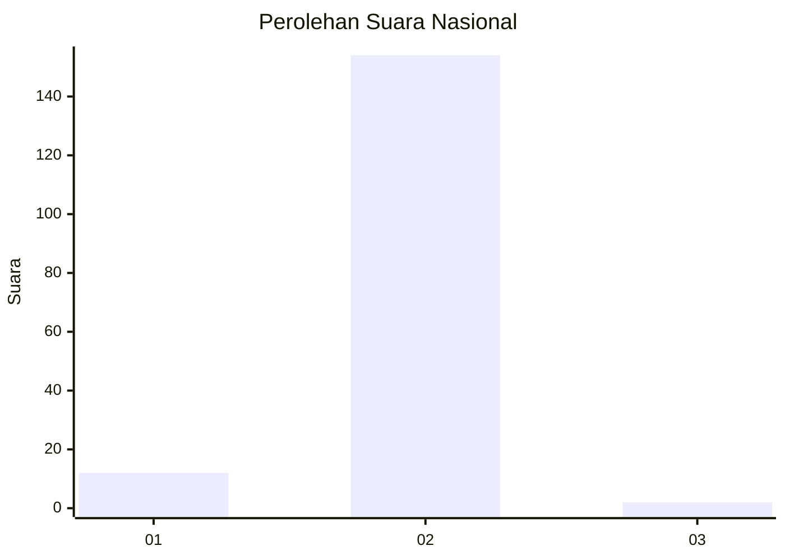
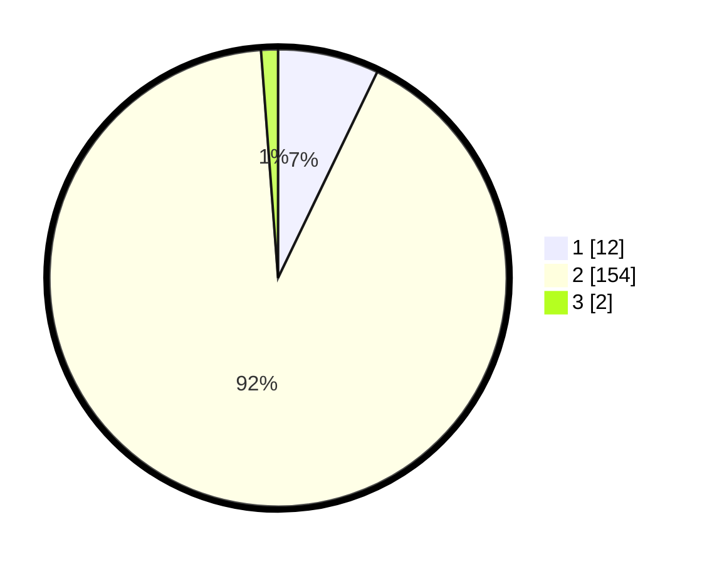

# Hasil

## Grafik

## Tabel

| No. | Nama Paslon    | Suara | Suara (raw) | Persentase |
|:--- |:-------------- | -----:| -----------:| ----------:|
| 1   | ANIES MUHAIMIN | 12    | [12][p-1]   | 7,14       |
| 2   | PRABOWO GIBRAN | 154   | [154][p-2]  | 91,67      |
| 3   | GANJAR MAHFUD  | 2     | [2][p-3]    | 1,19       |

[p-1]: https://github.com/gigit-pemilu/pemilu-2024/blob/main/pilpres/hitung-suara/sub/16-sumatera-selatan/sub/13-musi-rawas-utara/sub/02-rawas-ulu/sub/2015-lubuk-mas/sub/002-tps/sub/paslon-1.txt
[p-2]: https://github.com/gigit-pemilu/pemilu-2024/blob/main/pilpres/hitung-suara/sub/16-sumatera-selatan/sub/13-musi-rawas-utara/sub/02-rawas-ulu/sub/2015-lubuk-mas/sub/002-tps/sub/paslon-2.txt
[p-3]: https://github.com/gigit-pemilu/pemilu-2024/blob/main/pilpres/hitung-suara/sub/16-sumatera-selatan/sub/13-musi-rawas-utara/sub/02-rawas-ulu/sub/2015-lubuk-mas/sub/002-tps/sub/paslon-3.txt

## Foto C Plano

https://sirekap-obj-formc.kpu.go.id/f796/pemilu/ppwp/16/13/02/20/15/1613022015002-20240215-070152--b06700eb-ebda-4504-85b2-8a1b58e020b8.jpg

https://sirekap-obj-formc.kpu.go.id/f796/pemilu/ppwp/16/13/02/20/15/1613022015002-20240215-070527--eefaa8a9-0f3f-4eb5-b703-3ec3fb18544c.jpg

https://sirekap-obj-formc.kpu.go.id/f796/pemilu/ppwp/16/13/02/20/15/1613022015002-20240215-070749--55b197c2-a9ac-467c-8ac1-32b1bd41f0aa.jpg

## Metadata

| Key        | Value               |
| ---------- | ------------------- |
| Time Stamp | 2024-02-16 16:25:10 |

