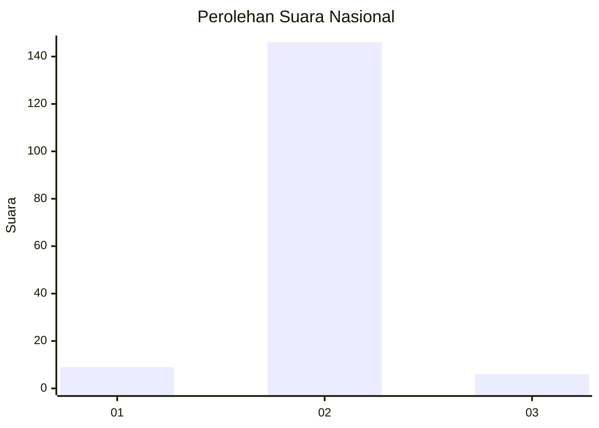
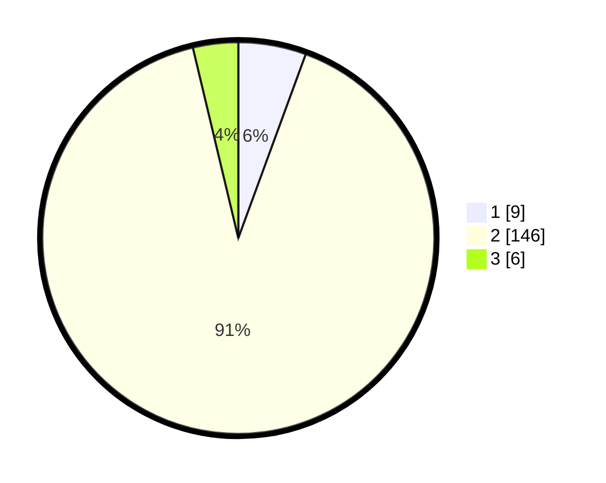

# Hasil

## Grafik

## Tabel

| No. | Nama Paslon    | Suara | Suara (raw) | Persentase |
|:--- |:-------------- | -----:| -----------:| ----------:|
| 1   | ANIES MUHAIMIN | 9     | [9][p-1]    | 5,59       |
| 2   | PRABOWO GIBRAN | 146   | [146][p-2]  | 90,68      |
| 3   | GANJAR MAHFUD  | 6     | [6][p-3]    | 3,73       |

[p-1]: https://github.com/gigit-pemilu/pemilu-2024/blob/main/pilpres/hitung-suara/sub/16-sumatera-selatan/sub/13-musi-rawas-utara/sub/02-rawas-ulu/sub/2015-lubuk-mas/sub/003-tps/sub/paslon-1.txt
[p-2]: https://github.com/gigit-pemilu/pemilu-2024/blob/main/pilpres/hitung-suara/sub/16-sumatera-selatan/sub/13-musi-rawas-utara/sub/02-rawas-ulu/sub/2015-lubuk-mas/sub/003-tps/sub/paslon-2.txt
[p-3]: https://github.com/gigit-pemilu/pemilu-2024/blob/main/pilpres/hitung-suara/sub/16-sumatera-selatan/sub/13-musi-rawas-utara/sub/02-rawas-ulu/sub/2015-lubuk-mas/sub/003-tps/sub/paslon-3.txt

## Foto C Plano

https://sirekap-obj-formc.kpu.go.id/5ddd/pemilu/ppwp/16/13/02/20/15/1613022015003-20240215-021848--aca10675-e5bc-4f12-abca-4d622c2868b9.jpg

https://sirekap-obj-formc.kpu.go.id/5ddd/pemilu/ppwp/16/13/02/20/15/1613022015003-20240215-022115--0d2d4507-ebba-4462-86bf-b3f5e7355384.jpg

https://sirekap-obj-formc.kpu.go.id/5ddd/pemilu/ppwp/16/13/02/20/15/1613022015003-20240215-022242--32bc2fd0-d2da-4d70-8a7b-6a160992048c.jpg

## Metadata

| Key        | Value               |
| ---------- | ------------------- |
| Time Stamp | 2024-02-15 23:29:50 |

