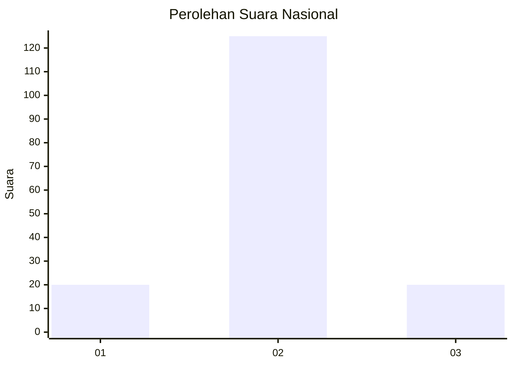
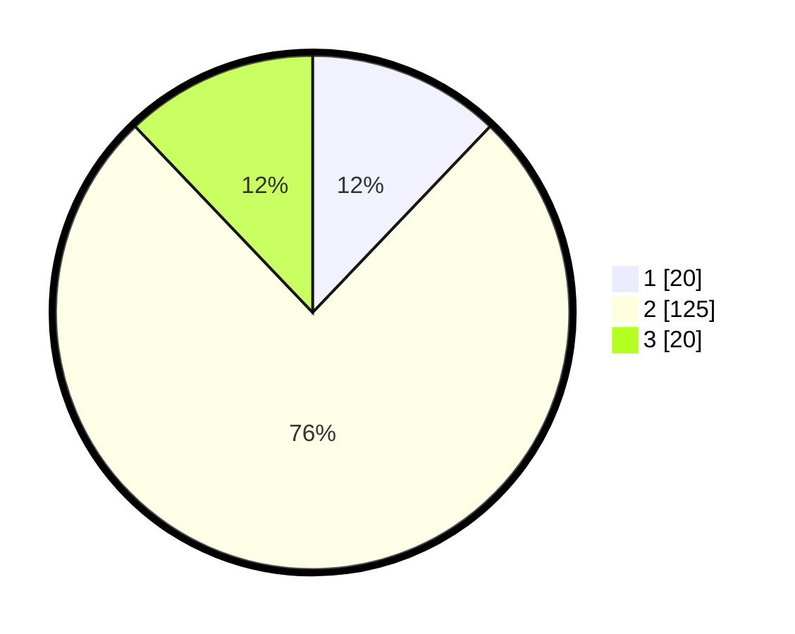

# Hasil

## Grafik

## Tabel

| No. | Nama Paslon    | Suara | Suara (raw) | Persentase |
|:--- |:-------------- | -----:| -----------:| ----------:|
| 1   | ANIES MUHAIMIN | 20    | [20][p-1]   | 12,12      |
| 2   | PRABOWO GIBRAN | 125   | [125][p-2]  | 75,76      |
| 3   | GANJAR MAHFUD  | 20    | [20][p-3]   | 12,12      |

[p-1]: https://github.com/gigit-pemilu/pemilu-2024/blob/main/pilpres/hitung-suara/sub/16-sumatera-selatan/sub/13-musi-rawas-utara/sub/03-nibung/sub/1003-karya-makmur/sub/005-tps/sub/paslon-1.txt
[p-2]: https://github.com/gigit-pemilu/pemilu-2024/blob/main/pilpres/hitung-suara/sub/16-sumatera-selatan/sub/13-musi-rawas-utara/sub/03-nibung/sub/1003-karya-makmur/sub/005-tps/sub/paslon-2.txt
[p-3]: https://github.com/gigit-pemilu/pemilu-2024/blob/main/pilpres/hitung-suara/sub/16-sumatera-selatan/sub/13-musi-rawas-utara/sub/03-nibung/sub/1003-karya-makmur/sub/005-tps/sub/paslon-3.txt

## Foto C Plano

https://sirekap-obj-formc.kpu.go.id/4505/pemilu/ppwp/16/13/03/10/03/1613031003005-20240215-042208--91a4bdc1-769e-45a0-b148-869694e2aab3.jpg

https://sirekap-obj-formc.kpu.go.id/4505/pemilu/ppwp/16/13/03/10/03/1613031003005-20240215-042212--1ae0a857-445b-4674-8941-4843f49241b5.jpg

https://sirekap-obj-formc.kpu.go.id/4505/pemilu/ppwp/16/13/03/10/03/1613031003005-20240215-042215--26d17782-62f2-4d1b-9f55-672a57c0a551.jpg

## Metadata

| Key        | Value               |
| ---------- | ------------------- |
| Time Stamp | 2024-02-15 21:30:27 |

