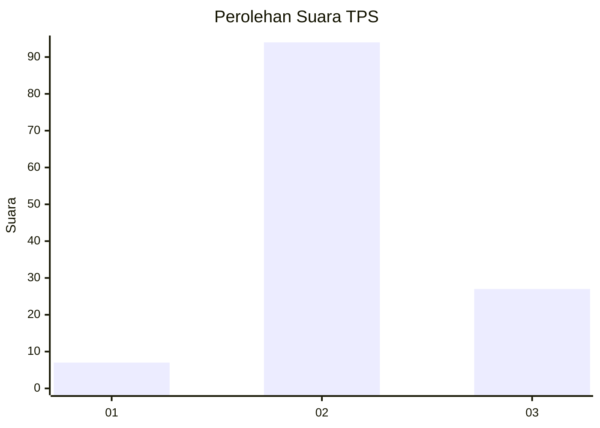

# Hasil

## Grafik

## Tabel

| No. | Nama Paslon    | Suara | Suara (raw) | Persentase |
|:--- |:-------------- | -----:| -----------:| ----------:|
| 1   | ANIES MUHAIMIN | 7     | [7][p-1]    | 5,47       |
| 2   | PRABOWO GIBRAN | 94    | [94][p-2]   | 73,44      |
| 3   | GANJAR MAHFUD  | 27    | [27][p-3]   | 21,09      |

[p-1]: https://github.com/gigit-pemilu/pemilu-2024-16-sumatera-selatan/blob/main/pilpres/hitung-suara/sub/16-sumatera-selatan/sub/13-musi-rawas-utara/sub/03-nibung/sub/1003-karya-makmur/sub/010-tps/sub/paslon-1.txt
[p-2]: https://github.com/gigit-pemilu/pemilu-2024-16-sumatera-selatan/blob/main/pilpres/hitung-suara/sub/16-sumatera-selatan/sub/13-musi-rawas-utara/sub/03-nibung/sub/1003-karya-makmur/sub/010-tps/sub/paslon-2.txt
[p-3]: https://github.com/gigit-pemilu/pemilu-2024-16-sumatera-selatan/blob/main/pilpres/hitung-suara/sub/16-sumatera-selatan/sub/13-musi-rawas-utara/sub/03-nibung/sub/1003-karya-makmur/sub/010-tps/sub/paslon-3.txt

## Foto C Plano

https://sirekap-obj-formc.kpu.go.id/df15/pemilu/ppwp/16/13/03/10/03/1613031003010-20240215-003013--f0ec6c91-31c3-4597-a7d4-1e8c3f0db9cd.jpg

https://sirekap-obj-formc.kpu.go.id/df15/pemilu/ppwp/16/13/03/10/03/1613031003010-20240215-021844--b6829626-3d72-4daf-89bd-5dc59e17b552.jpg

https://sirekap-obj-formc.kpu.go.id/df15/pemilu/ppwp/16/13/03/10/03/1613031003010-20240215-022323--8ec269d6-942a-4444-8a1f-f903fce63bc9.jpg

## Metadata

| Key        | Value               |
| ---------- | ------------------- |
| Time Stamp | 2024-02-15 15:00:29 |

