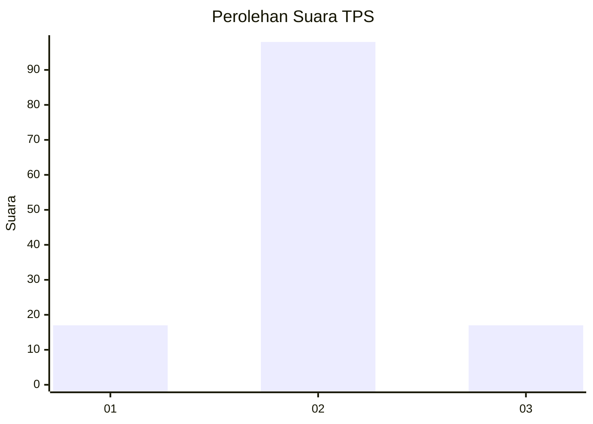
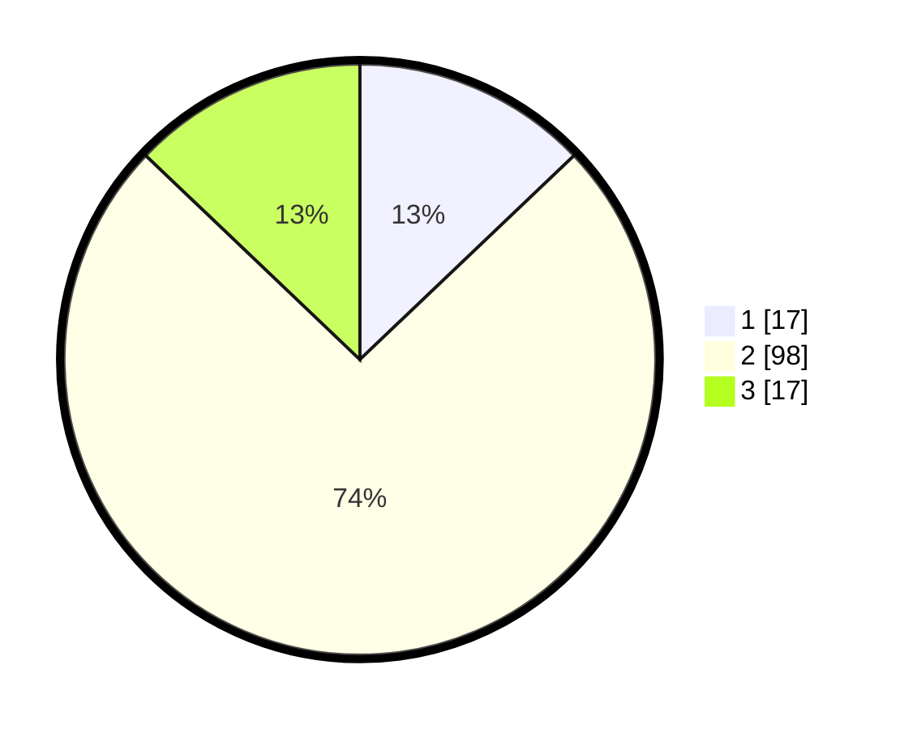

# Hasil

## Grafik

## Tabel

| No. | Nama Paslon    | Suara | Suara (raw) | Persentase |
|:--- |:-------------- | -----:| -----------:| ----------:|
| 1   | ANIES MUHAIMIN | 17    | [17][p-1]   | 12,88      |
| 2   | PRABOWO GIBRAN | 98    | [98][p-2]   | 74,24      |
| 3   | GANJAR MAHFUD  | 17    | [17][p-3]   | 12,88      |

[p-1]: https://github.com/gigit-pemilu/pemilu-2024-16-sumatera-selatan/blob/main/pilpres/hitung-suara/sub/16-sumatera-selatan/sub/13-musi-rawas-utara/sub/04-rawas-ilir/sub/2002-batu-kucing/sub/005-tps/sub/paslon-1.txt
[p-2]: https://github.com/gigit-pemilu/pemilu-2024-16-sumatera-selatan/blob/main/pilpres/hitung-suara/sub/16-sumatera-selatan/sub/13-musi-rawas-utara/sub/04-rawas-ilir/sub/2002-batu-kucing/sub/005-tps/sub/paslon-2.txt
[p-3]: https://github.com/gigit-pemilu/pemilu-2024-16-sumatera-selatan/blob/main/pilpres/hitung-suara/sub/16-sumatera-selatan/sub/13-musi-rawas-utara/sub/04-rawas-ilir/sub/2002-batu-kucing/sub/005-tps/sub/paslon-3.txt

## Foto C Plano

https://sirekap-obj-formc.kpu.go.id/40f3/pemilu/ppwp/16/13/04/20/02/1613042002005-20240220-174801--bb652022-2d07-43e9-9362-1f11c256541a.jpg

https://sirekap-obj-formc.kpu.go.id/40f3/pemilu/ppwp/16/13/04/20/02/1613042002005-20240220-174936--6ff88ea8-e1a3-43b8-83f6-0ae2fa49d696.jpg

https://sirekap-obj-formc.kpu.go.id/40f3/pemilu/ppwp/16/13/04/20/02/1613042002005-20240220-175107--382277c6-b841-46b9-800a-a0f7680a4960.jpg

## Metadata

| Key        | Value               |
| ---------- | ------------------- |
| Time Stamp | 2024-02-24 23:00:00 |

