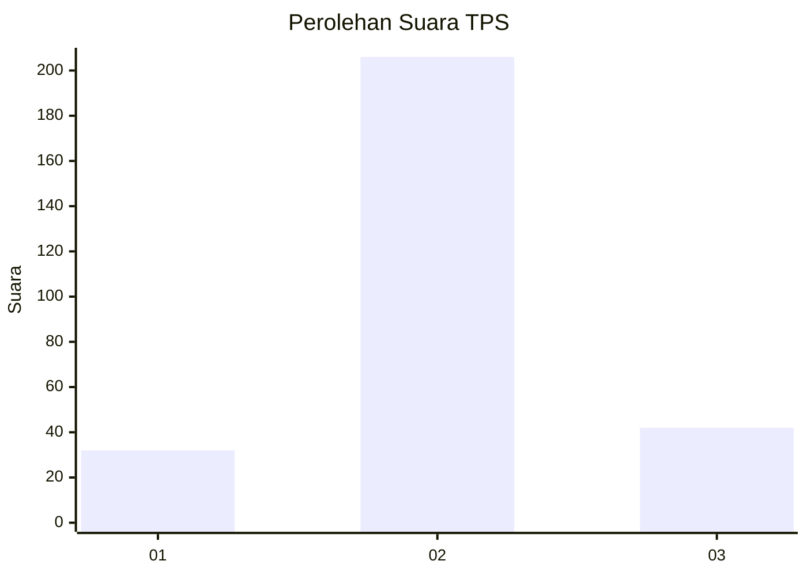
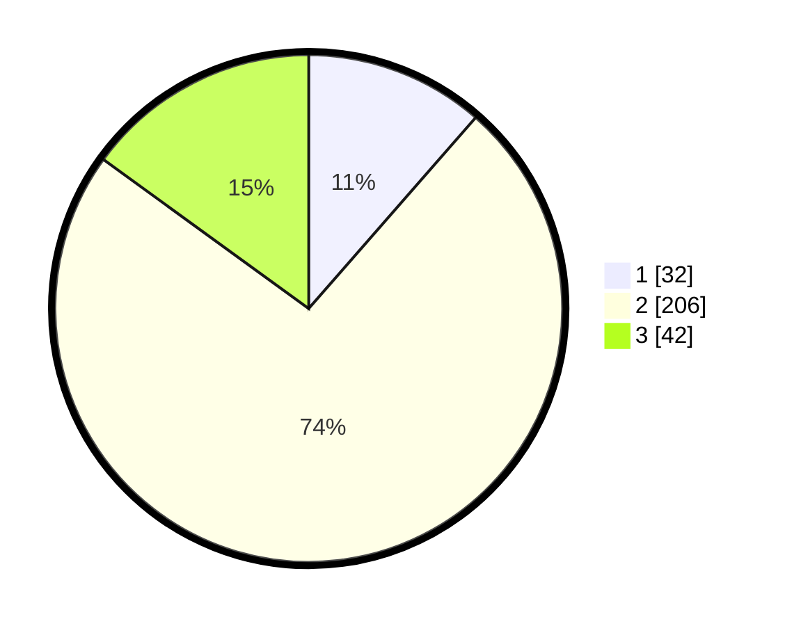

# Hasil

## Grafik

## Tabel

| No. | Nama Paslon    | Suara | Suara (raw) | Persentase |
|:--- |:-------------- | -----:| -----------:| ----------:|
| 1   | ANIES MUHAIMIN | 32    | [32][p-1]   | 11,43      |
| 2   | PRABOWO GIBRAN | 206   | [206][p-2]  | 73,57      |
| 3   | GANJAR MAHFUD  | 42    | [42][p-3]   | 15,00      |

[p-1]: https://github.com/gigit-pemilu/pemilu-2024-16-sumatera-selatan/blob/main/pilpres/hitung-suara/sub/16-sumatera-selatan/sub/13-musi-rawas-utara/sub/04-rawas-ilir/sub/2004-tanjung-raja/sub/005-tps/sub/paslon-1.txt
[p-2]: https://github.com/gigit-pemilu/pemilu-2024-16-sumatera-selatan/blob/main/pilpres/hitung-suara/sub/16-sumatera-selatan/sub/13-musi-rawas-utara/sub/04-rawas-ilir/sub/2004-tanjung-raja/sub/005-tps/sub/paslon-2.txt
[p-3]: https://github.com/gigit-pemilu/pemilu-2024-16-sumatera-selatan/blob/main/pilpres/hitung-suara/sub/16-sumatera-selatan/sub/13-musi-rawas-utara/sub/04-rawas-ilir/sub/2004-tanjung-raja/sub/005-tps/sub/paslon-3.txt

## Foto C Plano

https://sirekap-obj-formc.kpu.go.id/e3c8/pemilu/ppwp/16/13/04/20/04/1613042004005-20240215-044438--3dc2ceb4-0b2e-43d0-a892-43290178d1a3.jpg

https://sirekap-obj-formc.kpu.go.id/e3c8/pemilu/ppwp/16/13/04/20/04/1613042004005-20240215-044850--78ae0615-c3e4-4bc7-a1b8-02ede8af6ebe.jpg

https://sirekap-obj-formc.kpu.go.id/e3c8/pemilu/ppwp/16/13/04/20/04/1613042004005-20240215-044955--260a9bfc-1d13-4bc5-8cc1-5232d632de47.jpg

## Metadata

| Key        | Value               |
| ---------- | ------------------- |
| Time Stamp | 2024-02-15 15:00:29 |

