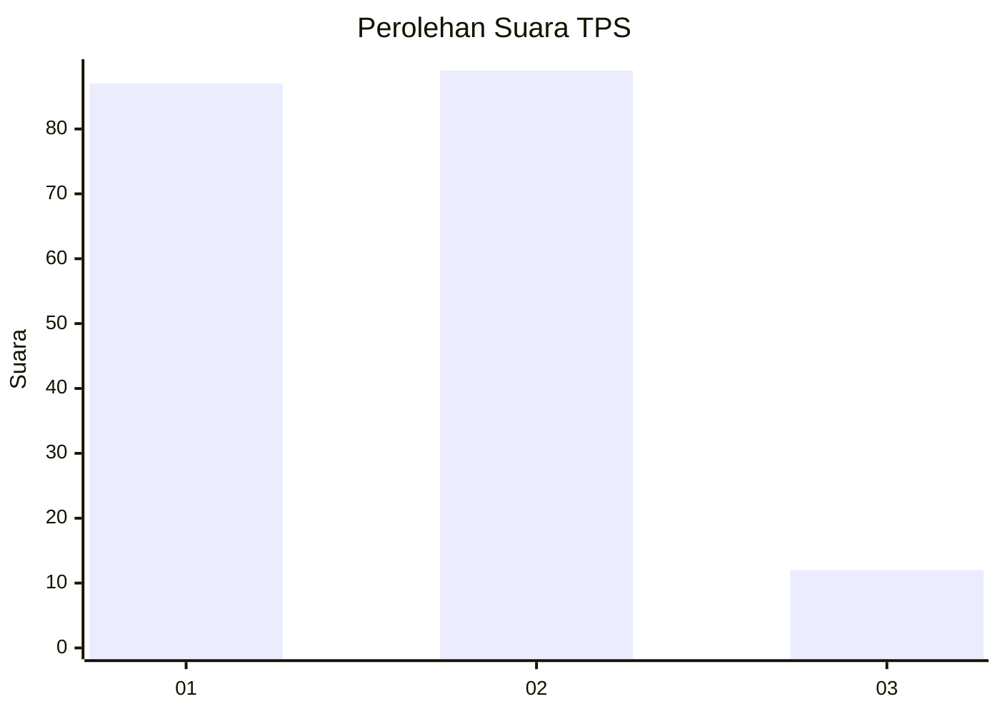
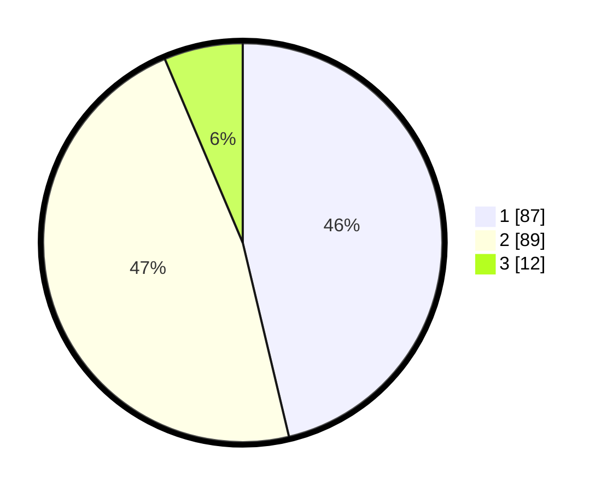

# Hasil

## Grafik

## Tabel

| No. | Nama Paslon    | Suara | Suara (raw) | Persentase |
|:--- |:-------------- | -----:| -----------:| ----------:|
| 1   | ANIES MUHAIMIN | 87    | [87][p-1]   | 46,28      |
| 2   | PRABOWO GIBRAN | 89    | [89][p-2]   | 47,34      |
| 3   | GANJAR MAHFUD  | 12    | [12][p-3]   | 6,38       |

[p-1]: https://github.com/gigit-pemilu/pemilu-2024-16-sumatera-selatan/blob/main/pilpres/hitung-suara/sub/16-sumatera-selatan/sub/13-musi-rawas-utara/sub/04-rawas-ilir/sub/2006-mandi-angin/sub/001-tps/sub/paslon-1.txt
[p-2]: https://github.com/gigit-pemilu/pemilu-2024-16-sumatera-selatan/blob/main/pilpres/hitung-suara/sub/16-sumatera-selatan/sub/13-musi-rawas-utara/sub/04-rawas-ilir/sub/2006-mandi-angin/sub/001-tps/sub/paslon-2.txt
[p-3]: https://github.com/gigit-pemilu/pemilu-2024-16-sumatera-selatan/blob/main/pilpres/hitung-suara/sub/16-sumatera-selatan/sub/13-musi-rawas-utara/sub/04-rawas-ilir/sub/2006-mandi-angin/sub/001-tps/sub/paslon-3.txt

## Foto C Plano

https://sirekap-obj-formc.kpu.go.id/4c59/pemilu/ppwp/16/13/04/20/06/1613042006001-20240215-094906--6fcfc74f-c965-4636-bcfa-c2ccd40bea82.jpg

https://sirekap-obj-formc.kpu.go.id/4c59/pemilu/ppwp/16/13/04/20/06/1613042006001-20240215-203139--34f23dba-f17f-46ef-8dfe-962a5106c940.jpg

https://sirekap-obj-formc.kpu.go.id/4c59/pemilu/ppwp/16/13/04/20/06/1613042006001-20240215-020249--d698ae01-08ff-4cfe-b4b1-3e6f5ec6cfc4.jpg

## Metadata

| Key        | Value               |
| ---------- | ------------------- |
| Time Stamp | 2024-02-16 00:30:27 |

