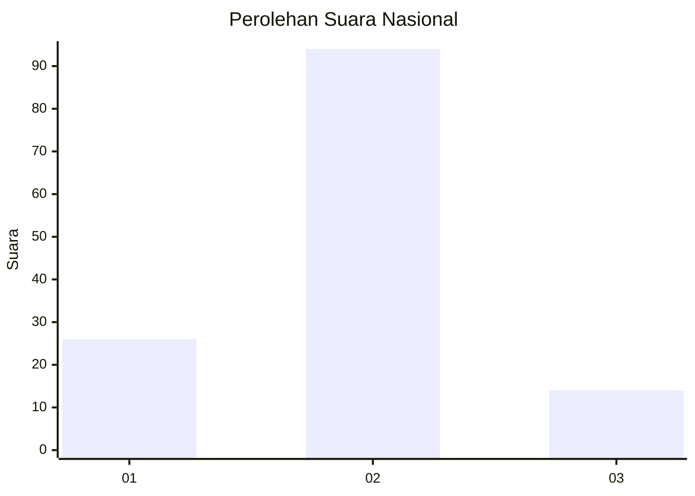
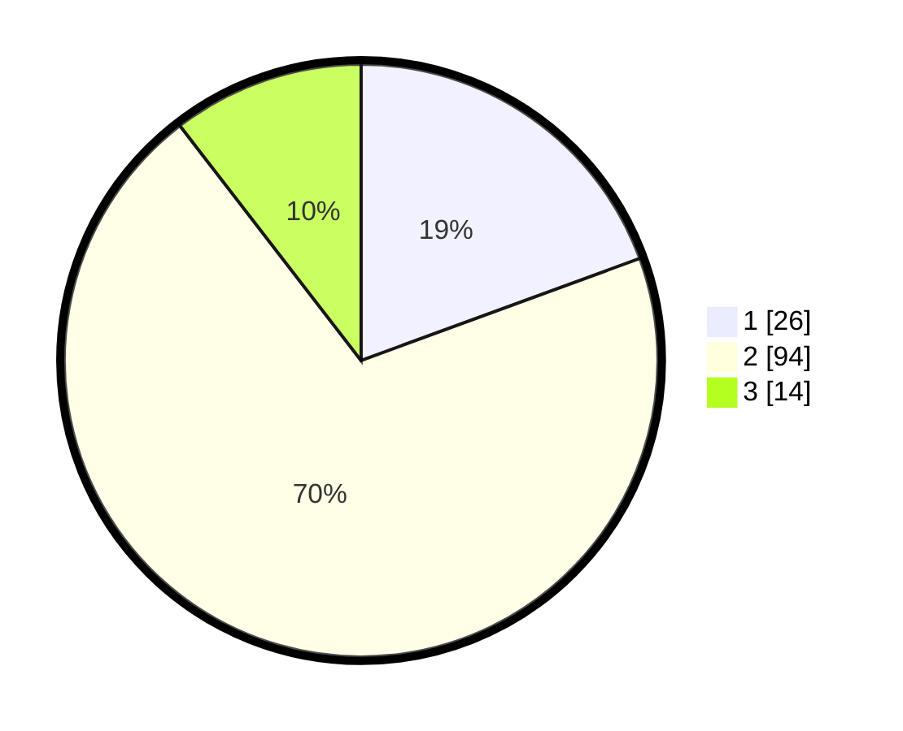

# Hasil

## Grafik

## Tabel

| No. | Nama Paslon    | Suara | Suara (raw) | Persentase |
|:--- |:-------------- | -----:| -----------:| ----------:|
| 1   | ANIES MUHAIMIN | 26    | [26][p-1]   | 19,40      |
| 2   | PRABOWO GIBRAN | 94    | [94][p-2]   | 70,15      |
| 3   | GANJAR MAHFUD  | 14    | [14][p-3]   | 10,45      |

[p-1]: https://github.com/gigit-pemilu/pemilu-2024/blob/main/pilpres/hitung-suara/sub/16-sumatera-selatan/sub/13-musi-rawas-utara/sub/05-karang-dapo/sub/1004-karang-dapo/sub/007-tps/sub/paslon-1.txt
[p-2]: https://github.com/gigit-pemilu/pemilu-2024/blob/main/pilpres/hitung-suara/sub/16-sumatera-selatan/sub/13-musi-rawas-utara/sub/05-karang-dapo/sub/1004-karang-dapo/sub/007-tps/sub/paslon-2.txt
[p-3]: https://github.com/gigit-pemilu/pemilu-2024/blob/main/pilpres/hitung-suara/sub/16-sumatera-selatan/sub/13-musi-rawas-utara/sub/05-karang-dapo/sub/1004-karang-dapo/sub/007-tps/sub/paslon-3.txt

## Foto C Plano

https://sirekap-obj-formc.kpu.go.id/b06e/pemilu/ppwp/16/13/05/10/04/1613051004007-20240214-223523--b75f6513-e4f3-4a26-867d-734b942b2f7c.jpg

https://sirekap-obj-formc.kpu.go.id/b06e/pemilu/ppwp/16/13/05/10/04/1613051004007-20240214-223536--fc80a7df-ab2a-49d8-bfd4-36707fad4fb4.jpg

https://sirekap-obj-formc.kpu.go.id/b06e/pemilu/ppwp/16/13/05/10/04/1613051004007-20240214-223543--9330aab4-7a0a-4209-bc7d-a59becbd0ead.jpg

## Metadata

| Key        | Value               |
| ---------- | ------------------- |
| Time Stamp | 2024-02-15 23:29:50 |

