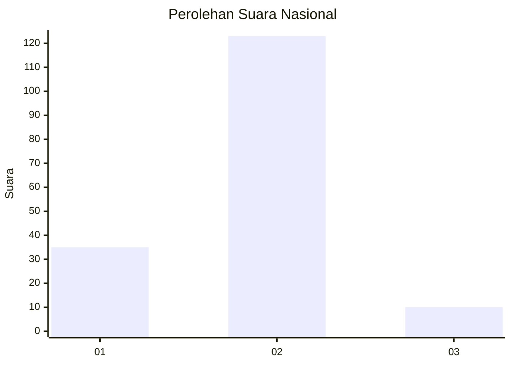

# Hasil

## Grafik

## Tabel

| No. | Nama Paslon    | Suara | Suara (raw) | Persentase |
|:--- |:-------------- | -----:| -----------:| ----------:|
| 1   | ANIES MUHAIMIN | 35    | [35][p-1]   | 20,83      |
| 2   | PRABOWO GIBRAN | 123   | [123][p-2]  | 73,21      |
| 3   | GANJAR MAHFUD  | 10    | [10][p-3]   | 5,95       |

[p-1]: https://github.com/gigit-pemilu/pemilu-2024/blob/main/pilpres/hitung-suara/sub/16-sumatera-selatan/sub/13-musi-rawas-utara/sub/05-karang-dapo/sub/2005-rantau-kadam/sub/002-tps/sub/paslon-1.txt
[p-2]: https://github.com/gigit-pemilu/pemilu-2024/blob/main/pilpres/hitung-suara/sub/16-sumatera-selatan/sub/13-musi-rawas-utara/sub/05-karang-dapo/sub/2005-rantau-kadam/sub/002-tps/sub/paslon-2.txt
[p-3]: https://github.com/gigit-pemilu/pemilu-2024/blob/main/pilpres/hitung-suara/sub/16-sumatera-selatan/sub/13-musi-rawas-utara/sub/05-karang-dapo/sub/2005-rantau-kadam/sub/002-tps/sub/paslon-3.txt

## Foto C Plano

https://sirekap-obj-formc.kpu.go.id/b8f4/pemilu/ppwp/16/13/05/20/05/1613052005002-20240221-125205--056c4e4a-9540-4c10-87e9-b7caaf76eb83.jpg

https://sirekap-obj-formc.kpu.go.id/b8f4/pemilu/ppwp/16/13/05/20/05/1613052005002-20240221-125342--b8b9c12b-219f-4b6f-9ceb-8a8488f5f474.jpg

https://sirekap-obj-formc.kpu.go.id/b8f4/pemilu/ppwp/16/13/05/20/05/1613052005002-20240221-125502--a9a7521e-5267-462c-b3db-e61d82d4614f.jpg

## Metadata

| Key        | Value               |
| ---------- | ------------------- |
| Time Stamp | 2024-02-22 12:00:00 |

