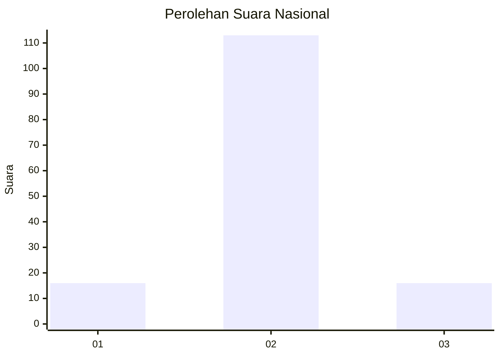
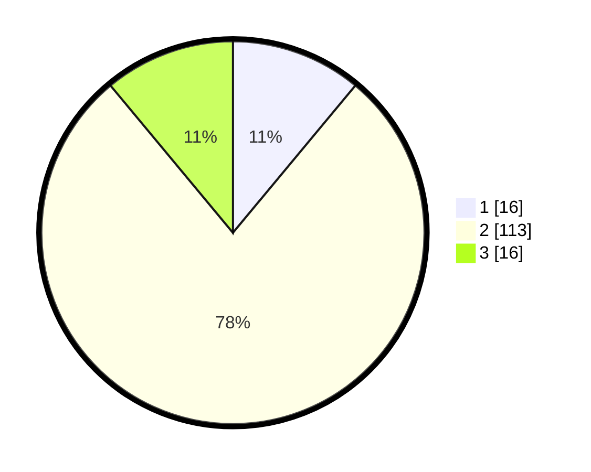

# Hasil

## Grafik

## Tabel

| No. | Nama Paslon    | Suara | Suara (raw) | Persentase |
|:--- |:-------------- | -----:| -----------:| ----------:|
| 1   | ANIES MUHAIMIN | 16    | [16][p-1]   | 11,03      |
| 2   | PRABOWO GIBRAN | 113   | [113][p-2]  | 77,93      |
| 3   | GANJAR MAHFUD  | 16    | [16][p-3]   | 11,03      |

[p-1]: https://github.com/gigit-pemilu/pemilu-2024/blob/main/pilpres/hitung-suara/sub/16-sumatera-selatan/sub/13-musi-rawas-utara/sub/05-karang-dapo/sub/2005-rantau-kadam/sub/005-tps/sub/paslon-1.txt
[p-2]: https://github.com/gigit-pemilu/pemilu-2024/blob/main/pilpres/hitung-suara/sub/16-sumatera-selatan/sub/13-musi-rawas-utara/sub/05-karang-dapo/sub/2005-rantau-kadam/sub/005-tps/sub/paslon-2.txt
[p-3]: https://github.com/gigit-pemilu/pemilu-2024/blob/main/pilpres/hitung-suara/sub/16-sumatera-selatan/sub/13-musi-rawas-utara/sub/05-karang-dapo/sub/2005-rantau-kadam/sub/005-tps/sub/paslon-3.txt

## Foto C Plano

https://sirekap-obj-formc.kpu.go.id/6ffa/pemilu/ppwp/16/13/05/20/05/1613052005005-20240214-221119--f6b94bce-04a6-4eeb-b9d4-b8c78b5561df.jpg

https://sirekap-obj-formc.kpu.go.id/6ffa/pemilu/ppwp/16/13/05/20/05/1613052005005-20240214-221242--e2e42a8b-baac-422c-98b7-e64e304724a4.jpg

https://sirekap-obj-formc.kpu.go.id/6ffa/pemilu/ppwp/16/13/05/20/05/1613052005005-20240214-221456--9d36e047-5ee7-460e-8638-0037eb6c8fba.jpg

## Metadata

| Key        | Value               |
| ---------- | ------------------- |
| Time Stamp | 2024-02-15 23:29:50 |

