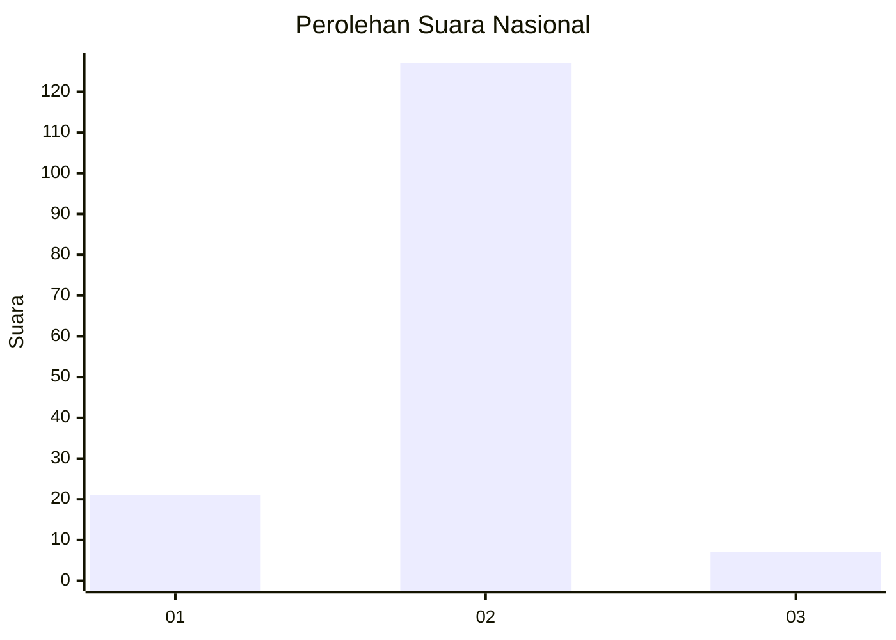
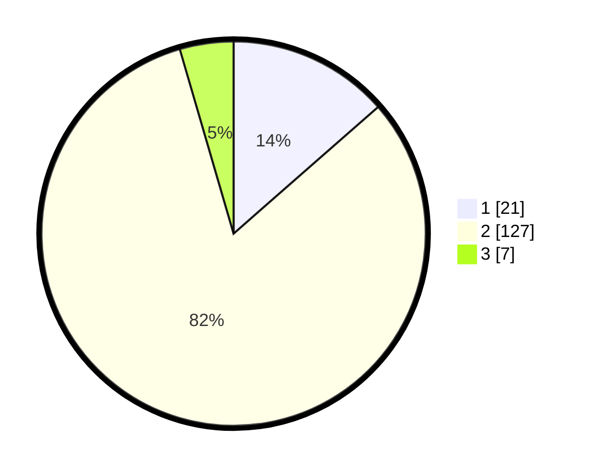

# Hasil

## Grafik

## Tabel

| No. | Nama Paslon    | Suara | Suara (raw) | Persentase |
|:--- |:-------------- | -----:| -----------:| ----------:|
| 1   | ANIES MUHAIMIN | 21    | [21][p-1]   | 13,55      |
| 2   | PRABOWO GIBRAN | 127   | [127][p-2]  | 81,94      |
| 3   | GANJAR MAHFUD  | 7     | [7][p-3]    | 4,52       |

[p-1]: https://github.com/gigit-pemilu/pemilu-2024/blob/main/pilpres/hitung-suara/sub/16-sumatera-selatan/sub/13-musi-rawas-utara/sub/05-karang-dapo/sub/2005-rantau-kadam/sub/006-tps/sub/paslon-1.txt
[p-2]: https://github.com/gigit-pemilu/pemilu-2024/blob/main/pilpres/hitung-suara/sub/16-sumatera-selatan/sub/13-musi-rawas-utara/sub/05-karang-dapo/sub/2005-rantau-kadam/sub/006-tps/sub/paslon-2.txt
[p-3]: https://github.com/gigit-pemilu/pemilu-2024/blob/main/pilpres/hitung-suara/sub/16-sumatera-selatan/sub/13-musi-rawas-utara/sub/05-karang-dapo/sub/2005-rantau-kadam/sub/006-tps/sub/paslon-3.txt

## Foto C Plano

https://sirekap-obj-formc.kpu.go.id/7b04/pemilu/ppwp/16/13/05/20/05/1613052005006-20240214-203445--f59c2a67-aa9e-4ce8-9e79-4c466781dda6.jpg

https://sirekap-obj-formc.kpu.go.id/7b04/pemilu/ppwp/16/13/05/20/05/1613052005006-20240214-203515--a1c843e0-eb55-4bf8-ae2a-e0e0bbd52acf.jpg

https://sirekap-obj-formc.kpu.go.id/7b04/pemilu/ppwp/16/13/05/20/05/1613052005006-20240214-203532--aaabd63d-f82b-4725-b179-e952a6c52ba9.jpg

## Metadata

| Key        | Value               |
| ---------- | ------------------- |
| Time Stamp | 2024-02-16 14:30:33 |

