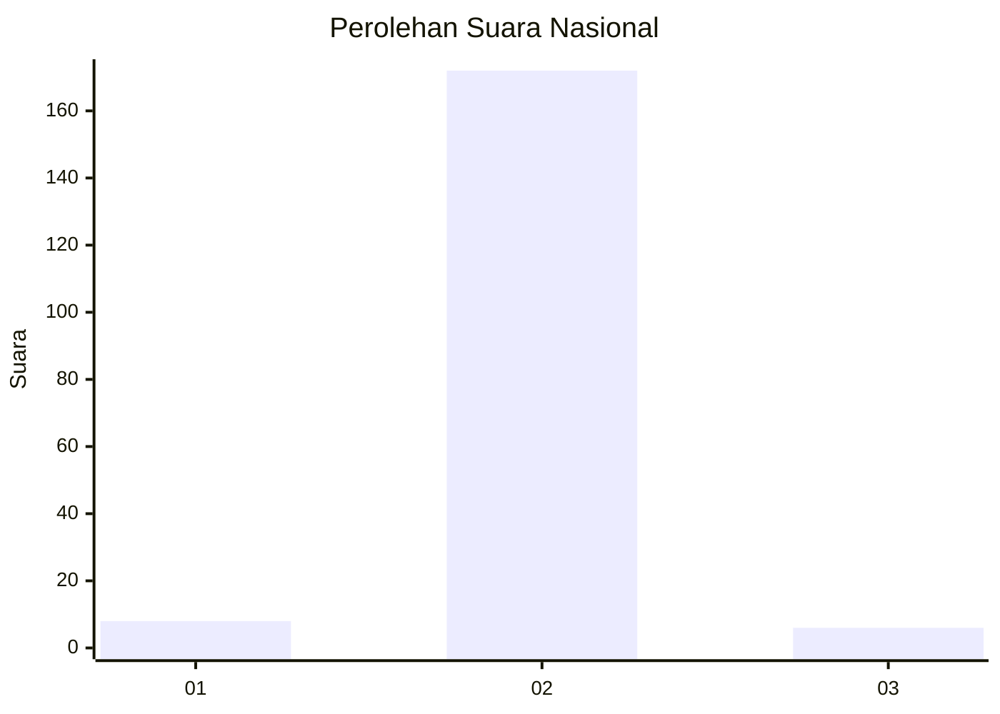
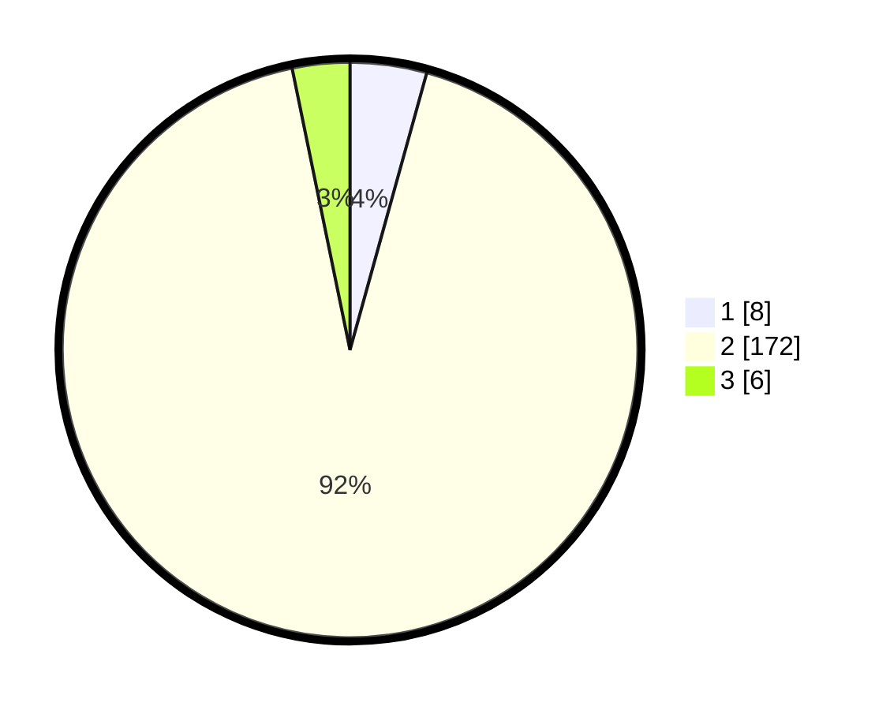

# Hasil

## Grafik

## Tabel

| No. | Nama Paslon    | Suara | Suara (raw) | Persentase |
|:--- |:-------------- | -----:| -----------:| ----------:|
| 1   | ANIES MUHAIMIN | 8     | [8][p-1]    | 4,30       |
| 2   | PRABOWO GIBRAN | 172   | [172][p-2]  | 92,47      |
| 3   | GANJAR MAHFUD  | 6     | [6][p-3]    | 3,23       |

[p-1]: https://github.com/gigit-pemilu/pemilu-2024/blob/main/pilpres/hitung-suara/sub/16-sumatera-selatan/sub/13-musi-rawas-utara/sub/05-karang-dapo/sub/2006-kerta-sari/sub/002-tps/sub/paslon-1.txt
[p-2]: https://github.com/gigit-pemilu/pemilu-2024/blob/main/pilpres/hitung-suara/sub/16-sumatera-selatan/sub/13-musi-rawas-utara/sub/05-karang-dapo/sub/2006-kerta-sari/sub/002-tps/sub/paslon-2.txt
[p-3]: https://github.com/gigit-pemilu/pemilu-2024/blob/main/pilpres/hitung-suara/sub/16-sumatera-selatan/sub/13-musi-rawas-utara/sub/05-karang-dapo/sub/2006-kerta-sari/sub/002-tps/sub/paslon-3.txt

## Foto C Plano

https://sirekap-obj-formc.kpu.go.id/b7d1/pemilu/ppwp/16/13/05/20/06/1613052006002-20240214-233306--049e5686-93ab-42c6-a5a8-6d00ab4854d4.jpg

https://sirekap-obj-formc.kpu.go.id/b7d1/pemilu/ppwp/16/13/05/20/06/1613052006002-20240214-233503--4fadb23f-f258-4130-8169-dc2478f1924f.jpg

https://sirekap-obj-formc.kpu.go.id/b7d1/pemilu/ppwp/16/13/05/20/06/1613052006002-20240214-233607--d6d4fce2-a9be-4569-a2bf-d0bb850898de.jpg

## Metadata

| Key        | Value               |
| ---------- | ------------------- |
| Time Stamp | 2024-02-16 16:25:10 |

