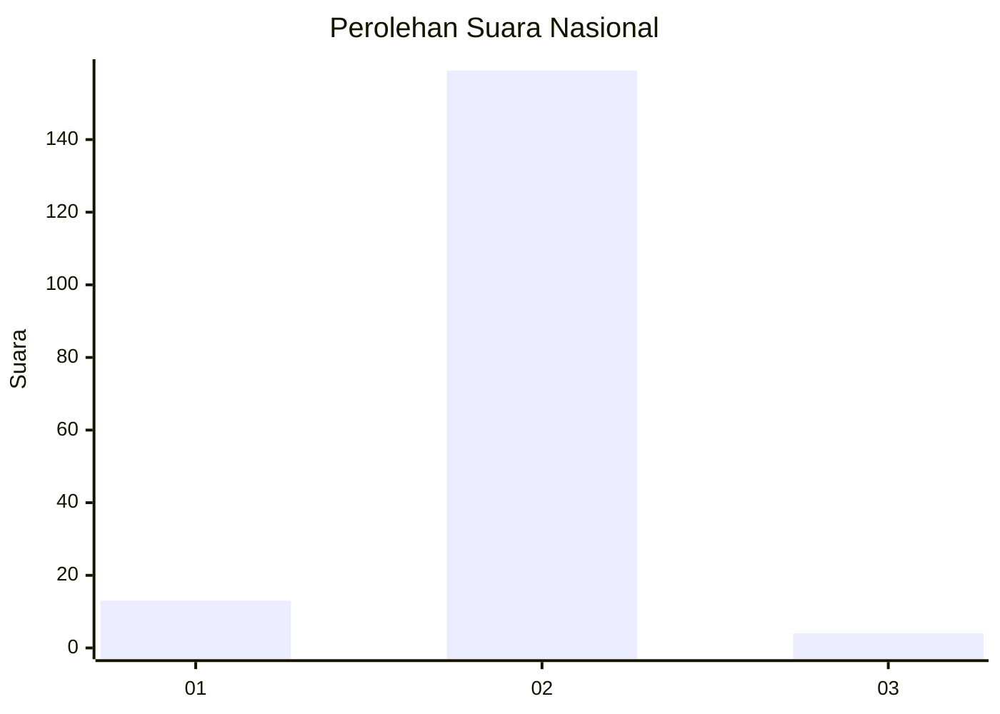
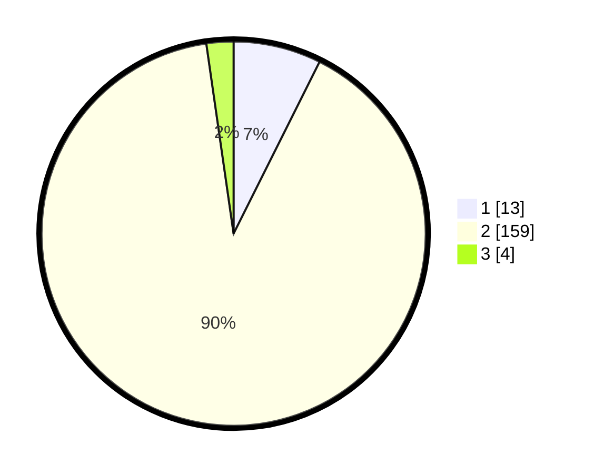

# Hasil

## Grafik

## Tabel

| No. | Nama Paslon    | Suara | Suara (raw) | Persentase |
|:--- |:-------------- | -----:| -----------:| ----------:|
| 1   | ANIES MUHAIMIN | 13    | [13][p-1]   | 7,39       |
| 2   | PRABOWO GIBRAN | 159   | [159][p-2]  | 90,34      |
| 3   | GANJAR MAHFUD  | 4     | [4][p-3]    | 2,27       |

[p-1]: https://github.com/gigit-pemilu/pemilu-2024/blob/main/pilpres/hitung-suara/sub/16-sumatera-selatan/sub/13-musi-rawas-utara/sub/05-karang-dapo/sub/2006-kerta-sari/sub/003-tps/sub/paslon-1.txt
[p-2]: https://github.com/gigit-pemilu/pemilu-2024/blob/main/pilpres/hitung-suara/sub/16-sumatera-selatan/sub/13-musi-rawas-utara/sub/05-karang-dapo/sub/2006-kerta-sari/sub/003-tps/sub/paslon-2.txt
[p-3]: https://github.com/gigit-pemilu/pemilu-2024/blob/main/pilpres/hitung-suara/sub/16-sumatera-selatan/sub/13-musi-rawas-utara/sub/05-karang-dapo/sub/2006-kerta-sari/sub/003-tps/sub/paslon-3.txt

## Foto C Plano

https://sirekap-obj-formc.kpu.go.id/16ad/pemilu/ppwp/16/13/05/20/06/1613052006003-20240214-221242--903cd376-51e0-411e-bc6b-9230ee5e1501.jpg

https://sirekap-obj-formc.kpu.go.id/16ad/pemilu/ppwp/16/13/05/20/06/1613052006003-20240214-221407--0d07d37b-67a3-41d9-8778-68646f039e8a.jpg

https://sirekap-obj-formc.kpu.go.id/16ad/pemilu/ppwp/16/13/05/20/06/1613052006003-20240214-221557--245ebb50-34ec-4de0-9b37-df7bfbbff3a0.jpg

## Metadata

| Key        | Value               |
| ---------- | ------------------- |
| Time Stamp | 2024-02-16 16:25:10 |

