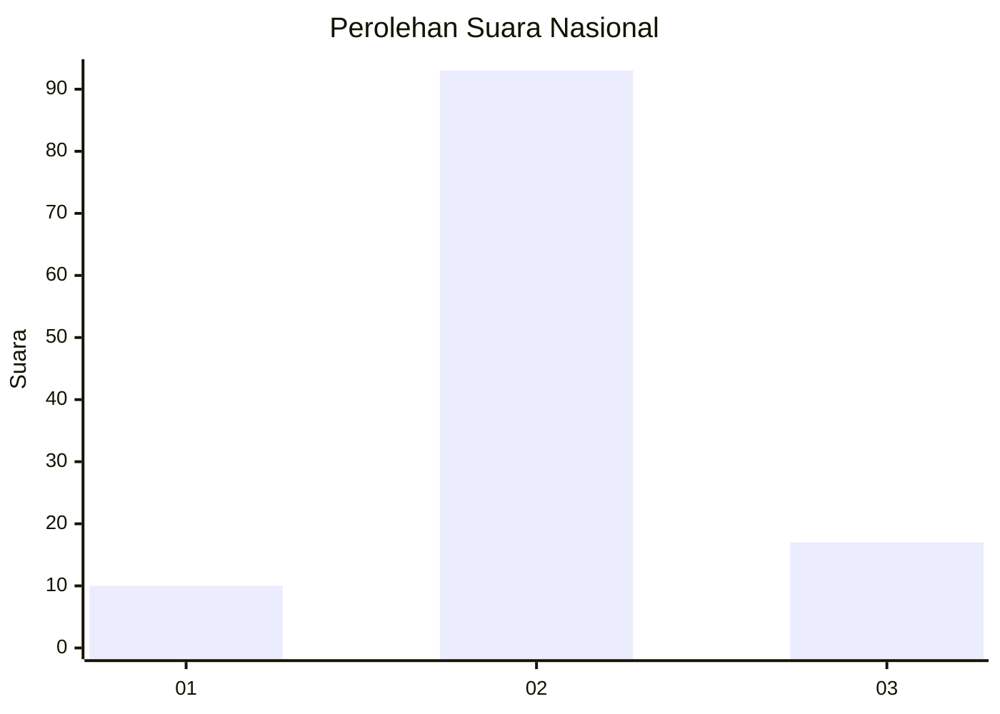
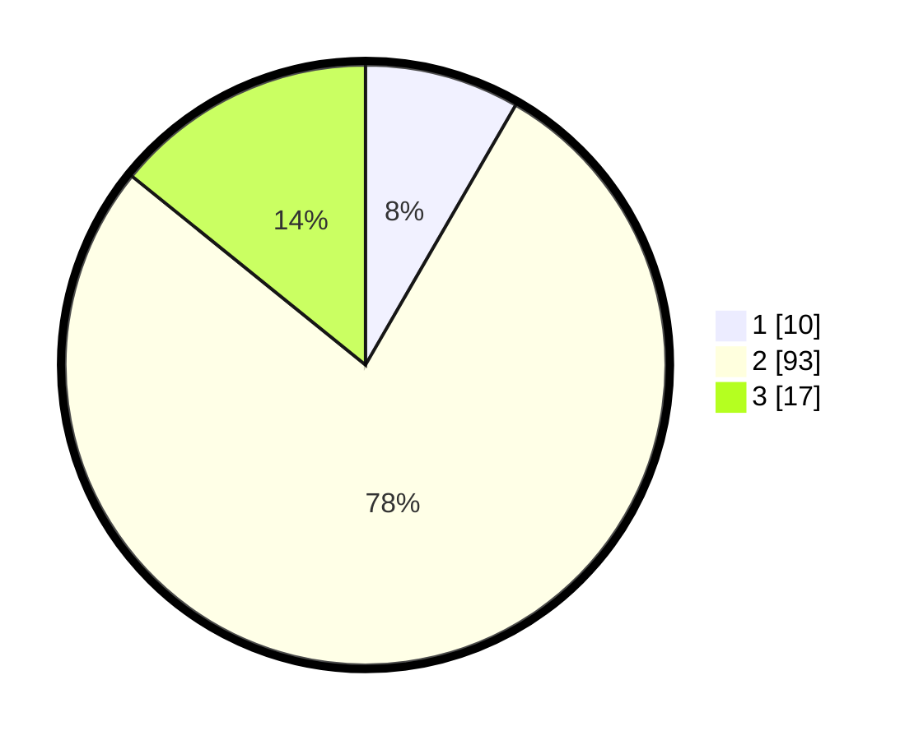

# Hasil

## Grafik

## Tabel

| No. | Nama Paslon    | Suara | Suara (raw) | Persentase |
|:--- |:-------------- | -----:| -----------:| ----------:|
| 1   | ANIES MUHAIMIN | 10    | [10][p-1]   | 8,33       |
| 2   | PRABOWO GIBRAN | 93    | [93][p-2]   | 77,50      |
| 3   | GANJAR MAHFUD  | 17    | [17][p-3]   | 14,17      |

[p-1]: https://github.com/gigit-pemilu/pemilu-2024/blob/main/pilpres/hitung-suara/sub/16-sumatera-selatan/sub/13-musi-rawas-utara/sub/05-karang-dapo/sub/2008-setia-marga/sub/013-tps/sub/paslon-1.txt
[p-2]: https://github.com/gigit-pemilu/pemilu-2024/blob/main/pilpres/hitung-suara/sub/16-sumatera-selatan/sub/13-musi-rawas-utara/sub/05-karang-dapo/sub/2008-setia-marga/sub/013-tps/sub/paslon-2.txt
[p-3]: https://github.com/gigit-pemilu/pemilu-2024/blob/main/pilpres/hitung-suara/sub/16-sumatera-selatan/sub/13-musi-rawas-utara/sub/05-karang-dapo/sub/2008-setia-marga/sub/013-tps/sub/paslon-3.txt

## Foto C Plano

https://sirekap-obj-formc.kpu.go.id/5dd3/pemilu/ppwp/16/13/05/20/08/1613052008013-20240215-004034--b479a800-afce-42e6-bb96-5f35b0c6ef56.jpg

https://sirekap-obj-formc.kpu.go.id/5dd3/pemilu/ppwp/16/13/05/20/08/1613052008013-20240215-025921--64939a0e-2a92-4bd4-a49c-0d2859c41b02.jpg

https://sirekap-obj-formc.kpu.go.id/5dd3/pemilu/ppwp/16/13/05/20/08/1613052008013-20240215-030006--d464fb2a-e894-49cf-aa52-5aca9b9615a7.jpg

## Metadata

| Key        | Value               |
| ---------- | ------------------- |
| Time Stamp | 2024-02-16 16:25:10 |

