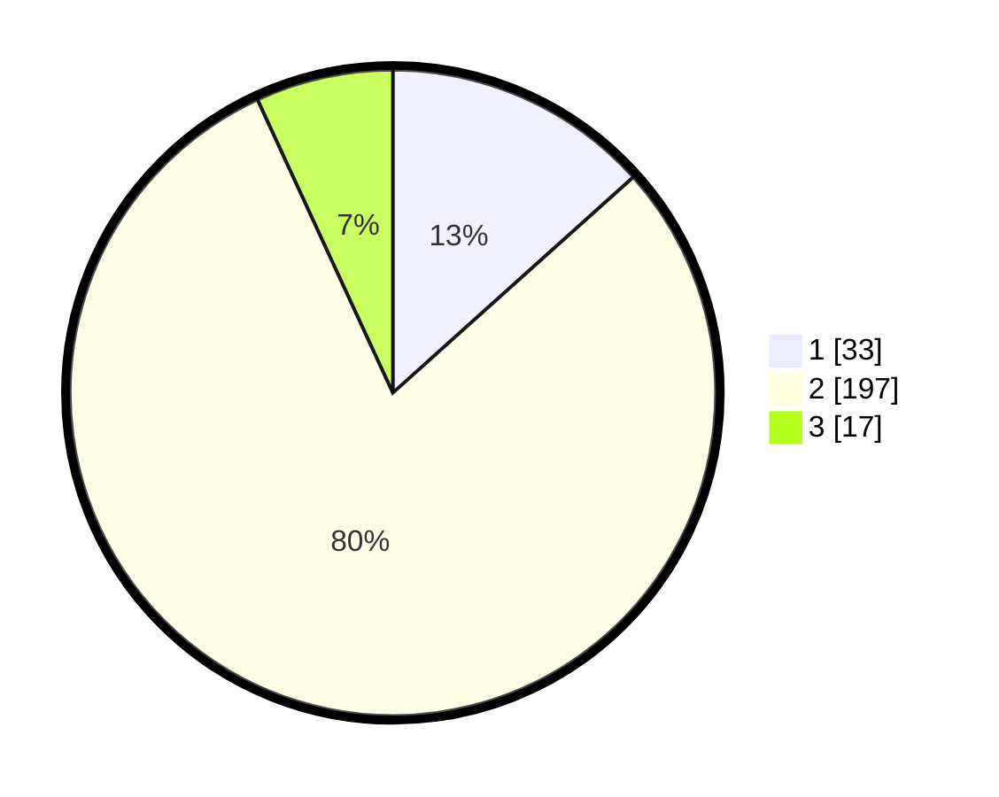

# Hasil

## Grafik

## Tabel

| No. | Nama Paslon    | Suara | Suara (raw) | Persentase |
|:--- |:-------------- | -----:| -----------:| ----------:|
| 1   | ANIES MUHAIMIN | 33    | [33][p-1]   | 13,36      |
| 2   | PRABOWO GIBRAN | 197   | [197][p-2]  | 79,76      |
| 3   | GANJAR MAHFUD  | 17    | [17][p-3]   | 6,88       |

[p-1]: https://github.com/gigit-pemilu/pemilu-2024-16-sumatera-selatan/blob/main/pilpres/hitung-suara/sub/16-sumatera-selatan/sub/13-musi-rawas-utara/sub/06-karang-jaya/sub/1009-karang-jaya/sub/003-tps/sub/paslon-1.txt
[p-2]: https://github.com/gigit-pemilu/pemilu-2024-16-sumatera-selatan/blob/main/pilpres/hitung-suara/sub/16-sumatera-selatan/sub/13-musi-rawas-utara/sub/06-karang-jaya/sub/1009-karang-jaya/sub/003-tps/sub/paslon-2.txt
[p-3]: https://github.com/gigit-pemilu/pemilu-2024-16-sumatera-selatan/blob/main/pilpres/hitung-suara/sub/16-sumatera-selatan/sub/13-musi-rawas-utara/sub/06-karang-jaya/sub/1009-karang-jaya/sub/003-tps/sub/paslon-3.txt

## Foto C Plano

https://sirekap-obj-formc.kpu.go.id/0a9c/pemilu/ppwp/16/13/06/10/09/1613061009003-20240214-233545--650c0fd2-6d38-4940-ba34-2110e6a86b7a.jpg

https://sirekap-obj-formc.kpu.go.id/0a9c/pemilu/ppwp/16/13/06/10/09/1613061009003-20240214-233618--0cd26c26-4427-47fd-9a91-0b30ba5acf68.jpg

https://sirekap-obj-formc.kpu.go.id/0a9c/pemilu/ppwp/16/13/06/10/09/1613061009003-20240214-233639--1eddc434-f629-4362-9eee-e6dc8d9c2089.jpg

## Metadata

| Key        | Value               |
| ---------- | ------------------- |
| Time Stamp | 2024-02-16 16:25:10 |

