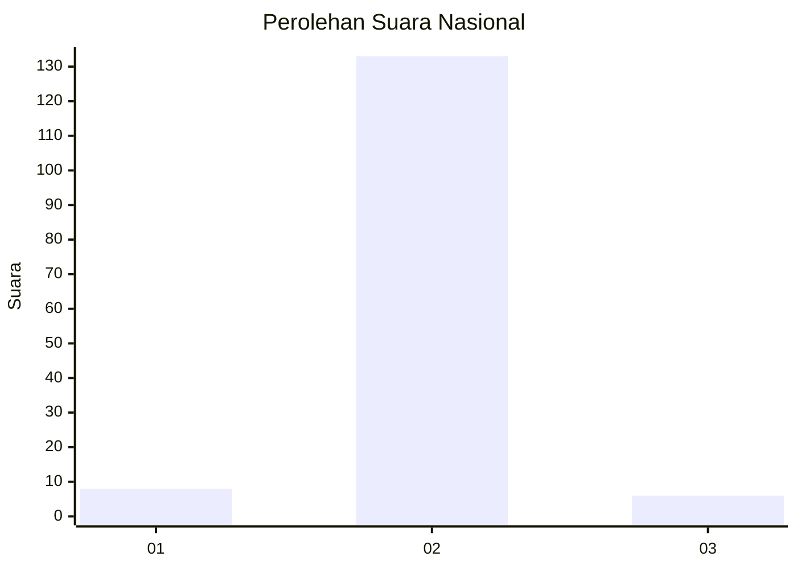
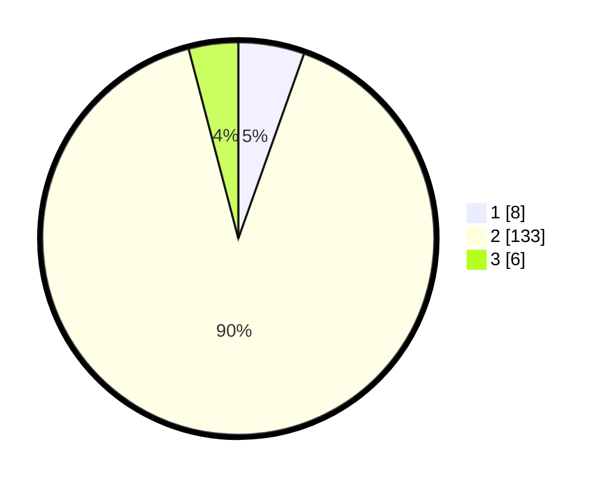

# Hasil

## Grafik

## Tabel

| No. | Nama Paslon    | Suara | Suara (raw) | Persentase |
|:--- |:-------------- | -----:| -----------:| ----------:|
| 1   | ANIES MUHAIMIN | 8     | [8][p-1]    | 5,44       |
| 2   | PRABOWO GIBRAN | 133   | [133][p-2]  | 90,48      |
| 3   | GANJAR MAHFUD  | 6     | [6][p-3]    | 4,08       |

[p-1]: https://github.com/gigit-pemilu/pemilu-2024/blob/main/pilpres/hitung-suara/sub/16-sumatera-selatan/sub/13-musi-rawas-utara/sub/06-karang-jaya/sub/2002-sukaraja/sub/007-tps/sub/paslon-1.txt
[p-2]: https://github.com/gigit-pemilu/pemilu-2024/blob/main/pilpres/hitung-suara/sub/16-sumatera-selatan/sub/13-musi-rawas-utara/sub/06-karang-jaya/sub/2002-sukaraja/sub/007-tps/sub/paslon-2.txt
[p-3]: https://github.com/gigit-pemilu/pemilu-2024/blob/main/pilpres/hitung-suara/sub/16-sumatera-selatan/sub/13-musi-rawas-utara/sub/06-karang-jaya/sub/2002-sukaraja/sub/007-tps/sub/paslon-3.txt

## Foto C Plano

https://sirekap-obj-formc.kpu.go.id/2e85/pemilu/ppwp/16/13/06/20/02/1613062002007-20240215-082131--a88bb5e5-6b9e-457f-8dee-7ca55daa5fdf.jpg

https://sirekap-obj-formc.kpu.go.id/2e85/pemilu/ppwp/16/13/06/20/02/1613062002007-20240216-145947--fae84cdb-acec-40e5-83b5-60edfd0b11c8.jpg

https://sirekap-obj-formc.kpu.go.id/2e85/pemilu/ppwp/16/13/06/20/02/1613062002007-20240215-082352--77816612-dc8f-4ed2-8d26-64b2a78e1bda.jpg

## Metadata

| Key        | Value               |
| ---------- | ------------------- |
| Time Stamp | 2024-02-16 16:25:10 |

