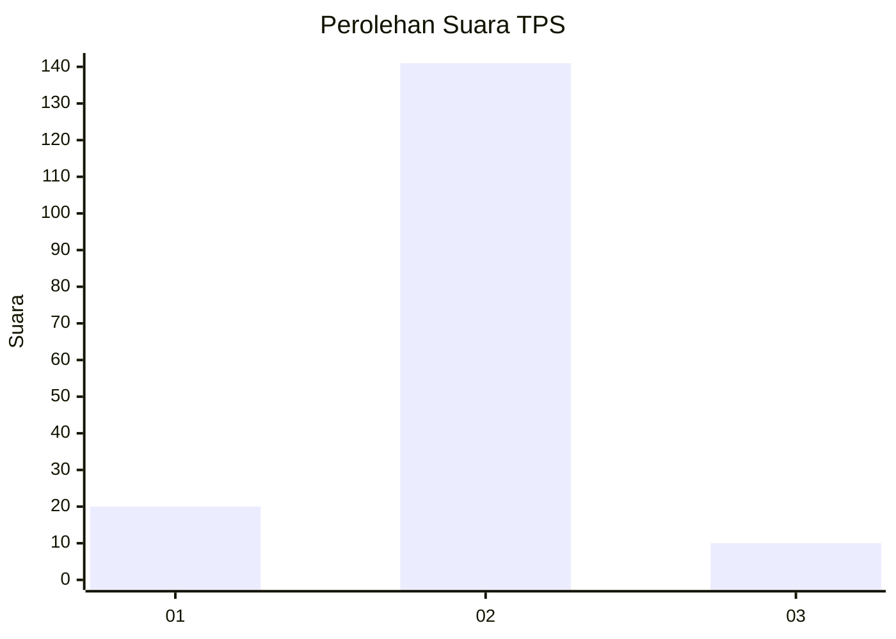
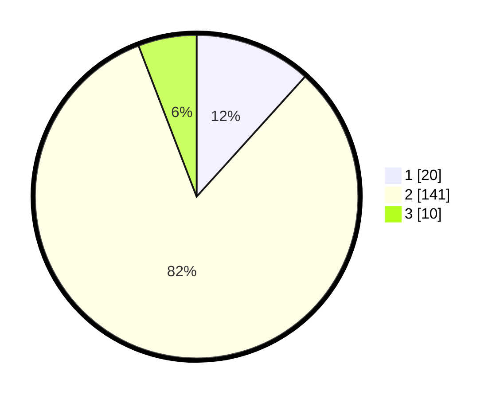

# Hasil

## Grafik

## Tabel

| No. | Nama Paslon    | Suara | Suara (raw) | Persentase |
|:--- |:-------------- | -----:| -----------:| ----------:|
| 1   | ANIES MUHAIMIN | 20    | [20][p-1]   | 11,70      |
| 2   | PRABOWO GIBRAN | 141   | [141][p-2]  | 82,46      |
| 3   | GANJAR MAHFUD  | 10    | [10][p-3]   | 5,85       |

[p-1]: https://github.com/gigit-pemilu/pemilu-2024-16-sumatera-selatan/blob/main/pilpres/hitung-suara/sub/16-sumatera-selatan/sub/13-musi-rawas-utara/sub/06-karang-jaya/sub/2004-muara-batang-empu/sub/002-tps/sub/paslon-1.txt
[p-2]: https://github.com/gigit-pemilu/pemilu-2024-16-sumatera-selatan/blob/main/pilpres/hitung-suara/sub/16-sumatera-selatan/sub/13-musi-rawas-utara/sub/06-karang-jaya/sub/2004-muara-batang-empu/sub/002-tps/sub/paslon-2.txt
[p-3]: https://github.com/gigit-pemilu/pemilu-2024-16-sumatera-selatan/blob/main/pilpres/hitung-suara/sub/16-sumatera-selatan/sub/13-musi-rawas-utara/sub/06-karang-jaya/sub/2004-muara-batang-empu/sub/002-tps/sub/paslon-3.txt

## Foto C Plano

https://sirekap-obj-formc.kpu.go.id/7b70/pemilu/ppwp/16/13/06/20/04/1613062004002-20240215-005655--4e89e154-4de6-419f-9656-a9f3084a77bb.jpg

https://sirekap-obj-formc.kpu.go.id/7b70/pemilu/ppwp/16/13/06/20/04/1613062004002-20240215-015116--9bceee2c-4c5d-4fd6-96ac-ade5ae9d71cb.jpg

https://sirekap-obj-formc.kpu.go.id/7b70/pemilu/ppwp/16/13/06/20/04/1613062004002-20240215-014622--44505bc1-2f86-434e-97cf-ca1d2e90e9a2.jpg

## Metadata

| Key        | Value               |
| ---------- | ------------------- |
| Time Stamp | 2024-02-16 16:25:10 |

