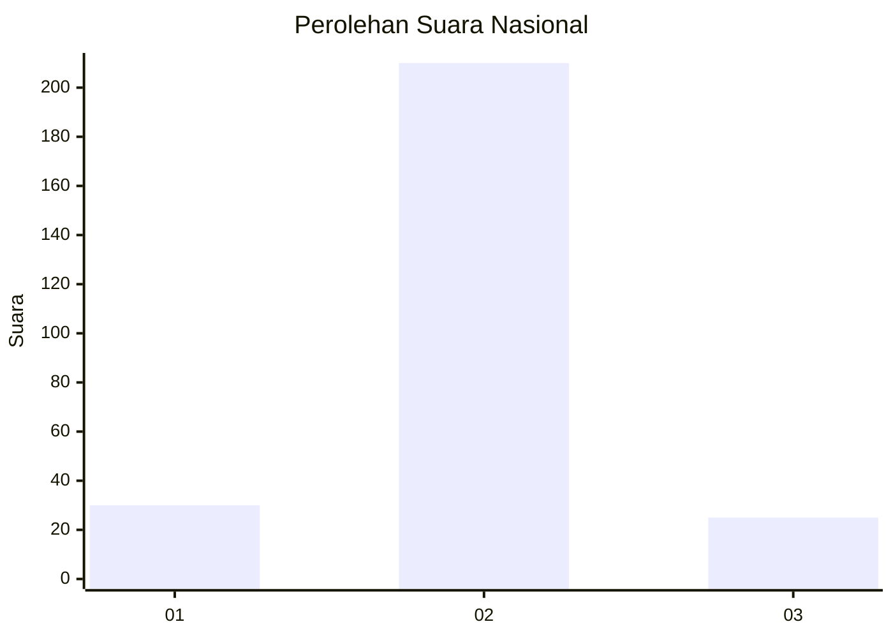
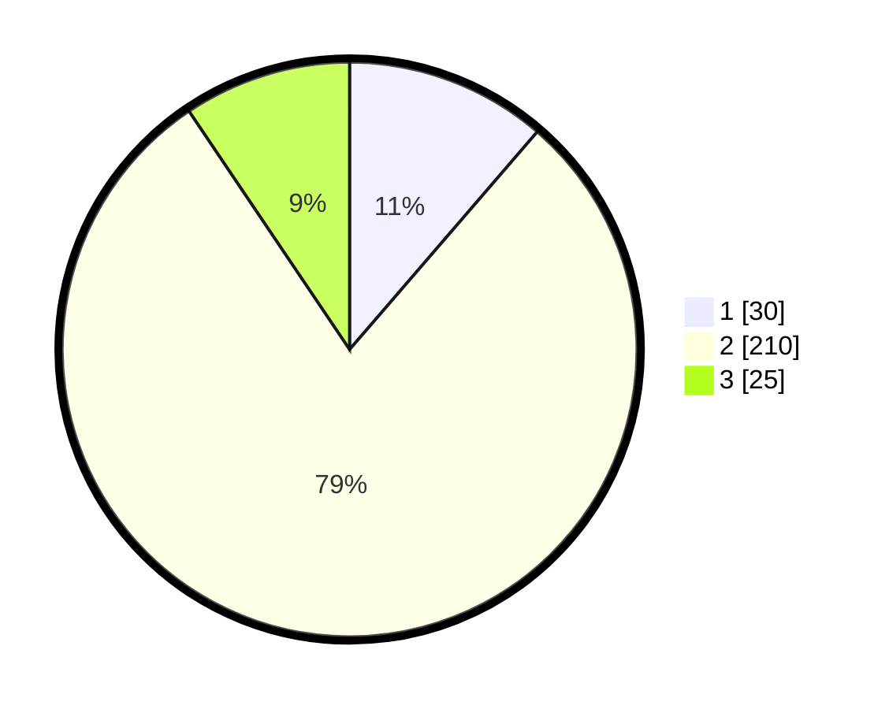

# Hasil

## Grafik

## Tabel

| No. | Nama Paslon    | Suara | Suara (raw) | Persentase |
|:--- |:-------------- | -----:| -----------:| ----------:|
| 1   | ANIES MUHAIMIN | 30    | [30][p-1]   | 11,32      |
| 2   | PRABOWO GIBRAN | 210   | [210][p-2]  | 79,25      |
| 3   | GANJAR MAHFUD  | 25    | [25][p-3]   | 9,43       |

[p-1]: https://github.com/gigit-pemilu/pemilu-2024/blob/main/pilpres/hitung-suara/sub/16-sumatera-selatan/sub/13-musi-rawas-utara/sub/06-karang-jaya/sub/2008-terusan/sub/008-tps/sub/paslon-1.txt
[p-2]: https://github.com/gigit-pemilu/pemilu-2024/blob/main/pilpres/hitung-suara/sub/16-sumatera-selatan/sub/13-musi-rawas-utara/sub/06-karang-jaya/sub/2008-terusan/sub/008-tps/sub/paslon-2.txt
[p-3]: https://github.com/gigit-pemilu/pemilu-2024/blob/main/pilpres/hitung-suara/sub/16-sumatera-selatan/sub/13-musi-rawas-utara/sub/06-karang-jaya/sub/2008-terusan/sub/008-tps/sub/paslon-3.txt

## Foto C Plano

https://sirekap-obj-formc.kpu.go.id/fd72/pemilu/ppwp/16/13/06/20/08/1613062008008-20240216-030307--46a9ce8f-f9f7-49f3-845a-93fa6739caff.jpg

https://sirekap-obj-formc.kpu.go.id/fd72/pemilu/ppwp/16/13/06/20/08/1613062008008-20240216-030322--0c0fd619-df00-42f1-a0bf-3f5d07b75d4a.jpg

https://sirekap-obj-formc.kpu.go.id/fd72/pemilu/ppwp/16/13/06/20/08/1613062008008-20240216-030326--62a5ac7e-5637-428e-84ad-3bf64a257aca.jpg

## Metadata

| Key        | Value               |
| ---------- | ------------------- |
| Time Stamp | 2024-02-16 10:30:29 |

