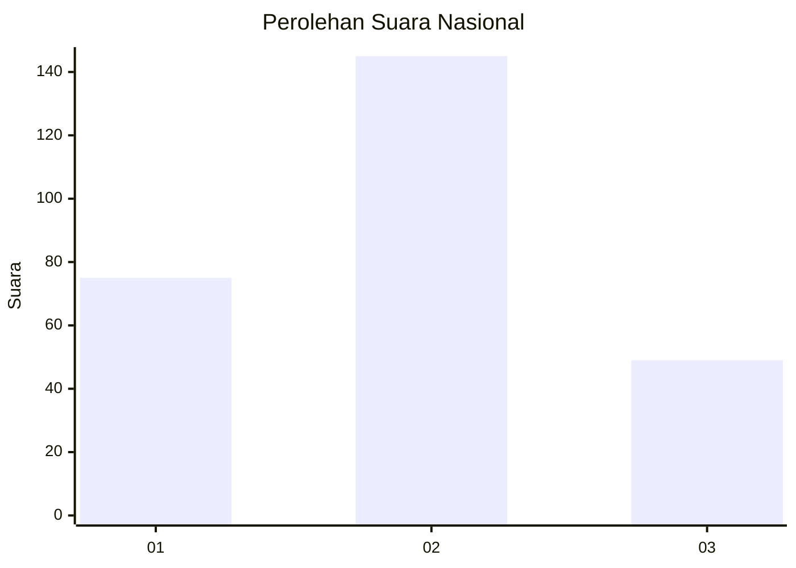
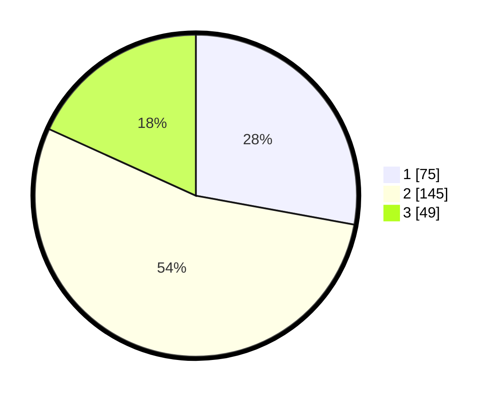

# Hasil

## Grafik

## Tabel

| No. | Nama Paslon    | Suara | Suara (raw) | Persentase |
|:--- |:-------------- | -----:| -----------:| ----------:|
| 1   | ANIES MUHAIMIN | 75    | [75][p-1]   | 27,88      |
| 2   | PRABOWO GIBRAN | 145   | [145][p-2]  | 53,90      |
| 3   | GANJAR MAHFUD  | 49    | [49][p-3]   | 18,22      |

[p-1]: https://github.com/gigit-pemilu/pemilu-2024/blob/main/pilpres/hitung-suara/sub/16-sumatera-selatan/sub/13-musi-rawas-utara/sub/06-karang-jaya/sub/2011-embacang-baru/sub/002-tps/sub/paslon-1.txt
[p-2]: https://github.com/gigit-pemilu/pemilu-2024/blob/main/pilpres/hitung-suara/sub/16-sumatera-selatan/sub/13-musi-rawas-utara/sub/06-karang-jaya/sub/2011-embacang-baru/sub/002-tps/sub/paslon-2.txt
[p-3]: https://github.com/gigit-pemilu/pemilu-2024/blob/main/pilpres/hitung-suara/sub/16-sumatera-selatan/sub/13-musi-rawas-utara/sub/06-karang-jaya/sub/2011-embacang-baru/sub/002-tps/sub/paslon-3.txt

## Foto C Plano

https://sirekap-obj-formc.kpu.go.id/580a/pemilu/ppwp/16/13/06/20/11/1613062011002-20240215-172900--71766ea7-59ff-4b92-a5d7-832c78749e7d.jpg

https://sirekap-obj-formc.kpu.go.id/580a/pemilu/ppwp/16/13/06/20/11/1613062011002-20240215-172833--582f0336-e2e8-49d6-9940-cc2e0a13ee4a.jpg

https://sirekap-obj-formc.kpu.go.id/580a/pemilu/ppwp/16/13/06/20/11/1613062011002-20240215-172933--3ac5d374-0c62-4b23-90d5-6169acc2de48.jpg

## Metadata

| Key        | Value               |
| ---------- | ------------------- |
| Time Stamp | 2024-02-20 00:00:00 |

