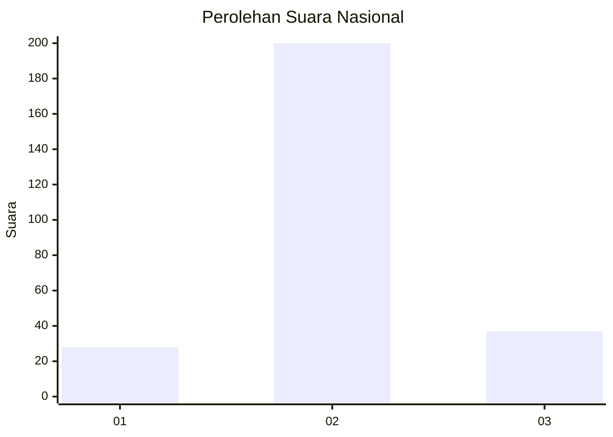
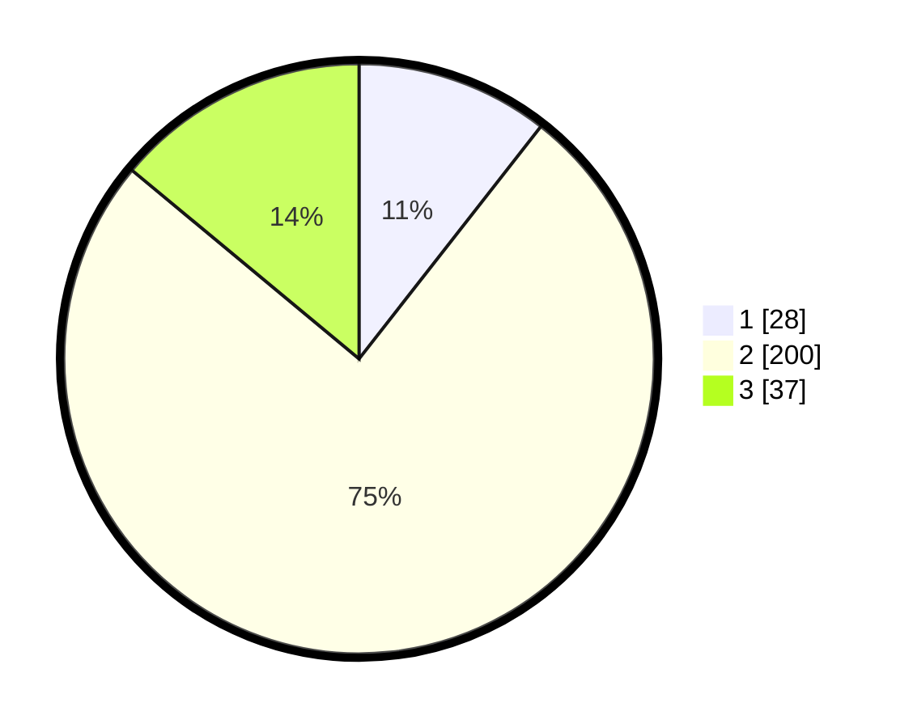

# Hasil

## Grafik

## Tabel

| No. | Nama Paslon    | Suara | Suara (raw) | Persentase |
|:--- |:-------------- | -----:| -----------:| ----------:|
| 1   | ANIES MUHAIMIN | 28    | [28][p-1]   | 10,57      |
| 2   | PRABOWO GIBRAN | 200   | [200][p-2]  | 75,47      |
| 3   | GANJAR MAHFUD  | 37    | [37][p-3]   | 13,96      |

[p-1]: https://github.com/gigit-pemilu/pemilu-2024/blob/main/pilpres/hitung-suara/sub/16-sumatera-selatan/sub/13-musi-rawas-utara/sub/06-karang-jaya/sub/2011-embacang-baru/sub/007-tps/sub/paslon-1.txt
[p-2]: https://github.com/gigit-pemilu/pemilu-2024/blob/main/pilpres/hitung-suara/sub/16-sumatera-selatan/sub/13-musi-rawas-utara/sub/06-karang-jaya/sub/2011-embacang-baru/sub/007-tps/sub/paslon-2.txt
[p-3]: https://github.com/gigit-pemilu/pemilu-2024/blob/main/pilpres/hitung-suara/sub/16-sumatera-selatan/sub/13-musi-rawas-utara/sub/06-karang-jaya/sub/2011-embacang-baru/sub/007-tps/sub/paslon-3.txt

## Foto C Plano

https://sirekap-obj-formc.kpu.go.id/e808/pemilu/ppwp/16/13/06/20/11/1613062011007-20240215-172221--d1a824bf-dfb2-4b00-958b-15130043cef1.jpg

https://sirekap-obj-formc.kpu.go.id/e808/pemilu/ppwp/16/13/06/20/11/1613062011007-20240215-172312--436d607b-3761-43db-b81b-c6c9d08f0da9.jpg

https://sirekap-obj-formc.kpu.go.id/e808/pemilu/ppwp/16/13/06/20/11/1613062011007-20240215-172401--948a331e-65fb-4838-b79c-330901ce8182.jpg

## Metadata

| Key        | Value               |
| ---------- | ------------------- |
| Time Stamp | 2024-02-20 00:00:00 |

