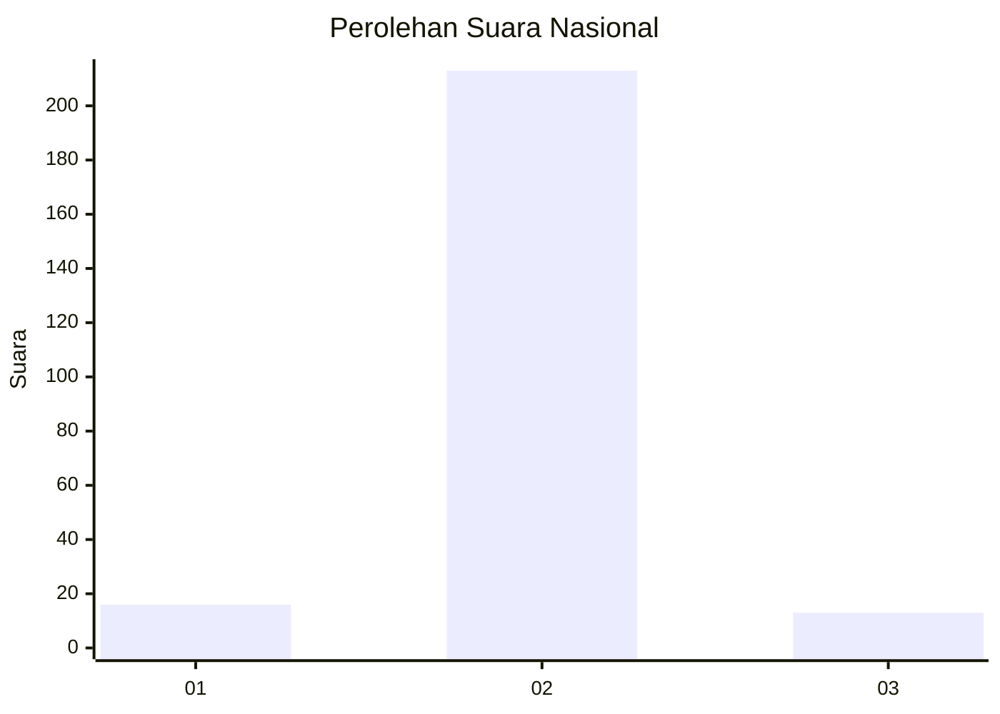
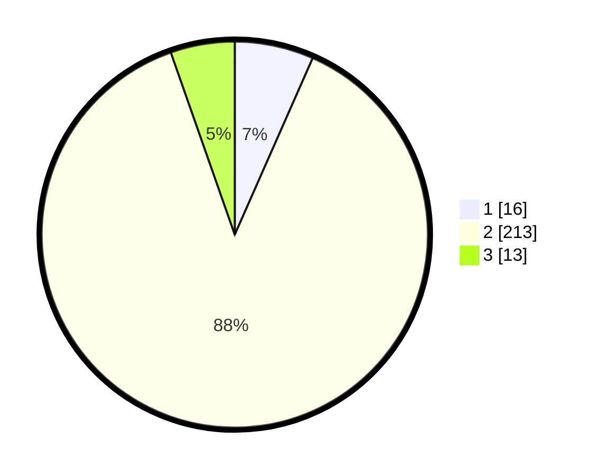

# Hasil

## Grafik

## Tabel

| No. | Nama Paslon    | Suara | Suara (raw) | Persentase |
|:--- |:-------------- | -----:| -----------:| ----------:|
| 1   | ANIES MUHAIMIN | 16    | [16][p-1]   | 6,61       |
| 2   | PRABOWO GIBRAN | 213   | [213][p-2]  | 88,02      |
| 3   | GANJAR MAHFUD  | 13    | [13][p-3]   | 5,37       |

[p-1]: https://github.com/gigit-pemilu/pemilu-2024/blob/main/pilpres/hitung-suara/sub/16-sumatera-selatan/sub/13-musi-rawas-utara/sub/06-karang-jaya/sub/2012-embacang-lama/sub/004-tps/sub/paslon-1.txt
[p-2]: https://github.com/gigit-pemilu/pemilu-2024/blob/main/pilpres/hitung-suara/sub/16-sumatera-selatan/sub/13-musi-rawas-utara/sub/06-karang-jaya/sub/2012-embacang-lama/sub/004-tps/sub/paslon-2.txt
[p-3]: https://github.com/gigit-pemilu/pemilu-2024/blob/main/pilpres/hitung-suara/sub/16-sumatera-selatan/sub/13-musi-rawas-utara/sub/06-karang-jaya/sub/2012-embacang-lama/sub/004-tps/sub/paslon-3.txt

## Foto C Plano

https://sirekap-obj-formc.kpu.go.id/57f6/pemilu/ppwp/16/13/06/20/12/1613062012004-20240215-105148--b526733c-57ff-4be1-91cc-65d21f08b99b.jpg

https://sirekap-obj-formc.kpu.go.id/57f6/pemilu/ppwp/16/13/06/20/12/1613062012004-20240215-143916--ecf45a84-bd99-40d2-82c6-f84dccaed505.jpg

https://sirekap-obj-formc.kpu.go.id/57f6/pemilu/ppwp/16/13/06/20/12/1613062012004-20240215-104753--9b6738eb-39bc-4764-b7d4-0d3b7fbf86b2.jpg

## Metadata

| Key        | Value               |
| ---------- | ------------------- |
| Time Stamp | 2024-02-16 21:01:00 |

