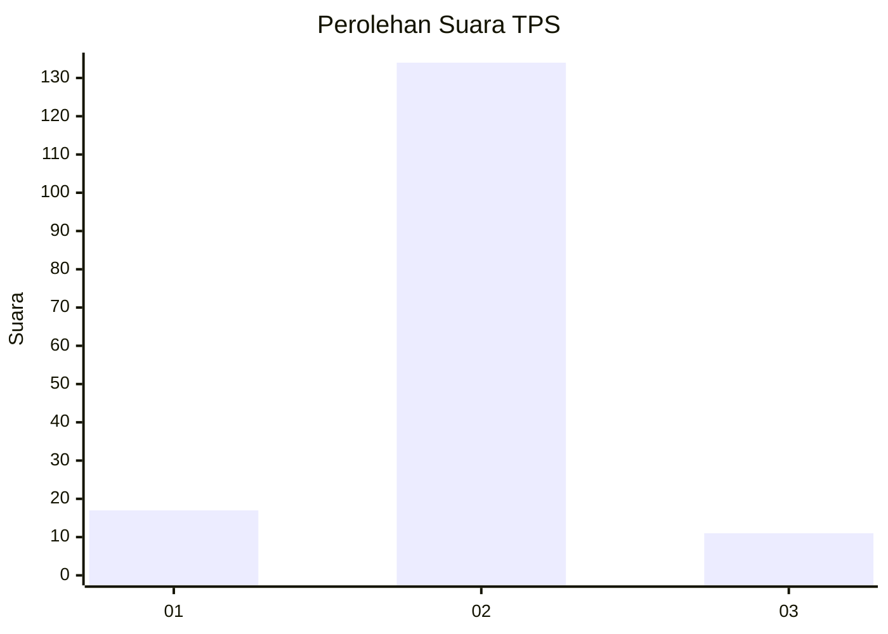
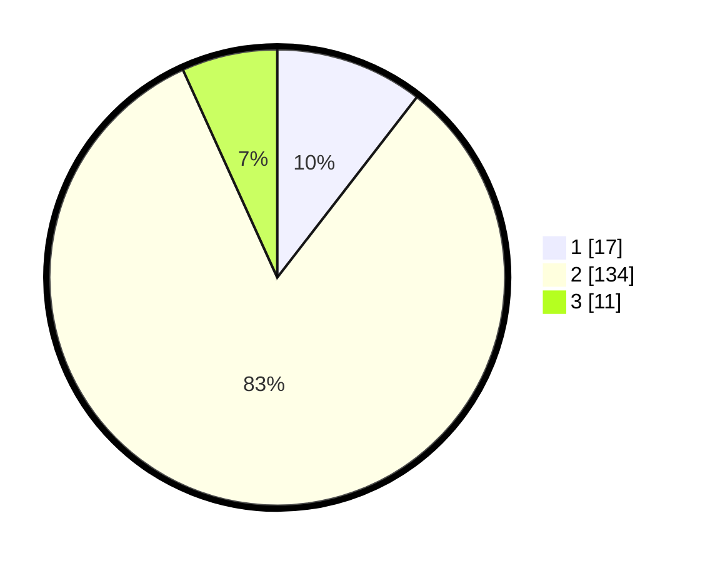

# Hasil

## Grafik

## Tabel

| No. | Nama Paslon    | Suara | Suara (raw) | Persentase |
|:--- |:-------------- | -----:| -----------:| ----------:|
| 1   | ANIES MUHAIMIN | 17    | [17][p-1]   | 10,49      |
| 2   | PRABOWO GIBRAN | 134   | [134][p-2]  | 82,72      |
| 3   | GANJAR MAHFUD  | 11    | [11][p-3]   | 6,79       |

[p-1]: https://github.com/gigit-pemilu/pemilu-2024-16-sumatera-selatan/blob/main/pilpres/hitung-suara/sub/16-sumatera-selatan/sub/13-musi-rawas-utara/sub/06-karang-jaya/sub/2014-bukit-langkap/sub/004-tps/sub/paslon-1.txt
[p-2]: https://github.com/gigit-pemilu/pemilu-2024-16-sumatera-selatan/blob/main/pilpres/hitung-suara/sub/16-sumatera-selatan/sub/13-musi-rawas-utara/sub/06-karang-jaya/sub/2014-bukit-langkap/sub/004-tps/sub/paslon-2.txt
[p-3]: https://github.com/gigit-pemilu/pemilu-2024-16-sumatera-selatan/blob/main/pilpres/hitung-suara/sub/16-sumatera-selatan/sub/13-musi-rawas-utara/sub/06-karang-jaya/sub/2014-bukit-langkap/sub/004-tps/sub/paslon-3.txt

## Foto C Plano

https://sirekap-obj-formc.kpu.go.id/4d86/pemilu/ppwp/16/13/06/20/14/1613062014004-20240215-022244--c1be2b7c-db41-4279-83b0-a16af299b8bb.jpg

https://sirekap-obj-formc.kpu.go.id/4d86/pemilu/ppwp/16/13/06/20/14/1613062014004-20240215-022356--e4470a41-e75c-4b3f-a61f-40b989ee9689.jpg

https://sirekap-obj-formc.kpu.go.id/4d86/pemilu/ppwp/16/13/06/20/14/1613062014004-20240215-022434--dacffd73-c807-46c8-ae0a-a15bb34f87cb.jpg

## Metadata

| Key        | Value               |
| ---------- | ------------------- |
| Time Stamp | 2024-02-16 21:01:00 |

