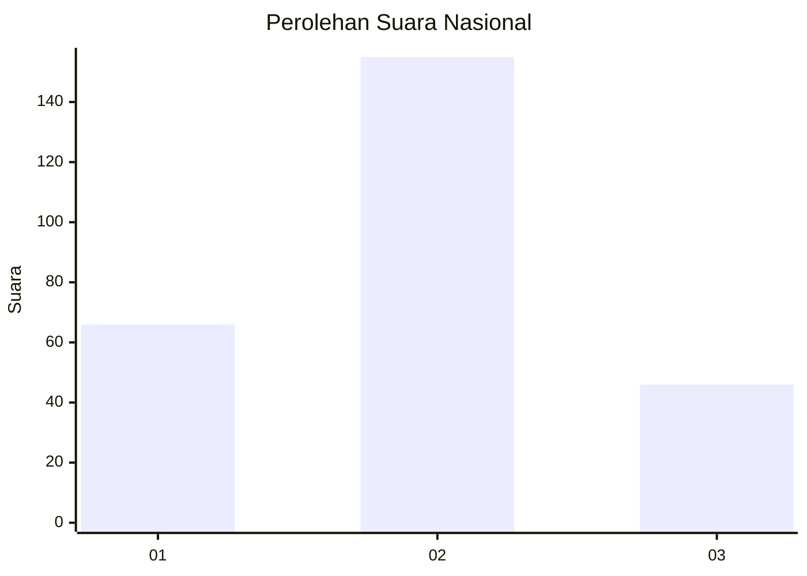
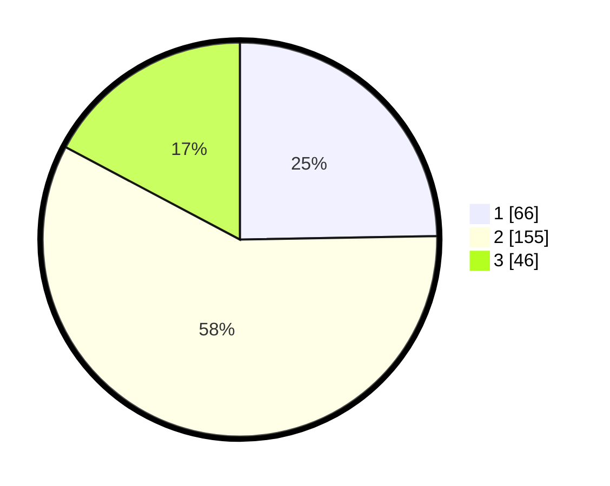

# Hasil

## Grafik

## Tabel

| No. | Nama Paslon    | Suara | Suara (raw) | Persentase |
|:--- |:-------------- | -----:| -----------:| ----------:|
| 1   | ANIES MUHAIMIN | 66    | [66][p-1]   | 24,72      |
| 2   | PRABOWO GIBRAN | 155   | [155][p-2]  | 58,05      |
| 3   | GANJAR MAHFUD  | 46    | [46][p-3]   | 17,23      |

[p-1]: https://github.com/gigit-pemilu/pemilu-2024/blob/main/pilpres/hitung-suara/sub/16-sumatera-selatan/sub/13-musi-rawas-utara/sub/06-karang-jaya/sub/2015-embacang-baru-ilir/sub/001-tps/sub/paslon-1.txt
[p-2]: https://github.com/gigit-pemilu/pemilu-2024/blob/main/pilpres/hitung-suara/sub/16-sumatera-selatan/sub/13-musi-rawas-utara/sub/06-karang-jaya/sub/2015-embacang-baru-ilir/sub/001-tps/sub/paslon-2.txt
[p-3]: https://github.com/gigit-pemilu/pemilu-2024/blob/main/pilpres/hitung-suara/sub/16-sumatera-selatan/sub/13-musi-rawas-utara/sub/06-karang-jaya/sub/2015-embacang-baru-ilir/sub/001-tps/sub/paslon-3.txt

## Foto C Plano

https://sirekap-obj-formc.kpu.go.id/426f/pemilu/ppwp/16/13/06/20/15/1613062015001-20240215-080747--4379be3d-3198-40f7-b90c-de00baf68d69.jpg

https://sirekap-obj-formc.kpu.go.id/426f/pemilu/ppwp/16/13/06/20/15/1613062015001-20240215-080923--c87f5582-aa83-4762-8cf6-7e99ee2988ff.jpg

https://sirekap-obj-formc.kpu.go.id/426f/pemilu/ppwp/16/13/06/20/15/1613062015001-20240215-081459--c0d75988-629c-484b-bc96-5c386fa88ec3.jpg

## Metadata

| Key        | Value               |
| ---------- | ------------------- |
| Time Stamp | 2024-02-16 01:00:27 |

