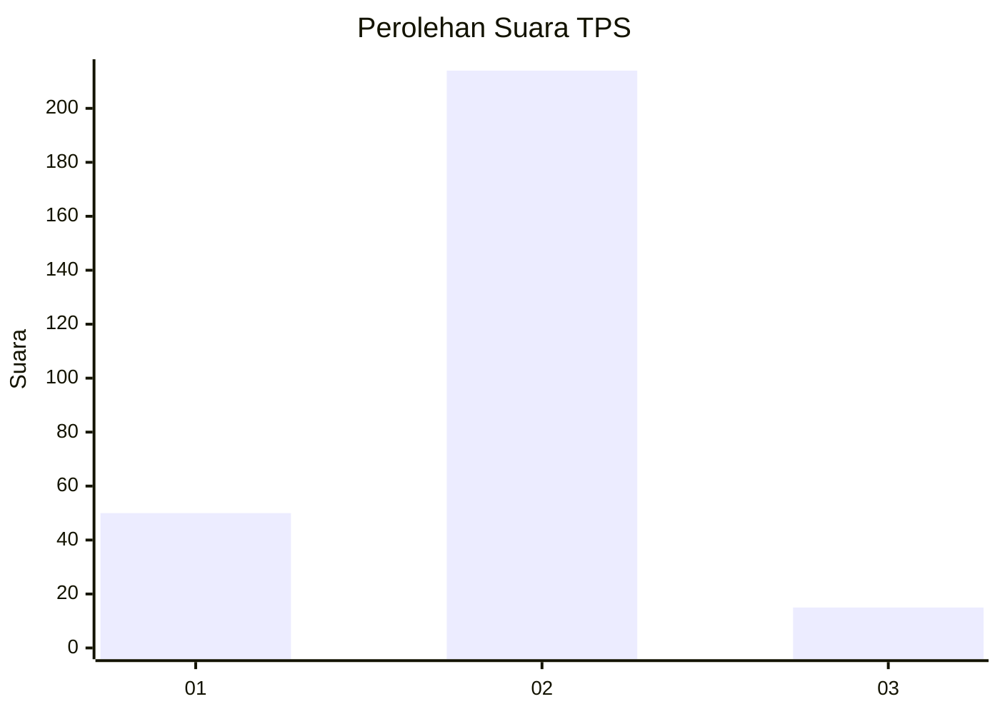
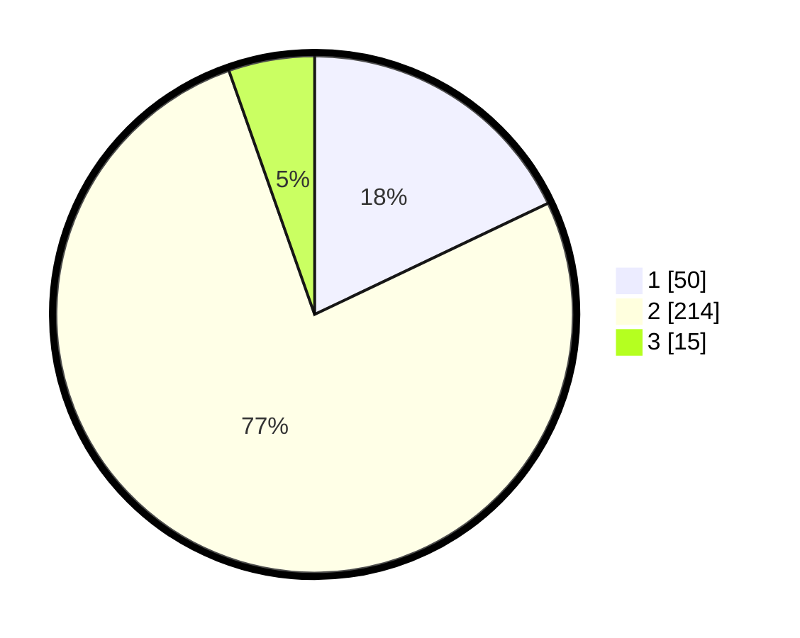

# Hasil

## Grafik

## Tabel

| No. | Nama Paslon    | Suara | Suara (raw) | Persentase |
|:--- |:-------------- | -----:| -----------:| ----------:|
| 1   | ANIES MUHAIMIN | 50    | [50][p-1]   | 17,92      |
| 2   | PRABOWO GIBRAN | 214   | [214][p-2]  | 76,70      |
| 3   | GANJAR MAHFUD  | 15    | [15][p-3]   | 5,38       |

[p-1]: https://github.com/gigit-pemilu/pemilu-2024-16-sumatera-selatan/blob/main/pilpres/hitung-suara/sub/16-sumatera-selatan/sub/13-musi-rawas-utara/sub/06-karang-jaya/sub/2015-embacang-baru-ilir/sub/006-tps/sub/paslon-1.txt
[p-2]: https://github.com/gigit-pemilu/pemilu-2024-16-sumatera-selatan/blob/main/pilpres/hitung-suara/sub/16-sumatera-selatan/sub/13-musi-rawas-utara/sub/06-karang-jaya/sub/2015-embacang-baru-ilir/sub/006-tps/sub/paslon-2.txt
[p-3]: https://github.com/gigit-pemilu/pemilu-2024-16-sumatera-selatan/blob/main/pilpres/hitung-suara/sub/16-sumatera-selatan/sub/13-musi-rawas-utara/sub/06-karang-jaya/sub/2015-embacang-baru-ilir/sub/006-tps/sub/paslon-3.txt

## Foto C Plano

https://sirekap-obj-formc.kpu.go.id/bfc8/pemilu/ppwp/16/13/06/20/15/1613062015006-20240215-071645--63108def-9128-471d-a876-8c758e79e15e.jpg

https://sirekap-obj-formc.kpu.go.id/bfc8/pemilu/ppwp/16/13/06/20/15/1613062015006-20240215-071836--af3a618f-f501-4eb9-a15d-f4017b9245c9.jpg

https://sirekap-obj-formc.kpu.go.id/bfc8/pemilu/ppwp/16/13/06/20/15/1613062015006-20240215-071951--fcfce0b4-1cde-4ae0-adf8-7caec8bbd638.jpg

## Metadata

| Key        | Value               |
| ---------- | ------------------- |
| Time Stamp | 2024-02-20 00:00:00 |

