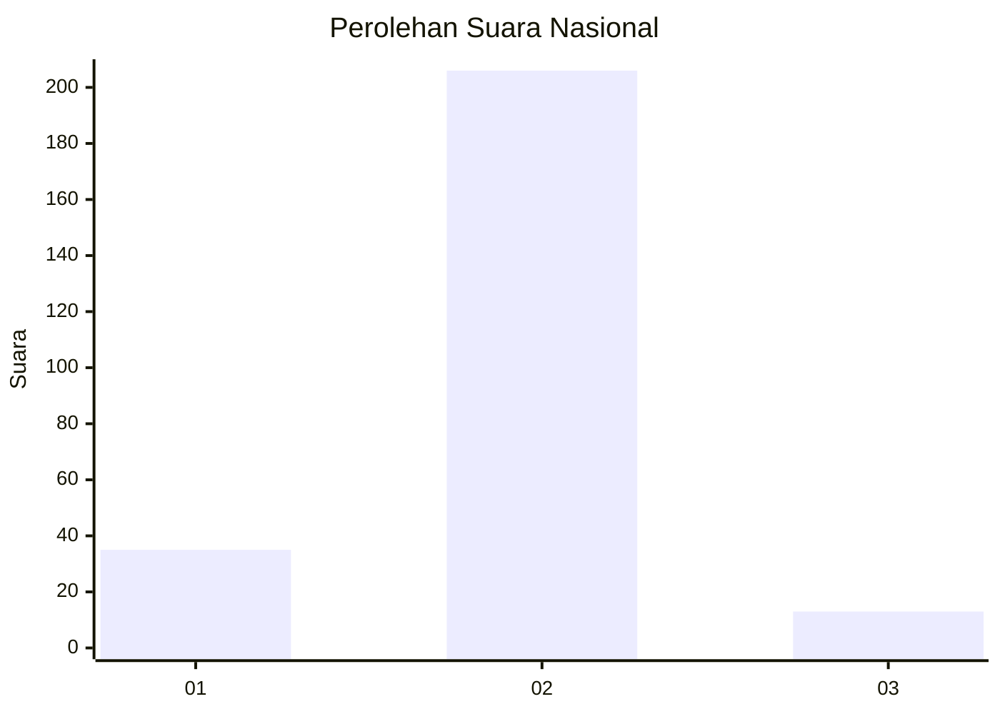
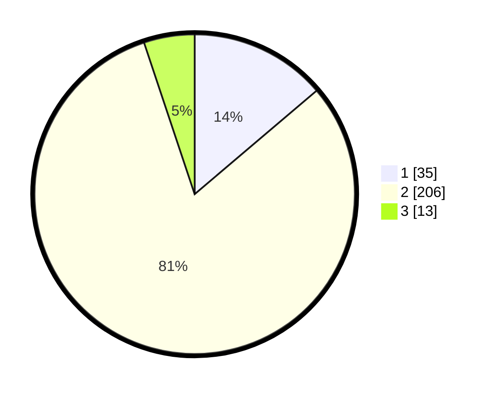

# Hasil

## Grafik

## Tabel

| No. | Nama Paslon    | Suara | Suara (raw) | Persentase |
|:--- |:-------------- | -----:| -----------:| ----------:|
| 1   | ANIES MUHAIMIN | 35    | [35][p-1]   | 13,78      |
| 2   | PRABOWO GIBRAN | 206   | [206][p-2]  | 81,10      |
| 3   | GANJAR MAHFUD  | 13    | [13][p-3]   | 5,12       |

[p-1]: https://github.com/gigit-pemilu/pemilu-2024/blob/main/pilpres/hitung-suara/sub/16-sumatera-selatan/sub/13-musi-rawas-utara/sub/07-ulu-rawas/sub/2001-jangkat/sub/001-tps/sub/paslon-1.txt
[p-2]: https://github.com/gigit-pemilu/pemilu-2024/blob/main/pilpres/hitung-suara/sub/16-sumatera-selatan/sub/13-musi-rawas-utara/sub/07-ulu-rawas/sub/2001-jangkat/sub/001-tps/sub/paslon-2.txt
[p-3]: https://github.com/gigit-pemilu/pemilu-2024/blob/main/pilpres/hitung-suara/sub/16-sumatera-selatan/sub/13-musi-rawas-utara/sub/07-ulu-rawas/sub/2001-jangkat/sub/001-tps/sub/paslon-3.txt

## Foto C Plano

https://sirekap-obj-formc.kpu.go.id/d967/pemilu/ppwp/16/13/07/20/01/1613072001001-20240217-144934--7cb3eaab-b85d-4e8d-9742-2c30eb8c63e2.jpg

https://sirekap-obj-formc.kpu.go.id/d967/pemilu/ppwp/16/13/07/20/01/1613072001001-20240217-153929--5c46e040-edb6-4ad9-9542-77c7ab80f019.jpg

https://sirekap-obj-formc.kpu.go.id/d967/pemilu/ppwp/16/13/07/20/01/1613072001001-20240217-144358--923b5dd3-964f-42b4-8bec-62c8c0b6cc20.jpg

## Metadata

| Key        | Value               |
| ---------- | ------------------- |
| Time Stamp | 2024-02-19 12:00:00 |

