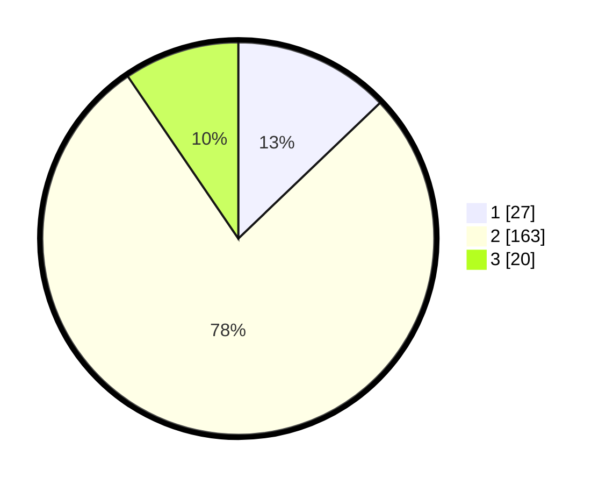

# Hasil

## Grafik

## Tabel

| No. | Nama Paslon    | Suara | Suara (raw) | Persentase |
|:--- |:-------------- | -----:| -----------:| ----------:|
| 1   | ANIES MUHAIMIN | 27    | [27][p-1]   | 12,86      |
| 2   | PRABOWO GIBRAN | 163   | [163][p-2]  | 77,62      |
| 3   | GANJAR MAHFUD  | 20    | [20][p-3]   | 9,52       |

[p-1]: https://github.com/gigit-pemilu/pemilu-2024-16-sumatera-selatan/blob/main/pilpres/hitung-suara/sub/16-sumatera-selatan/sub/71-kota-palembang/sub/01-ilir-barat-dua/sub/1001-tiga-puluh-lima-ilir/sub/004-tps/sub/paslon-1.txt
[p-2]: https://github.com/gigit-pemilu/pemilu-2024-16-sumatera-selatan/blob/main/pilpres/hitung-suara/sub/16-sumatera-selatan/sub/71-kota-palembang/sub/01-ilir-barat-dua/sub/1001-tiga-puluh-lima-ilir/sub/004-tps/sub/paslon-2.txt
[p-3]: https://github.com/gigit-pemilu/pemilu-2024-16-sumatera-selatan/blob/main/pilpres/hitung-suara/sub/16-sumatera-selatan/sub/71-kota-palembang/sub/01-ilir-barat-dua/sub/1001-tiga-puluh-lima-ilir/sub/004-tps/sub/paslon-3.txt

## Foto C Plano

https://sirekap-obj-formc.kpu.go.id/a792/pemilu/ppwp/16/71/01/10/01/1671011001004-20240214-230956--b8af112c-f6fb-4305-966a-db4a1d267ea5.jpg

https://sirekap-obj-formc.kpu.go.id/a792/pemilu/ppwp/16/71/01/10/01/1671011001004-20240214-220159--399249d2-dcf3-4a0c-8fb2-44c27673e305.jpg

https://sirekap-obj-formc.kpu.go.id/a792/pemilu/ppwp/16/71/01/10/01/1671011001004-20240214-220613--b07afb8d-7732-4983-a455-82af51c5b89e.jpg

## Metadata

| Key        | Value               |
| ---------- | ------------------- |
| Time Stamp | 2024-02-24 22:31:28 |

