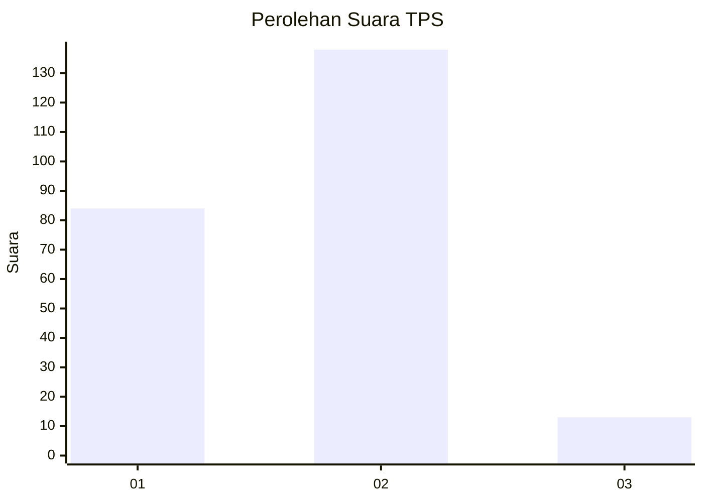
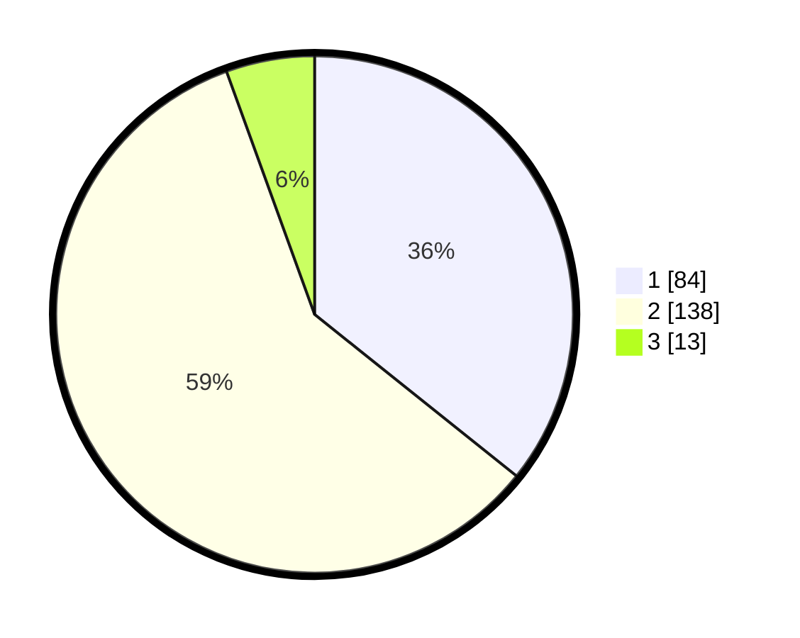

# Hasil

## Grafik

## Tabel

| No. | Nama Paslon    | Suara | Suara (raw) | Persentase |
|:--- |:-------------- | -----:| -----------:| ----------:|
| 1   | ANIES MUHAIMIN | 84    | [84][p-1]   | 35,74      |
| 2   | PRABOWO GIBRAN | 138   | [138][p-2]  | 58,72      |
| 3   | GANJAR MAHFUD  | 13    | [13][p-3]   | 5,53       |

[p-1]: https://github.com/gigit-pemilu/pemilu-2024-16-sumatera-selatan/blob/main/pilpres/hitung-suara/sub/16-sumatera-selatan/sub/71-kota-palembang/sub/01-ilir-barat-dua/sub/1001-tiga-puluh-lima-ilir/sub/005-tps/sub/paslon-1.txt
[p-2]: https://github.com/gigit-pemilu/pemilu-2024-16-sumatera-selatan/blob/main/pilpres/hitung-suara/sub/16-sumatera-selatan/sub/71-kota-palembang/sub/01-ilir-barat-dua/sub/1001-tiga-puluh-lima-ilir/sub/005-tps/sub/paslon-2.txt
[p-3]: https://github.com/gigit-pemilu/pemilu-2024-16-sumatera-selatan/blob/main/pilpres/hitung-suara/sub/16-sumatera-selatan/sub/71-kota-palembang/sub/01-ilir-barat-dua/sub/1001-tiga-puluh-lima-ilir/sub/005-tps/sub/paslon-3.txt

## Foto C Plano

https://sirekap-obj-formc.kpu.go.id/2835/pemilu/ppwp/16/71/01/10/01/1671011001005-20240214-160100--57b896d7-29dc-4a5f-9032-fb8a07e228fe.jpg

https://sirekap-obj-formc.kpu.go.id/2835/pemilu/ppwp/16/71/01/10/01/1671011001005-20240214-231404--942944a8-96f8-4cdd-99fa-adbef7a70478.jpg

https://sirekap-obj-formc.kpu.go.id/2835/pemilu/ppwp/16/71/01/10/01/1671011001005-20240214-155300--65289886-5e74-4343-9d01-a26ba23c1503.jpg

## Metadata

| Key        | Value               |
| ---------- | ------------------- |
| Time Stamp | 2024-02-24 22:31:28 |

