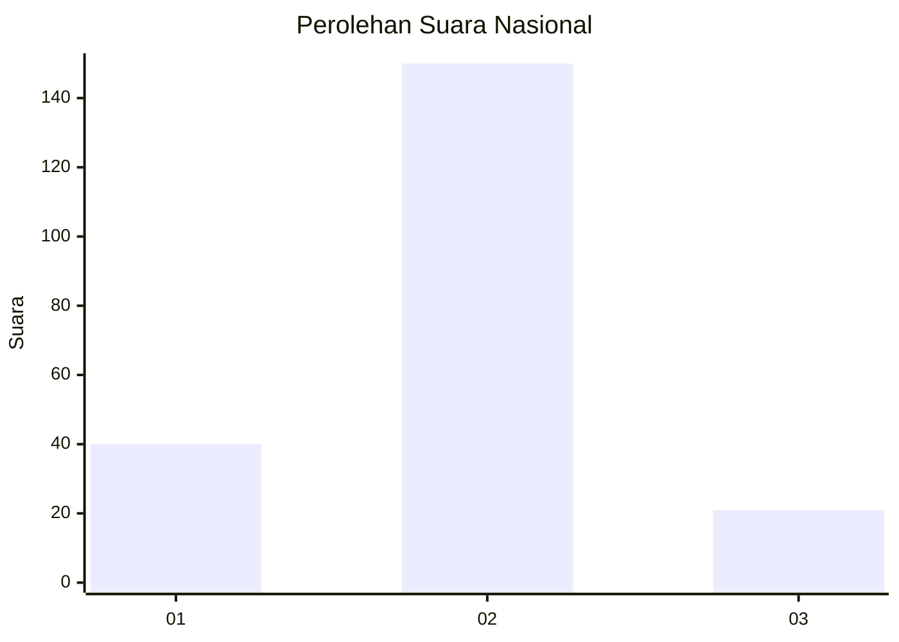
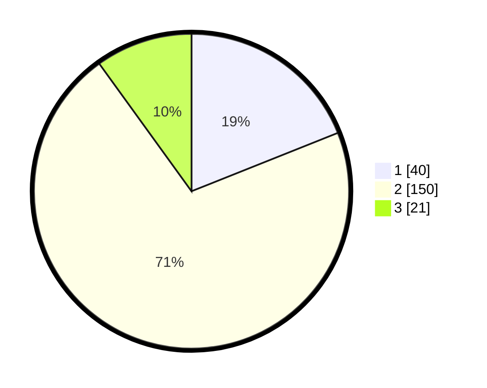

# Hasil

## Grafik

## Tabel

| No. | Nama Paslon    | Suara | Suara (raw) | Persentase |
|:--- |:-------------- | -----:| -----------:| ----------:|
| 1   | ANIES MUHAIMIN | 40    | [40][p-1]   | 18,96      |
| 2   | PRABOWO GIBRAN | 150   | [150][p-2]  | 71,09      |
| 3   | GANJAR MAHFUD  | 21    | [21][p-3]   | 9,95       |

[p-1]: https://github.com/gigit-pemilu/pemilu-2024/blob/main/pilpres/hitung-suara/sub/16-sumatera-selatan/sub/71-kota-palembang/sub/01-ilir-barat-dua/sub/1001-tiga-puluh-lima-ilir/sub/006-tps/sub/paslon-1.txt
[p-2]: https://github.com/gigit-pemilu/pemilu-2024/blob/main/pilpres/hitung-suara/sub/16-sumatera-selatan/sub/71-kota-palembang/sub/01-ilir-barat-dua/sub/1001-tiga-puluh-lima-ilir/sub/006-tps/sub/paslon-2.txt
[p-3]: https://github.com/gigit-pemilu/pemilu-2024/blob/main/pilpres/hitung-suara/sub/16-sumatera-selatan/sub/71-kota-palembang/sub/01-ilir-barat-dua/sub/1001-tiga-puluh-lima-ilir/sub/006-tps/sub/paslon-3.txt

## Foto C Plano

https://sirekap-obj-formc.kpu.go.id/2c7c/pemilu/ppwp/16/71/01/10/01/1671011001006-20240214-213238--ce284d14-f3a7-42c5-9d7f-61eaed0a4b05.jpg

https://sirekap-obj-formc.kpu.go.id/2c7c/pemilu/ppwp/16/71/01/10/01/1671011001006-20240214-213305--5d615a97-a02e-4b0b-9ea4-c63ece3f1cf0.jpg

https://sirekap-obj-formc.kpu.go.id/2c7c/pemilu/ppwp/16/71/01/10/01/1671011001006-20240214-213335--87a610bd-c5af-45e7-b05d-ce550c361713.jpg

## Metadata

| Key        | Value               |
| ---------- | ------------------- |
| Time Stamp | 2024-02-25 17:00:00 |

