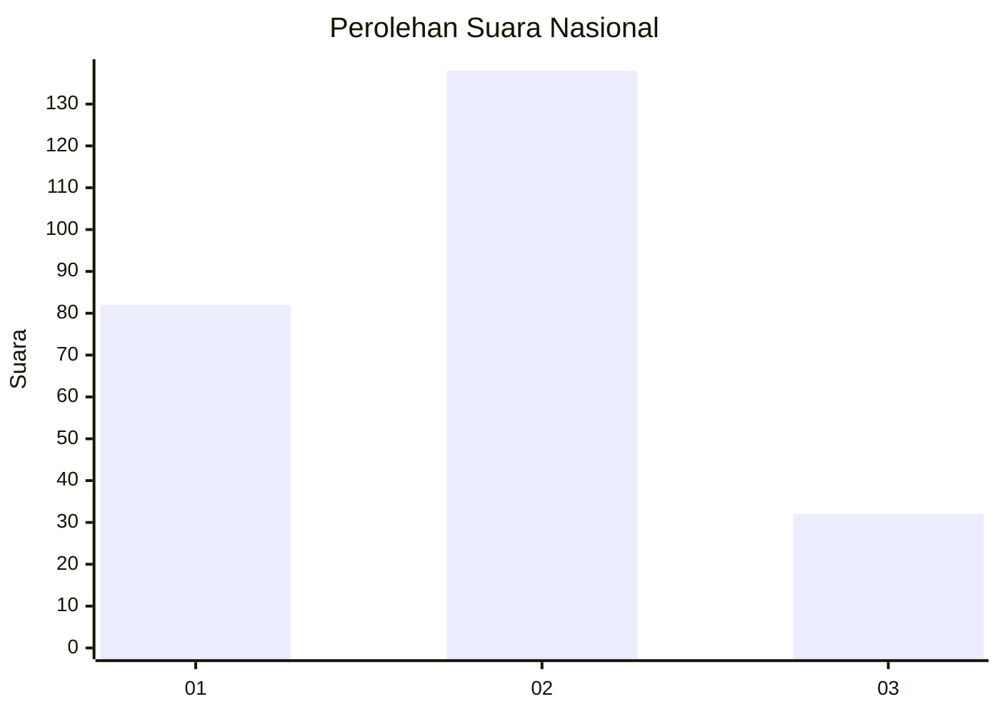
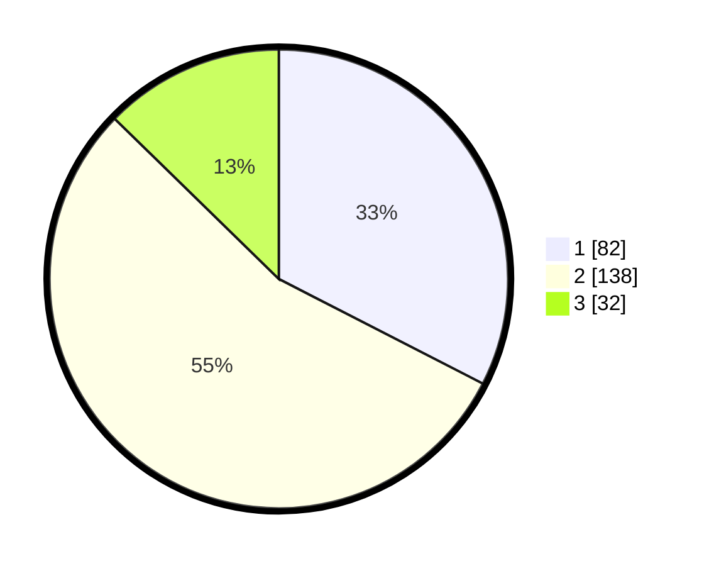

# Hasil

## Grafik

## Tabel

| No. | Nama Paslon    | Suara | Suara (raw) | Persentase |
|:--- |:-------------- | -----:| -----------:| ----------:|
| 1   | ANIES MUHAIMIN | 82    | [82][p-1]   | 32,54      |
| 2   | PRABOWO GIBRAN | 138   | [138][p-2]  | 54,76      |
| 3   | GANJAR MAHFUD  | 32    | [32][p-3]   | 12,70      |

[p-1]: https://github.com/gigit-pemilu/pemilu-2024/blob/main/pilpres/hitung-suara/sub/16-sumatera-selatan/sub/71-kota-palembang/sub/01-ilir-barat-dua/sub/1001-tiga-puluh-lima-ilir/sub/025-tps/sub/paslon-1.txt
[p-2]: https://github.com/gigit-pemilu/pemilu-2024/blob/main/pilpres/hitung-suara/sub/16-sumatera-selatan/sub/71-kota-palembang/sub/01-ilir-barat-dua/sub/1001-tiga-puluh-lima-ilir/sub/025-tps/sub/paslon-2.txt
[p-3]: https://github.com/gigit-pemilu/pemilu-2024/blob/main/pilpres/hitung-suara/sub/16-sumatera-selatan/sub/71-kota-palembang/sub/01-ilir-barat-dua/sub/1001-tiga-puluh-lima-ilir/sub/025-tps/sub/paslon-3.txt

## Foto C Plano

https://sirekap-obj-formc.kpu.go.id/f056/pemilu/ppwp/16/71/01/10/01/1671011001025-20240215-022712--64bcc44e-2873-4b98-922b-9ea87bfe7e1c.jpg

https://sirekap-obj-formc.kpu.go.id/f056/pemilu/ppwp/16/71/01/10/01/1671011001025-20240215-022859--38b210e3-7a54-4357-839b-882439f8a032.jpg

https://sirekap-obj-formc.kpu.go.id/f056/pemilu/ppwp/16/71/01/10/01/1671011001025-20240215-022944--413d91fc-b87c-4aff-85da-92bcc3374f44.jpg

## Metadata

| Key        | Value               |
| ---------- | ------------------- |
| Time Stamp | 2024-02-25 13:00:00 |

