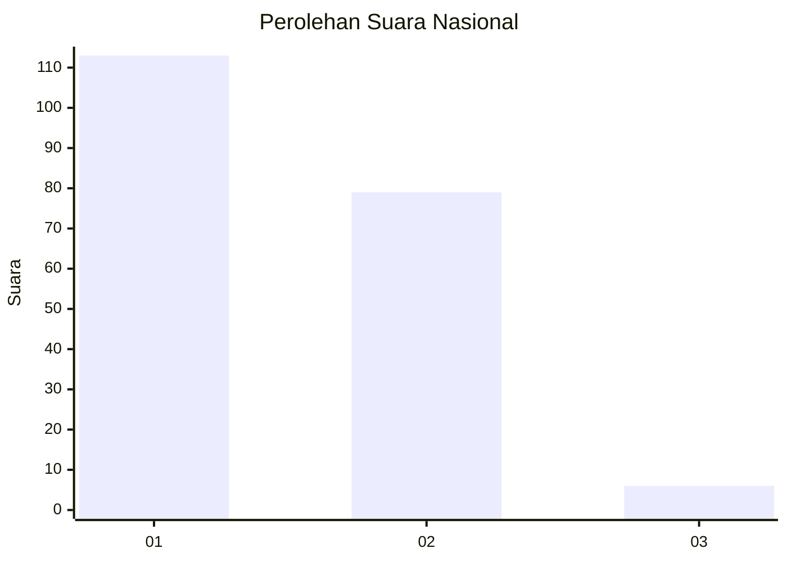
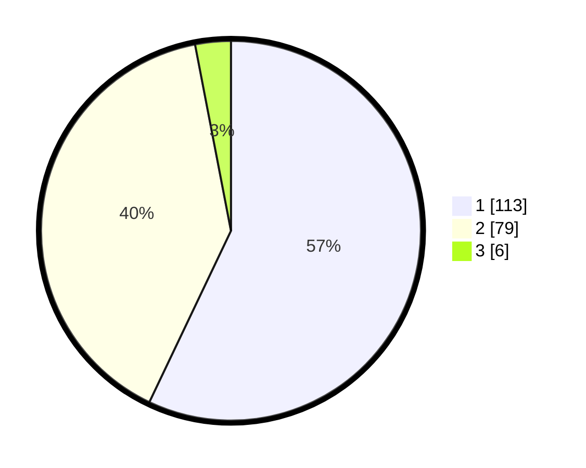

# Hasil

## Grafik

## Tabel

| No. | Nama Paslon    | Suara | Suara (raw) | Persentase |
|:--- |:-------------- | -----:| -----------:| ----------:|
| 1   | ANIES MUHAIMIN | 113   | [113][p-1]  | 57,07      |
| 2   | PRABOWO GIBRAN | 79    | [79][p-2]   | 39,90      |
| 3   | GANJAR MAHFUD  | 6     | [6][p-3]    | 3,03       |

[p-1]: https://github.com/gigit-pemilu/pemilu-2024/blob/main/pilpres/hitung-suara/sub/16-sumatera-selatan/sub/71-kota-palembang/sub/01-ilir-barat-dua/sub/1003-tiga-puluh-ilir/sub/010-tps/sub/paslon-1.txt
[p-2]: https://github.com/gigit-pemilu/pemilu-2024/blob/main/pilpres/hitung-suara/sub/16-sumatera-selatan/sub/71-kota-palembang/sub/01-ilir-barat-dua/sub/1003-tiga-puluh-ilir/sub/010-tps/sub/paslon-2.txt
[p-3]: https://github.com/gigit-pemilu/pemilu-2024/blob/main/pilpres/hitung-suara/sub/16-sumatera-selatan/sub/71-kota-palembang/sub/01-ilir-barat-dua/sub/1003-tiga-puluh-ilir/sub/010-tps/sub/paslon-3.txt

## Foto C Plano

https://sirekap-obj-formc.kpu.go.id/59be/pemilu/ppwp/16/71/01/10/03/1671011003010-20240214-225916--0675b536-bd79-4365-94fb-f73d72089928.jpg

https://sirekap-obj-formc.kpu.go.id/59be/pemilu/ppwp/16/71/01/10/03/1671011003010-20240214-225942--2439508c-bc3e-406b-a354-2de002a1e109.jpg

https://sirekap-obj-formc.kpu.go.id/59be/pemilu/ppwp/16/71/01/10/03/1671011003010-20240214-230015--8b762bd4-ed62-4d2b-a73a-cfe1916f3512.jpg

## Metadata

| Key        | Value               |
| ---------- | ------------------- |
| Time Stamp | 2024-02-25 23:00:00 |

