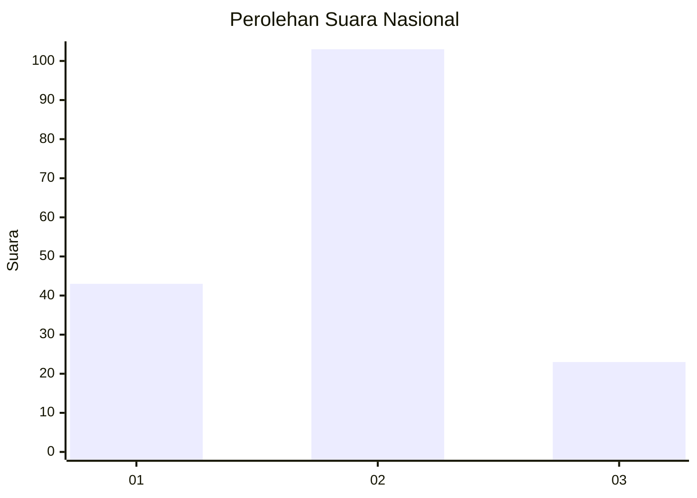
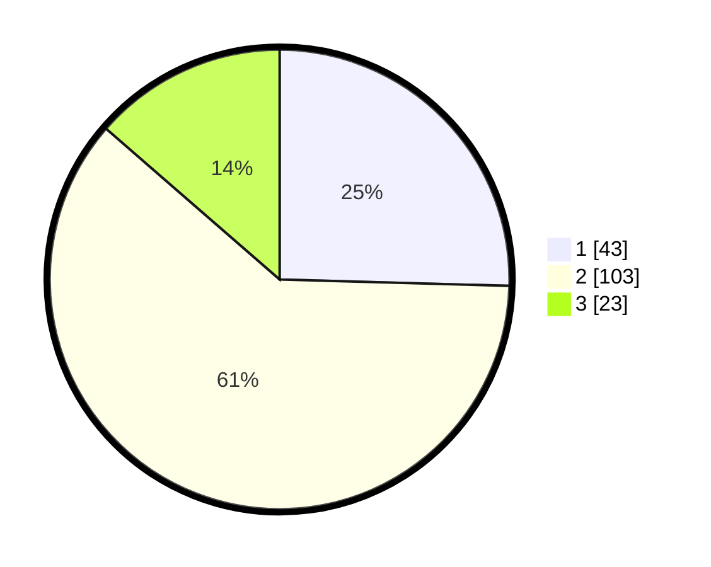

# Hasil

## Grafik

## Tabel

| No. | Nama Paslon    | Suara | Suara (raw) | Persentase |
|:--- |:-------------- | -----:| -----------:| ----------:|
| 1   | ANIES MUHAIMIN | 43    | [43][p-1]   | 25,44      |
| 2   | PRABOWO GIBRAN | 103   | [103][p-2]  | 60,95      |
| 3   | GANJAR MAHFUD  | 23    | [23][p-3]   | 13,61      |

[p-1]: https://github.com/gigit-pemilu/pemilu-2024/blob/main/pilpres/hitung-suara/sub/16-sumatera-selatan/sub/71-kota-palembang/sub/01-ilir-barat-dua/sub/1003-tiga-puluh-ilir/sub/048-tps/sub/paslon-1.txt
[p-2]: https://github.com/gigit-pemilu/pemilu-2024/blob/main/pilpres/hitung-suara/sub/16-sumatera-selatan/sub/71-kota-palembang/sub/01-ilir-barat-dua/sub/1003-tiga-puluh-ilir/sub/048-tps/sub/paslon-2.txt
[p-3]: https://github.com/gigit-pemilu/pemilu-2024/blob/main/pilpres/hitung-suara/sub/16-sumatera-selatan/sub/71-kota-palembang/sub/01-ilir-barat-dua/sub/1003-tiga-puluh-ilir/sub/048-tps/sub/paslon-3.txt

## Foto C Plano

https://sirekap-obj-formc.kpu.go.id/74e5/pemilu/ppwp/16/71/01/10/03/1671011003048-20240214-221417--0ec4f255-eecb-4894-98de-2561fbf66274.jpg

https://sirekap-obj-formc.kpu.go.id/74e5/pemilu/ppwp/16/71/01/10/03/1671011003048-20240214-221502--f236f18c-054e-4031-8431-080c1f6f4a64.jpg

https://sirekap-obj-formc.kpu.go.id/74e5/pemilu/ppwp/16/71/01/10/03/1671011003048-20240214-221535--d312a8eb-b930-4d64-9425-66654ade9aaa.jpg

## Metadata

| Key        | Value               |
| ---------- | ------------------- |
| Time Stamp | 2024-02-25 12:00:00 |

